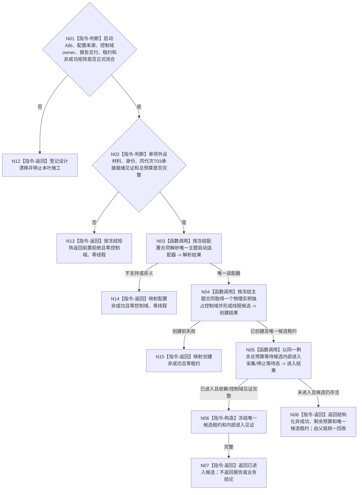

# BIZ-L3-001-07-01 启动一个外设线程目标函数流程图 v0.2

更新时间：2026-08-28

## 依据

```text
0050、6320、6340、6350、8110、8120；BIZ-L1-T06 v0.4；BIZ-L2-001-07；
HEAD 海中鱼巣/启动.应用程序.ixx、海中鱼巣/线程/外设采样材料线程.ixx、
海中鱼巣/适配/采集器.D455相机.ixx、海中鱼巣/线程/上行桥.D455采样材料.ixx。
```

## 身份与边界

正式目标治理图。6340只要求每个物理外设实例拥有独立控制域，高实时/高带宽实例独占OS线程；6350进一步要求双目相机独占观察线程。单线程启动目标因此只能确定：从显式启动材料选择一个已支持主题，为一个物理实例形成唯一控制域候选，使外层线程wrapper绑定BIZ-L1-T06依赖并进入可响应采集时机或停止生产门的内部等待态。

旧 v0.1 把进程内适配器注册表、启动规格DTO、控制域当前租约表、同义候选定位、D455候选创建字段和完整非成功矩阵写成已冻结合同；6340/6350并未规定这些物理ABI。BIZ-L1-T06 v0.4冻结了运行循环所需依赖和材料守恒，但不替代启动owner、主题配置来源、驱动打开阶段、候选租约或进入见证的设计。

当前没有外设启动配置的权威生产者、6340强类型物理报告发布端/队列、T03报告承接就绪见证、候选/正式控制域租约、外层wrapper或进入/失败矩阵。下列骨架不能直接交代码施工。

## 函数合同

```text
根函数候选：启动一个外设线程
归属模块 / 文件 / 目标分解深度：外设线程启动协调 / 物理文件待设计治理冻结 / BIZ-L3
现有或待新增：HEAD启动外设线程组为空壳；D455采集器工厂与材料上行桥零生产启动接线；模拟外设采样材料线程明确禁止真实外设和D455
完整签名：未冻结；旧 v0.1 的外设单线程启动请求/结果只作目标草图
参数：未冻结；必须明确外设实例/主题/配置的正式来源、运行代次与逻辑身份、驱动及控制域owner、BIZ-L1-T06依赖、6340报告发布端、T03承接就绪见证、8110端口、启动幂等和同一单调总预算
返回结果：未冻结；目标成功只含一份唯一移动候选租约和内部进入见证，不含报告形成、任务承接或世界事实结论；创建/打开后任一未回收非成功必须返还唯一租约和控制域材料
被调函数流程图：旧 BIZ-L4-001-07-01-01—03 只保留显式配置解析—控制域候选形成—内部进入等待职责方向；其公开签名、字段、owner和矩阵均未冻结
父图：BIZ-L2-001-07
```

## 设计门禁与目标骨架



## 节点合同

| 节点 | 当前可确认合同 | 仍待冻结 | 验证边界 |
| --- | --- | --- | --- |
| N01/N12 | ABI、配置来源、owner、报告交付或矩阵缺一项即停止 | DTO、物理文件、状态和结果优先级 | 不从D455代码存在、文件名或目标图补造通用注册表 |
| N02/N13 | 外设实例必须显式指定；T03承接端须在采集前可接收6340报告 | 规格身份、版本、就绪见证字段和调用方保证 | 不用旧“多源等待”bool、8110投影或空壳true替代 |
| N03/N14 | 主题选择只读显式不可变启动材料，不查询DATA或运行时发现世界事实 | 配置owner、登记唯一性和版本兼容方向 | 进程表是实现候选，不是机器权威或既定ABI |
| N04/N15 | 一个物理实例只有一个控制域；创建失败必须守恒驱动和线程资源 | 驱动打开在父/子线程的阶段、控制域owner和幂等墓碑 | D455工厂unique_ptr只证明机械独占，不证明线程候选 |
| N05—N08 | 成功只证明wrapper依赖已冻结并可响应采集/停止；非成功返还存活租约 | 进入见证、条件变量、伪唤醒和共享总预算 | D455打开、线程构造、已进入bool或8110事件不能替代内部见证 |

## 当前代码对应（HEAD `bccb077f`）

- `启动外设线程组()`仍无参且恒返回true，`收口并连接外设线程组()`为空；当前启动路径不创建、停止或连接任何外设控制域。
- `创建并打开D455相机采集器`能够同步取得RealSense独占驱动、采样、停止和读状态，但全仓没有生产启动调用；它没有运行代次、线程身份、候选租约、BIZ-L1-T06 wrapper、6340报告发布端或内部进入见证。
- `D455采样材料上行桥`只编排帧来源、专用缓存和标量运行消息，文件规则明确不入队、不写仓库、不调用领域服务；它不是6340强类型物理报告队列或T03正式承接入口。
- `外设采样材料线程`只承载模拟/空外部材料并明确禁止真实外设、D455和外设动作；其无参启动、busy-wait、bool进入量和无时限join只能作机械参考。
- HEAD没有目标适配器注册表、规范化启动规格、控制域租约表、可移动候选租约或按主题的外层线程wrapper；旧L4三叶均未实现。

## 具名偏差

1. `DRIFT-BIZ-PERIPHERAL-SINGLE-START-ABI-OWNER-AND-MATRIX-UNFROZEN`：单线程启动DTO、候选/正式租约owner、阶段、幂等墓碑、进入/失败/回收矩阵未冻结；旧同义租约定位与唯一移动所有权冲突。
2. `DRIFT-BIZ-PERIPHERAL-ADAPTER-CONFIG-AND-CONTROL-DOMAIN-LIFECYCLE-UNFROZEN`：外设实例/主题/配置的正式生产者、适配器登记物理位置、版本兼容、驱动打开阶段和控制域生命周期未冻结。
3. `DRIFT-BIZ-PERIPHERAL-T03-REPORT-DELIVERY-AND-READY-WITNESS-UNFROZEN`：6340强类型报告发布端、唯一物理队列及T03承接就绪见证尚未实现或冻结；旧“多源等待见证”和D455标量桥不能代替。

## 关键边界

```text
进程内启动配置和适配器路由不属于L1/DATA事实，也不得运行时枚举仓库补造设备配置。
外设线程进入不证明已采集、报告已形成、任务已承接或世界事实已提交。
创建后仍存活的驱动、线程和在途材料必须始终由唯一控制域租约覆盖；禁止detach或启动失败析构冒充收口。
```

## v0.2 校正记录

- 撤销旧 v0.1 已冻结的通用启动签名、适配器表、当前租约读取和同义候选定位。
- 将6340/6350正式边界与具体D455实现候选分账，登记报告交付/T03就绪前置缺口。
- 保留显式配置选择、每实例独占控制域、内部进入见证和非成功租约守恒四项目标方向。
