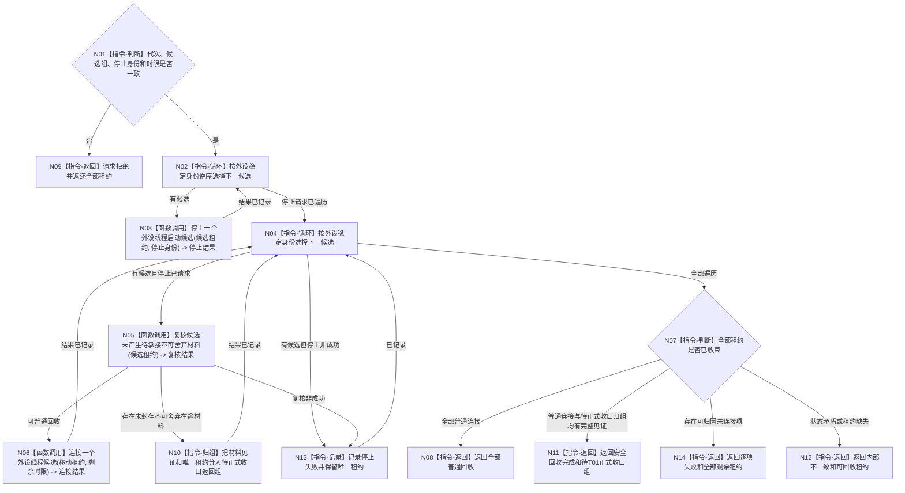

# BIZ-L3-001-07-02 停止并连接本轮外设线程目标函数流程图 v0.1

更新时间：2026-08-27

## 依据

```text
6340、8110、8120；BIZ-L2-001-07；当前外设采样材料线程停止/收口相邻能力
```

## 身份与边界

正式目标函数设计图。只处理外设线程组完整租约尚未发布时的启动半失败：先向全部已进入候选发停止，再逐项裁决普通连接或把不可舍弃在途材料及唯一租约分入待正式收口返回组。它不等待已发布报告被消费，也不直接调用BIZ-L2-001-13；父级把返回组交T01的统一失败收口路径。

## 函数合同

```text
根函数：停止并连接本轮外设线程
归属模块 / 文件 / 目标分解深度：线程启动协调 / 海中鱼巣/启动.线程组协调.ixx / BIZ-L3
现有或待新增：目标组合函数、移动候选租约组、逐项材料复核和正式收口转交结果均未实现
完整签名：外设线程候选回收结果 停止并连接本轮外设线程(外设线程候选租约组&& 候选租约组, const 外设线程候选回收请求& 请求) noexcept
参数：候选租约组为唯一移动所有权并按外设稳定身份确定排列；请求为只读借用，含运行代次、逐项停止幂等身份、启动失败原因和总单调时限
返回结果：移动值式逐外设回收结果；逐项含普通已连接、待正式收口、停止失败、复核失败、连接超时或内部不一致；所有未连接项必须返还唯一租约
被调函数流程图：BIZ-L4-001-07-02-01 停止一个外设线程启动候选；BIZ-L4-001-07-02-02 复核候选未产生待承接不可舍弃材料；BIZ-L4-001-07-02-03 连接一个外设线程候选
父图：BIZ-L2-001-07
```

## 流程图



## 节点合同

| 节点 | 类型 | 输入 | 输出 | 事实读写 | 验证 |
| --- | --- | --- | --- | --- | --- |
| N01—N04 | 判断 / 循环 / 调用 | 回收请求 | 稳定停止结果 | 只发8110消息 | 错代、重复租约、停止失败 |
| N05—N06 | 函数调用 | 候选租约 | 材料复核和普通连接结果 | 只读唯一在途槽、发布/恢复见证 | 不可舍弃材料、连接超时 |
| N10/N13 | 归组 / 记录 | 不可舍弃材料、停止或复核非成功 | 待正式收口租约或剩余租约 | 不消费、不删除正式报告 | 原材料/身份/租约守恒 |
| N07—N14 | 判断 / 返回 | 全部逐项结果 | 回收、转交或结构化非成功 | 不删除正式报告 | 零悬空控制域、零遗失租约 |

## 关键边界

已经进入6340物理报告队列的报告不因线程停止而回退，也不要求本函数等待消费；只有候选唯一在途槽内尚未正式发布/封存的不可舍弃材料阻止普通连接。发现该材料时不得按“启动失败”静默丢弃，必须把原材料见证和唯一控制域租约返还父级，最终由T01交BIZ-L2-001-13正式停产、封存、读回和连接。

## 当前代码对应（HEAD `79985857`）

- HEAD没有本组合函数、候选租约组、逐项停止幂等、总时限、在途材料复核或BIZ-L2-001-13转交端口；`收口并连接外设线程组()`仍为空。
- 模拟外设采样材料线程只有`请求停止并发送停止消息()`和无时限`收口等待()`；停止消息与外部材料共用旧标量队列，线程入口实际只观察原子停止位，不消费该消息。
- 当前代码没有6340强类型报告队列、T06唯一在途槽、不可舍弃恢复owner或逐项租约返还，因此不能证明普通回收和正式收口两路中的任一路。
