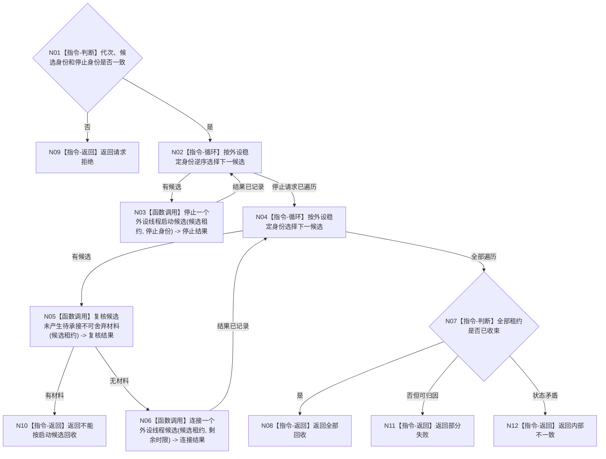

# BIZ-L3-001-07-02 停止并连接本轮外设线程目标函数流程图 v0.1

更新时间：2026-08-03

## 依据

```text
6340、8110、8120；BIZ-L2-001-07；当前外设采样材料线程停止/收口相邻能力
```

## 身份与边界

正式目标函数设计图。只回收外设线程组启动半失败时尚未发布的候选，不替代生产停机中的不可舍弃报告收束。

## 函数合同

```text
根函数：停止并连接本轮外设线程
归属模块 / 文件 / 层级：线程启动协调 / 海中鱼巣/启动.线程组协调.ixx / L3
现有或待新增：待新增；组合具体外设线程停止与连接能力
完整签名：外设线程候选回收结果 停止并连接本轮外设线程(const 外设线程候选回收请求& 请求)
参数：请求为只读借用；含运行代次、按外设稳定身份排序的候选租约组、停止身份组和回收时限；租约由调用方持有至返回
返回结果：值式逐外设回收结果；含全部回收、部分失败、请求拒绝或内部不一致
被调函数流程图：BIZ-L4-001-07-02-01 停止一个外设线程启动候选；BIZ-L4-001-07-02-02 复核候选未产生待承接不可舍弃材料；BIZ-L4-001-07-02-03 连接一个外设线程候选
父图：BIZ-L2-001-07
```

## 流程图



## 节点合同

| 节点 | 类型 | 输入 | 输出 | 事实读写 | 验证 |
| --- | --- | --- | --- | --- | --- |
| N01—N04 | 判断 / 循环 / 调用 | 回收请求 | 稳定停止结果 | 只发8110消息 | 错代、重复租约、停止失败 |
| N05—N06 | 函数调用 | 候选租约 | 材料复核和连接结果 | 只读候选报告队列 | 不可舍弃材料、连接超时 |
| N07—N12 | 判断 / 返回 | 全部结果 | 回收结论 | 不删除正式报告 | 零悬空控制域 |

## 关键边界

发现已经产生的不可舍弃报告时不得按“启动失败”静默丢弃，必须升级到6340正式停机和材料承接路径。
