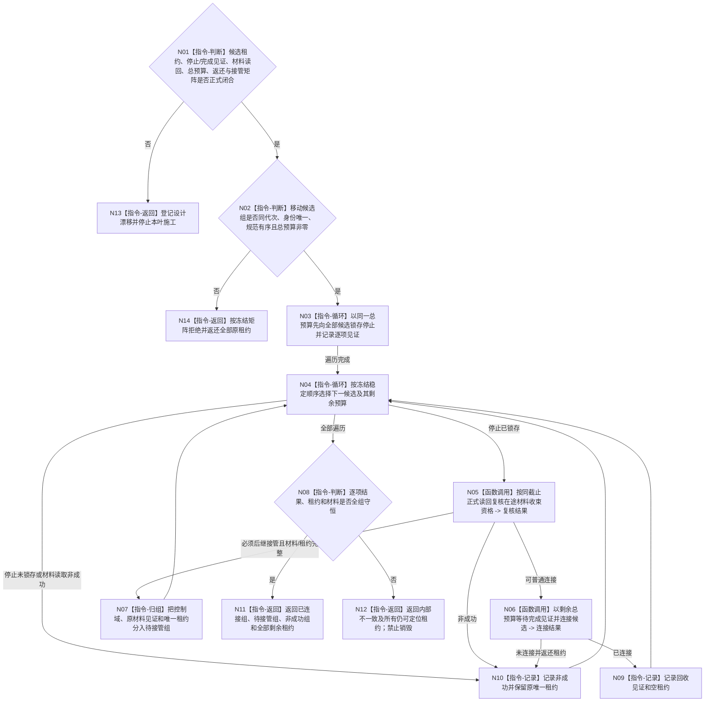

# BIZ-L3-001-07-02 停止并连接本轮外设线程目标函数流程图 v0.2

更新时间：2026-08-28

## 依据

```text
0050、6320、6340、6350、8110、8120；BIZ-L1-T06 v0.4；BIZ-L2-001-07；
BIZ-L3-001-07-01 v0.2；HEAD 海中鱼巣/启动.应用程序.ixx、
海中鱼巣/线程/外设采样材料线程.ixx、海中鱼巣/适配/采集器.D455相机.ixx。
```

## 身份与边界

正式目标治理图。只处理外设线程组正式租约发布前的启动半失败。安全顺序固定为：先向全部已形成候选锁存停止，再逐项判断候选是否具备普通连接资格；不能普通连接的控制域、在途材料和唯一租约必须完整返还给父级后继owner，最后才返回整组结构化结果。

6340要求不可静默舍弃的报告先形成可恢复强类型材料，BIZ-L1-T06 v0.4要求停止后收束门前在途槽；但当前没有通用T06线程、唯一在途槽、6340强类型报告队列/发布见证、不可舍弃恢复材料owner或BIZ-L2-001-13接管端口。旧 v0.1 把这些不存在的提供者连同停止/复核/连接DTO和矩阵写成已冻结合同，不能施工。

本根还依赖07-01未冻结的候选租约、主题适配器和控制域owner。总停止/连接预算、停止全部后的逐项顺序、未连接租约返还、待正式收口组的接管owner与异常矩阵均需详细设计闭合。

## 函数合同

```text
根函数候选：停止并连接本轮外设线程
归属模块 / 文件 / 目标分解深度：外设线程启动协调 / 物理文件待设计治理冻结 / BIZ-L3
现有或待新增：HEAD收口并连接外设线程组为空；只有模拟线程原子停止/无时限join和D455采集器停止资源动作，目标组合、DTO、租约组、材料复核与转交端口均不存在
完整签名：未冻结；旧 v0.1 的移动租约组签名只作所有权方向草图
参数：未冻结；至少必须移动交付规范有序唯一候选租约组、运行代次/身份、逐项停止身份、失败原因和同一单调总预算
返回结果：未冻结；必须逐项守恒已连接、待后继接管和仍未连接租约，任何仍存活线程/驱动/在途材料都不得从结果消失
被调函数流程图：旧 BIZ-L4-001-07-02-01—03 只保留停止—同截止材料复核—有限连接职责方向；其公开ABI、owner、见证和矩阵未冻结
父图：BIZ-L2-001-07
```

## 设计门禁与目标骨架



## 节点合同

| 节点 | 当前可确认合同 | 仍待冻结 | 验证边界 |
| --- | --- | --- | --- |
| N01/N13 | 上游07-01或材料/接管提供者未闭合即停止施工 | DTO、owner、状态、结果优先级 | 不从目标图、D455缓存或队列空推断提供者存在 |
| N02/N14 | 入口移动接管全部候选，坏请求也不得丢失租约 | 租约组类型、排序键、重复和错代矩阵 | 禁止复制租约或用线程地址作稳定身份 |
| N03 | 必须先尝试停止全部候选，再开始任何逐项等待/连接 | 停止身份、重复语义、唤醒源和总预算扣减 | 防止前项join阻塞后项继续生产 |
| N04—N10 | 每项只由同截止正式材料读回裁决普通连接或待接管 | 在途槽/发布/恢复owner、完整读回、合法空槽证明 | 模拟队列空、D455缓存状态、8110或裸bool均为弱证据 |
| N08/N11/N12 | 每个输入租约恰落入已连接、待接管或仍未连接之一 | 接管owner、有限返回和内部错误后继 | 零detach、零析构阻塞兜底、零材料/租约遗失 |

## 当前代码对应（HEAD `e3f624c9`）

- `收口并连接外设线程组()`仍为空，生产路径没有任何外设停止、材料复核、连接或租约返还证据。
- 模拟`外设采样材料线程::请求停止并发送停止消息()`先把停止消息塞入旧外部材料队列，再置原子停止；线程入口只busy-wait该原子量，从不消费停止消息，也没有驱动、发布重试或材料等待唤醒合同。
- 模拟线程`收口等待()`和析构直接无时限join；没有完成见证、共享总预算、超时返还或候选/正式阶段。
- D455采集器`请求停止()`能停止并关闭SDK资源，析构也会关闭；但其工厂零生产启动调用，没有外层线程、候选租约、T06在途槽或完成见证。
- HEAD没有6340强类型报告队列、报告发布/恢复正式读回、不可舍弃恢复owner或BIZ-L2-001-13接管端口；旧07-02-02的普通回收/正式转交裁决无数据来源。

## 具名偏差

1. `DRIFT-BIZ-PERIPHERAL-CANDIDATE-RECOVERY-ABI-OWNER-AND-MATRIX-UNFROZEN`：候选组租约、停止/完成/连接见证、组状态、幂等墓碑、总预算和逐项返还矩阵未冻结，并依赖07-01未闭合owner。
2. `DRIFT-BIZ-PERIPHERAL-INFLIGHT-MATERIAL-READBACK-AND-TRANSFER-OWNER-UNAVAILABLE`：唯一在途槽、6340发布/恢复见证、合法空槽证明、不可舍弃材料owner及001-13接管端口均未实现，不能诚实裁决普通连接资格。
3. `DRIFT-BIZ-PERIPHERAL-STOP-WAKE-AND-LIVENESS-UNFROZEN`：逐主题停止应关闭哪些生产门、唤醒哪些驱动/采集/发布等待，以及停止全部与逐项连接共享预算的活性合同未冻结。

## 关键边界

```text
已发布报告不因线程停止回退，也不要求本根等待任务域消费。
尚未发布/封存的不可舍弃材料不能因启动失败丢弃；必须与控制域唯一租约共同进入正式接管。
父级已发布完整外设线程组后必须改走正式停产链，本根不得旁路运行期材料收束。
```

## v0.2 校正记录

- 撤销旧 v0.1 已冻结的回收DTO、三叶签名、材料复核结果和接管矩阵。
- 将先停全部、同截止材料复核、有限连接、未连接租约返还保留为职责骨架。
- 登记6340材料读回/恢复owner和001-13接管端口缺失，禁止用运行期缓存或空队列冒充正式资格。
