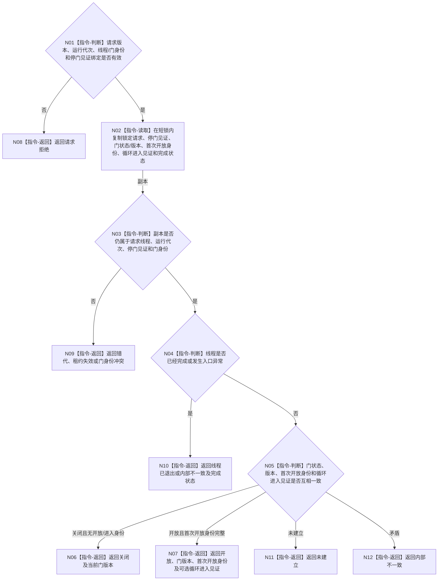

# BIZ-L3-001-08-01 读取自我治理运行门目标函数流程图 v0.1

更新时间：2026-08-27

## 依据

```text
0050、8100、8110、8120 v0.10；BIZ-L2-001-08；BIZ-L3-001-03-11
```

## 身份与边界

正式目标函数设计图。只按普通应用仍持有的唯一自我线程租约和阶段20停门见证，读取同一线程对象内部的治理运行门、首次开放身份和治理循环进入见证。运行门是进程内线程协调状态，不是任务权限、需求活动或业务授权。

## 函数合同

```text
根函数：自我线程::读取治理运行门
归属模块 / 文件 / 目标分解深度：自我线程 / 海中鱼巣/线程/创建.自我线程.ixx / BIZ-L3
现有或待新增：部分相邻能力存在；HEAD已有 `读取停门见证()`，但没有当前门状态、门版本、首次开放身份或治理循环进入见证读取
完整签名：自我治理运行门读取结果 自我线程::读取治理运行门(const 自我治理运行门读取请求& 请求) const noexcept
参数：请求为只读借用；含运行代次、线程逻辑身份、预期停门见证身份和预期运行门身份；调用期间普通应用保持唯一线程租约有效
返回结果：调用方拥有的值式结果；含关闭、开放、未建立、错代、租约失效、线程已退出或内部不一致，并携带门版本、首次开放幂等身份、可选治理循环进入见证和内部完成状态
被调函数流程图：无
父图：BIZ-L2-001-08
```

## 流程图



## 节点合同

| 节点 | 类型 | 输入 | 输出 | 事实读写 | 验证 |
| --- | --- | --- | --- | --- | --- |
| N01 | 指令-判断 | 读取请求与调用方持有租约 | 准入 | 无 | 错代、错身份和过期停门见证 |
| N02—N05 | 指令 | 当前线程内部协调槽 | 一个锁内不可变副本和分类 | 只读线程内部门、进入和完成状态 | 并发开门/进入/退出、身份复义 |
| N06—N12 | 指令-返回 | 分类结果 | 结构化读取结果 | 不写线程或业务事实 | 关闭/开放/退出/未建立/矛盾互斥 |

## 关键边界

调用方不得取得条件变量、互斥量或可变门对象；读取到开放也不证明治理循环已经进入，更不证明某个任务具有执行权限。治理循环进入见证只能由线程入口在真正调用 `运行治理循环()` 前内部发布，8110投影不能补造。

## 当前代码对应（HEAD `745ef2ae`）

- `海中鱼巣/线程/创建.自我线程.ixx` 已有 `读取停门见证()`，只复制创建阶段发布的停门见证；门开放后该值仍存在，不能表示当前门状态。
- 当前门只有 `bool 运行门已开放_`，没有门身份、版本、首次开放幂等身份、治理循环进入见证或结构化读取状态。本目标读取入口尚未实现。
- 目标物理位置改为现有自我线程类所在的 `创建.自我线程.ixx`，不再指向不存在的 `线程/自我线程.ixx`，也不新建第二自我线程owner。
