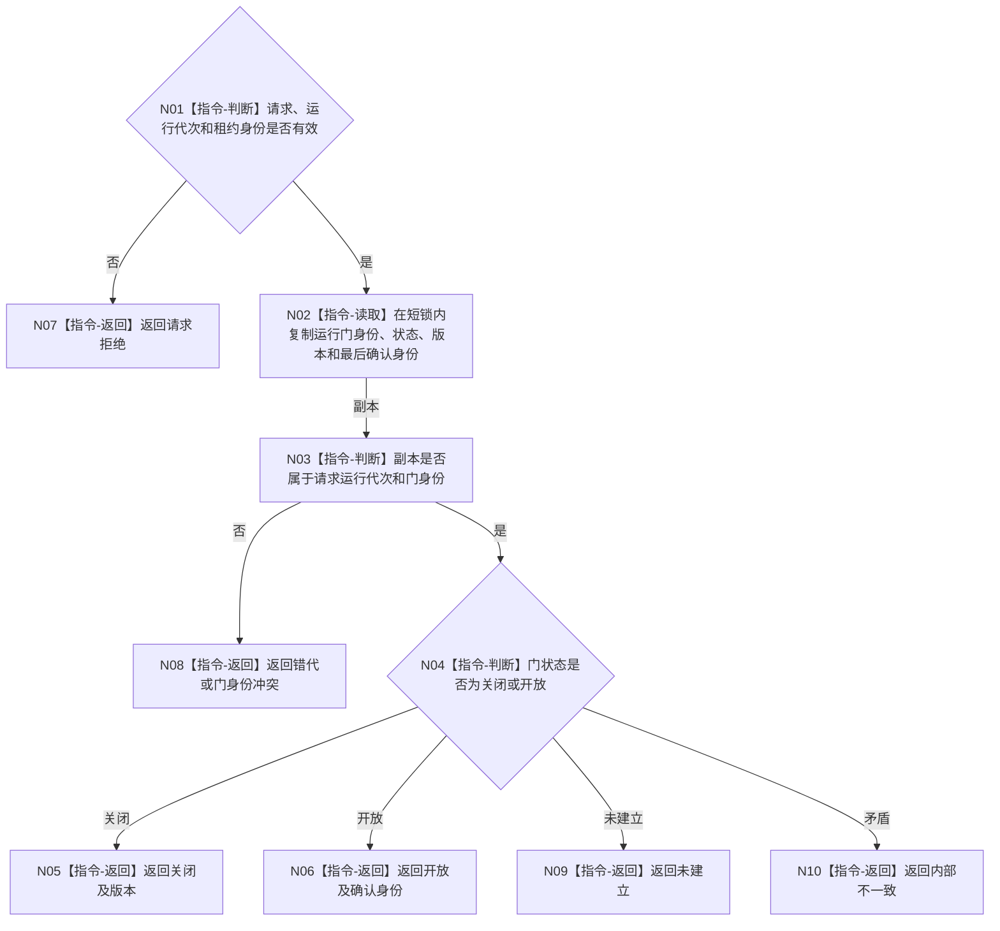

# BIZ-L3-001-08-01 读取自我治理运行门目标函数流程图 v0.1

更新时间：2026-08-03

## 依据

```text
0050、8100、8110、8120；BIZ-L2-001-08；BIZ-L3-001-03-02—04
```

## 身份与边界

正式目标函数设计图。运行门是线程生命周期协调状态，不是任务权限、需求活动或业务授权。

## 函数合同

```text
根函数：自我线程::读取治理运行门
归属模块 / 文件 / 层级：自我线程 / 海中鱼巣/线程/自我线程.ixx / L3
现有或待新增：待新增
完整签名：自我治理运行门读取结果 自我线程::读取治理运行门(const 自我治理运行门读取请求& 请求) const
参数：请求为只读借用；含运行代次、自我线程租约身份和预期运行门身份；调用期间租约保持有效
返回结果：调用方拥有的值式结果；含关闭、开放、未建立、错代、租约失效或内部不一致，并携带门版本和最后确认身份
被调函数流程图：无
父图：BIZ-L2-001-08
```

## 流程图



## 节点合同

| 节点 | 类型 | 输入 | 输出 | 事实读写 | 验证 |
| --- | --- | --- | --- | --- | --- |
| N01 | 指令-判断 | 读取请求 | 准入 | 无 | 错代、失效租约 |
| N02—N04 | 指令 | 当前门记录 | 不可变副本和分类 | 只读线程内部门状态 | 并发读取、身份复义 |
| N05—N10 | 指令-返回 | 分类结果 | 结构化读取结果 | 不写业务事实 | 四类结果互斥 |

## 关键边界

调用方不得取得条件变量、互斥量或可变门对象；读取到开放也不证明某个任务具有执行权限。

