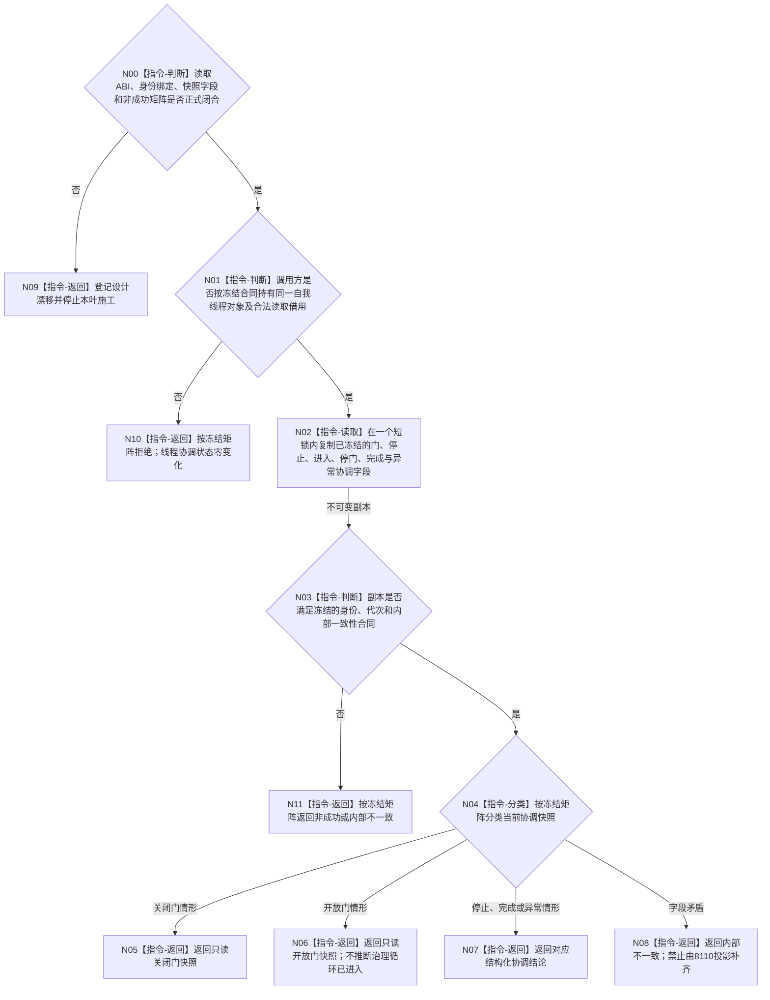

# BIZ-L3-001-08-01 读取自我治理运行门目标函数流程图 v0.2

更新时间：2026-08-28

## 依据

```text
0050、8100、8110、8120 v0.10；BIZ-L1-T01 v0.5、BIZ-L1-T02 v0.6；
BIZ-L2-001-08；当前发布源码：海中鱼巣/线程/线程_自我.h、海中鱼巣/线程/线程_自我.cpp、海中鱼巣/启动.应用程序.h、海中鱼巣/启动.应用程序.cpp。
```

## 身份与边界

正式目标治理图。目标职责仅是从普通应用持有的同一个自我线程对象中取得不可变的治理运行门协调快照，供父级判断“尚停在关闭门”“已经开放”或“线程已停止/完成”等运行期协调情形。读取不得暴露条件变量、互斥量或可变门，也不得读取、消费或裁决治理邮箱中的业务材料。

8120 v0.10 只冻结：唯一自我线程先真实停在关闭门，支持线程、工作线程、任务管理线程和外设等必要消费者/生产者就绪后由 BIZ-L2-001-08 独立开放门，开门前不得消费治理邮箱。它没有冻结治理门读取请求/结果、门稳定身份、门版本、首次开放幂等身份、循环进入见证或关闭/开放/退出矩阵。旧 v0.1 把这些字段和状态直接写成完整 ABI，越过了正式规范与详细设计，不能施工。

当前 `读取诊断快照()` 会在对象状态锁内复制生命周期、治理运行门布尔值、线程进入/完成和邮箱计数等诊断字段，但发布源码没有把治理运行门布尔值改为开放的路径。该诊断入口可以作为实现证据候选，不能冒充完整门读取合同；裸 `bool`、8110 生命周期投影或调用方缓存同样不能补足正式语义。

## 函数合同

```text
根函数候选：自我线程::读取治理运行门
归属模块 / 文件 / 目标分解深度：自我线程 / 现行承载为海中鱼巣/线程/线程_自我.h 与 海中鱼巣/线程/线程_自我.cpp / BIZ-L3
现有或待新增：发布源码已有结构化诊断快照和对象内状态锁，但没有正式治理运行门读取 ABI，也没有开放门状态生产路径
完整签名：未冻结；旧 v0.1 的自我治理运行门读取请求/结果只作目标草图，不构成ABI
参数：未冻结；必须明确同一线程对象的合法借用、运行代次/创建见证绑定、租约寿命和并发读取边界
返回结果：未冻结；必须能按正式矩阵区分可继续、不可继续和内部矛盾，且任何结果都不得交出可变协调对象
被调函数流程图：无
父图：BIZ-L2-001-08
```

## 设计门禁与目标骨架



## 节点合同

| 节点 | 当前可确认合同 | 仍待冻结 | 验证边界 |
| --- | --- | --- | --- |
| N00/N09 | 缺少正式读取合同即停止施工 | 请求/结果物理位置、字段顺序、状态稳定值和成功公式 | 目标图、裸bool和生命周期投影都不能生成ABI |
| N01/N10 | 只允许读取普通应用持有的同一个自我线程对象 | 租约/借用类型、代次与创建/停门见证绑定 | 禁止按线程地址、系统线程ID或旧缓存认领对象 |
| N02 | 必须在短锁内形成不可变副本，锁和条件变量不出对象 | 完整快照字段及并发开门/停止/完成的线性化点 | 读取零写入、零通知、零治理邮箱消费 |
| N03—N08 | 分类必须以冻结矩阵为准，开放与循环进入分账 | 门身份/版本、首次开放与循环进入见证是否存在及其生命周期 | 8110只读投影、消息出队和父级bool均为弱证据 |

## 冻结发布源码对照（头源迁移与现行入口复核基线 `ab877eef9e8cc4a179603ada71389d23a3401a4e`）

- `自我线程::读取诊断快照()`在`状态互斥`下复制生命周期、`治理运行门开启`、线程进入/完成、邮箱计数和最近外部调用等诊断字段；它不是具名门读取合同。
- 当前发布源码中`治理运行门开启`只有默认 `false` 和读取，没有写为 `true` 的路径。`复核前置并开放治理运行门()`明确标记待实现，前置可达时返回`依赖未就绪`，不修改门也不通知。
- 私有`自我线程::实现::运行()`形成入口和停门见证后，只等待停止请求或内部错误；当前没有越过门、治理循环调用或运行成功见证。
- 因而本图只能把现行诊断快照列为相近读取证据，不能把“字段存在”写成门读取、开门或治理循环已经实现。

## 具名偏差

1. `DRIFT-BIZ-SELF-GOVERNANCE-GATE-READ-ABI-IDENTITY-AND-MATRIX-UNFROZEN`：读取请求/结果、同一线程对象绑定、门身份和关闭/开放/停止/完成/异常矩阵均未由正式设计闭合。
2. `DRIFT-BIZ-SELF-GOVERNANCE-GATE-VERSION-OPEN-WITNESS-AND-ENTRY-WITNESS-UNFROZEN`：是否需要门版本、首次开放身份、开放见证和治理循环进入见证，以及各自生产、寿命和互证关系尚未冻结；不得从旧图补造。

## 关键边界

```text
读取门只观察进程内线程协调状态，不产生业务授权。
门已开放不等于治理循环已进入，更不等于任一治理消息已消费或任务可执行。
8110线程生命周期投影只供只读观察，不能补造对象内部协调见证。
```

## v0.2 校正记录

- 撤销旧 v0.1 已冻结的请求/结果字段、门身份/版本、首次开放幂等身份、循环进入见证和完整状态矩阵。
- 保留只读同一线程对象、短锁不可变快照、零治理邮箱消费及“开放不等于进入”的职责方向。
- 将两个合同缺口登记为具名 DRIFT；闭合前 08-02、08-03 只能保留旧目标草图，不得反向为本叶生成 ABI。
