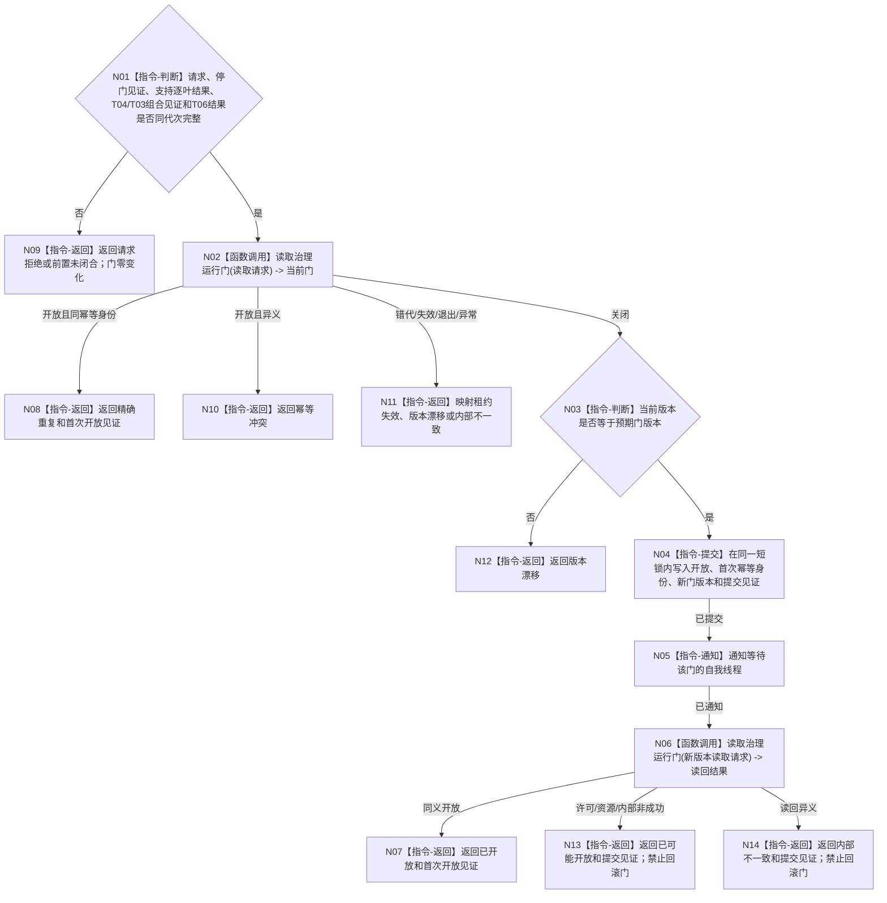

# BIZ-L3-001-08-02 确认自我治理运行门目标函数流程图 v0.1

更新时间：2026-08-27

## 依据

```text
0050、8100、8110、8120 v0.10；BIZ-L2-001-08；BIZ-L3-001-08-01；BIZ-L2-001-03—07
```

## 身份与边界

正式目标函数设计图。只在阶段20停门见证、支持逐叶结果、T04/T03组合见证和T06结果全部同运行代次闭合时，以稳定幂等身份把一个关闭门提交为开放门。门提交只发生一次且不可补偿回滚；提交后读回失败必须返回已可能开放。

## 函数合同

```text
根函数：自我线程::确认治理运行门
归属模块 / 文件 / 目标分解深度：自我线程 / 海中鱼巣/线程/创建.自我线程.ixx / BIZ-L3
现有或待新增：相邻无类型入口已实现；HEAD `void 开放治理运行门()` 只写布尔并通知，目标版本化确认、前置绑定、幂等和读回未实现
完整签名：自我治理运行门确认结果 自我线程::确认治理运行门(const 自我治理运行门确认请求& 请求) noexcept
参数：请求为只读借用；含运行代次、线程/门身份、阶段20停门见证、预期关闭门版本、001-04支持逐叶结果、001-05 T04结果、001-06 T03/T04组合见证、001-07 T06结果和开放幂等身份；调用方继续持有唯一租约
返回结果：值式确认结果；含已开放、精确重复、请求拒绝、前置未闭合、版本漂移、幂等冲突、租约失效、资源失败、内部不一致或已可能开放，以及首次门开放见证或四字段提交见证
被调函数流程图：BIZ-L3-001-08-01
父图：BIZ-L2-001-08
```

## 流程图



## 节点合同

| 节点 | 类型 | 输入 | 输出 | 事实读写 | 验证 |
| --- | --- | --- | --- | --- | --- |
| N01—N03 | 判断 / 调用 | 确认请求和全部原始前置见证 | 准入、当前门和版本结论 | 只读值式前置与线程门 | 支持降级合法、T04/T03/T06不完整阻断、同义/异义重复 |
| N04—N06 | 提交 / 通知 / 调用 | 关闭门、开放身份和预期版本 | 新版本、提交见证与正式读回 | 只改线程内部门并通知 | 并发确认、丢失唤醒、提交后读回失败 |
| N07—N14 | 返回 | 确认或读回结论 | 首次开放见证、零变化非成功或已可能开放 | 不写业务事实，不补偿关门 | 写后读回一致、提交边界和租约守恒 |

## 关键边界

门确认是一次性线程协调动作；不得因开放门而跳过自我治理每轮的安全、服务和任务权限裁决。支持线程组的具名降级属于完整前置，不得误当整体拒绝；T04、T03及其接收门、T06非空组则必须真实就绪，T06空配置只接受正式“无需启动”。

提交点是N04。N04前任一非成功保证门零变化；N04后读回或通知观察非成功不得把门改回关闭，只能返回已可能开放/内部不一致及提交见证，由父级进入正式收口。

## 当前代码对应（HEAD `745ef2ae`）

- 当前 `void 自我线程::开放治理运行门() noexcept` 无条件把 `运行门已开放_` 置 `true` 后通知；重复调用无首次身份，错代、提前开放、线程已退出和异义请求均无法分账。
- 当前没有门版本、开放幂等身份、提交见证和写后读回；父函数也没有把阶段20停门见证或001-04—07强类型结果传入该方法。
- 本目标应原位增强现有自我线程类，不新建第二门owner；旧无参 `void` 生产调用在目标接线后退出。
