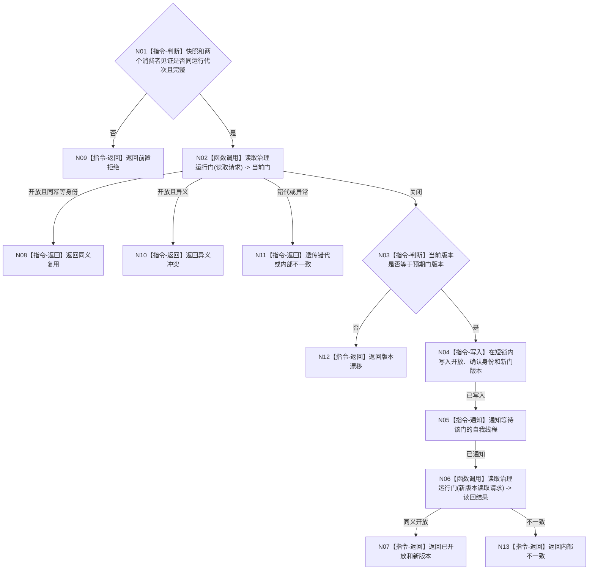

# BIZ-L3-001-08-02 确认自我治理运行门目标函数流程图 v0.1

更新时间：2026-08-03

## 依据

```text
0050、8100、8110、8120；BIZ-L2-001-08；BIZ-L3-001-08-01
```

## 身份与边界

正式目标函数设计图。只在初始化快照与任务消费者见证同代次时，以稳定幂等身份把关闭门确认成开放门。

## 函数合同

```text
根函数：自我线程::确认治理运行门
归属模块 / 文件 / 层级：自我线程 / 海中鱼巣/线程/自我线程.ixx / L3
现有或待新增：待新增
完整签名：自我治理运行门确认结果 自我线程::确认治理运行门(const 自我治理运行门确认请求& 请求)
参数：请求为只读借用；含运行代次、线程租约、门身份、预期门版本、初始化快照版本、任务管理/工作线程池进入见证和开放幂等身份
返回结果：值式确认结果；含已开放、同义复用、前置拒绝、版本漂移、异义冲突、租约失效或内部不一致，以及新门版本
被调函数流程图：BIZ-L3-001-08-01
父图：BIZ-L2-001-08
```

## 流程图



## 节点合同

| 节点 | 类型 | 输入 | 输出 | 事实读写 | 验证 |
| --- | --- | --- | --- | --- | --- |
| N01—N03 | 判断 / 调用 | 确认请求 | 准入、当前门和版本结论 | 只读见证和门投影 | 消费者未就绪、同义/异义重复 |
| N04—N06 | 指令 / 调用 | 关闭门和确认身份 | 新版本与读回 | 只改线程运行门并通知 | 并发确认、丢失唤醒 |
| N07—N13 | 返回 | 确认结论 | 结构化结果 | 不写业务事实 | 写后读回一致 |

## 关键边界

门确认是一次性线程协调动作；不得因开放门而跳过自我治理每轮的安全、服务和任务权限裁决。

