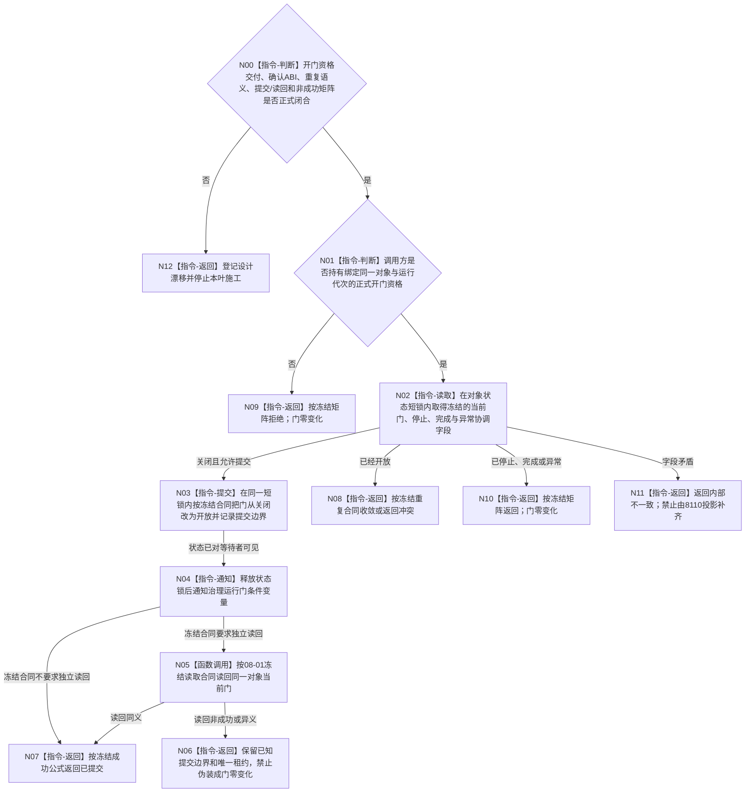

# BIZ-L3-001-08-02 确认自我治理运行门目标函数流程图 v0.2

更新时间：2026-08-28

## 依据

```text
0050、8100、8110、8120 v0.10；BIZ-L1-T01 v0.5、BIZ-L1-T02 v0.6；
BIZ-L2-001-08；BIZ-L3-001-08-01 v0.2；HEAD 海中鱼巣/线程/创建.自我线程.ixx、
海中鱼巣/启动.应用程序.ixx。
```

## 身份与边界

正式目标治理图。目标职责是在 BIZ-L2-001-08 已经按正式合同证明必要消费者/生产者就绪后，由同一个自我线程对象 owner 执行一次关闭门到开放门的进程内协调提交，并在状态对等待线程可见后发出唤醒。它不读取或消费治理邮箱，也不把开门解释为任务、安全或现实执行授权。

正式材料尚未裁决父协调者怎样把“可以开门”的结论交给自我线程对象：把001-04—07全部业务结果复制进线程对象会造成跨层重复验证，保留当前公开无参 `void` 又允许绕过父级就绪门。必须先冻结最小不可伪造的开门资格、调用可见性、同一对象/运行代次绑定和寿命，才能决定目标函数签名。

旧 v0.1 还自行冻结了门身份/版本、开放幂等身份、首次开放见证、四字段提交见证、写后读回和完整失败矩阵；8120没有定义这些机器语义。进程内布尔门是否需要版本化、重复开门怎样收敛、通知后是否必须独立读回及提交后不确定怎样承载，都必须由详细设计与有效计划共同闭合。

## 函数合同

```text
根函数候选：自我线程::确认治理运行门
归属模块 / 文件 / 目标分解深度：自我线程 / 海中鱼巣/线程/创建.自我线程.ixx / BIZ-L3
现有或待新增：HEAD已有void开放治理运行门()，在状态锁内写布尔并在锁外notify_all；无准入、结果、版本或读回
完整签名：未冻结；旧 v0.1 的确认请求/结果只作目标草图，不构成ABI
参数：未冻结；必须承载父级正式开门资格、同一对象/运行代次绑定和必要并发前置，但不得把全部上游业务DTO复制进线程owner
返回结果：未冻结；必须保留门零变化、已提交和提交边界不确定的区别，并保证唯一线程租约始终由父级持有
被调函数流程图：[BIZ-L3-001-08-01 v0.2](BIZ-L3-001-08-01_读取自我治理运行门_目标函数流程图_v0.2.md) 只提供待冻结的读取方向，不能反向生成确认ABI
父图：BIZ-L2-001-08
```

## 设计门禁与目标骨架



## 节点合同

| 节点 | 当前可确认合同 | 仍待冻结 | 验证边界 |
| --- | --- | --- | --- |
| N00/N12 | 资格交付或提交矩阵未闭合即停止施工 | DTO、调用可见性、owner、状态稳定值和结果优先级 | 不从父级bool、旧图或8110生成开门资格 |
| N01/N09 | 线程对象不能接受可绕过父级就绪门的裸调用 | 最小不可伪造资格、对象/代次绑定和寿命 | 既不复制全部上游业务DTO，也不保留公开无参旁路 |
| N02—N03 | 同一对象短锁内只允许关闭到开放的冻结事务形状 | 版本/幂等是否需要、重复/冲突/停止竞态矩阵 | 并发开门、并发停止和已完成对象必须结构化分账 |
| N04 | 状态先可见，后通知等待者 | 通知是否需要独立观察见证 | 通知不产生业务事实，不读取邮箱 |
| N05—N07 | 是否需要写后读回必须由正式合同决定 | 读取结果绑定、提交后不确定承载和父级收口 | 读回失败不得反向断言门零变化或丢失租约 |

## 当前代码对应（HEAD `cb6ca44e`）

- `void 自我线程::开放治理运行门() noexcept` 在`状态锁_`内无条件把`运行门已开放_`置为`true`，随后`notify_all()`；已有“状态先可见、后通知”的机械顺序。
- 该方法没有调用方资格、运行代次、停门/停止/完成复核、结构化返回或同义/异义重复分账；生产路径和多项端到端测试都可直接调用。
- `运行普通程序()`只用恒真空壳与旧启动布尔合取后旁路开门，没有把001-04—07的强结果交给对象，也没有取得确认结果。
- 当前没有门版本、开放身份、提交见证或结构化读取入口；因此不能把旧 v0.1 的版本化幂等事务解释为已实现或已冻结。

## 具名偏差

1. `DRIFT-BIZ-SELF-GOVERNANCE-GATE-OPEN-AUTHORITY-AND-PRECONDITION-HANDOFF-UNFROZEN`：父协调者如何把必要模块就绪结论以最小不可伪造资格交给同一线程对象、入口可见性与寿命均未冻结。
2. `DRIFT-BIZ-SELF-GOVERNANCE-GATE-OPEN-ABI-IDEMPOTENCY-COMMIT-READBACK-AND-WAKE-MATRIX-UNFROZEN`：确认请求/结果、重复语义、门版本/开放身份是否存在、提交边界、通知观察、写后读回及非成功矩阵未冻结。

## 关键边界

```text
父级负责证明必要运行模块已经就绪；线程对象只执行最小协调提交，不能成为上游业务结果的第二裁决者。
当前公开无参void开门是可绕过父级顺序的旁路，不能作为目标合同保留。
开门和通知只取得治理邮箱消费资格，不取得任何业务授权。
```

## v0.2 校正记录

- 撤销旧 v0.1 的完整确认DTO、门身份/版本、开放幂等身份、提交见证、写后读回和矩阵。
- 保留同一对象owner内短锁提交、状态先可见后通知、零治理邮箱读写和父级继续持有唯一租约的职责方向。
- 新增父级开门资格最小交付门禁，禁止“复制全部上游DTO”和“公开无参直接开门”两种旁路。
