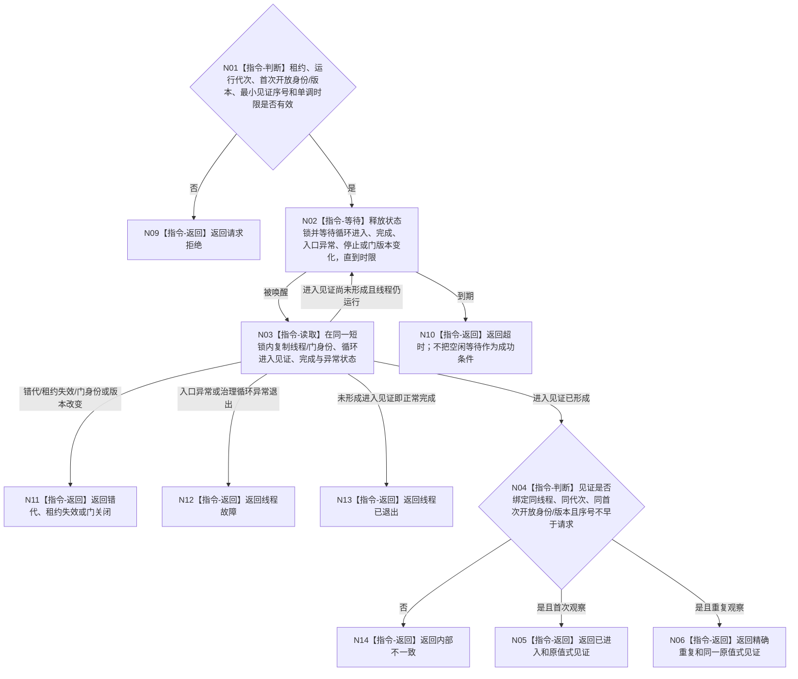

# BIZ-L3-001-08-03 等待自我线程进入治理循环目标函数流程图 v0.1

更新时间：2026-08-27

## 依据

```text
0050、8100、8110、8120 v0.10；BIZ-L2-001-08；BIZ-L3-001-08-01—02；BIZ-L4-001-03-11-01
```

## 身份与边界

正式目标函数设计图。等待自我线程在指定门开放后真实进入 `运行治理循环()` 并取得治理邮箱消费资格的内部见证，不要求线程先处于空闲等待，不等待任何消息、业务处理或治理结果。

## 函数合同

```text
根函数：自我线程::等待进入治理循环
归属模块 / 文件 / 目标分解深度：自我线程 / 海中鱼巣/线程/创建.自我线程.ixx / BIZ-L3
现有或待新增：待新增；HEAD线程入口会调用治理循环，但没有循环进入见证、版本化等待入口或结构化结果
完整签名：自我治理循环进入等待结果 自我线程::等待进入治理循环(const 自我治理循环进入等待请求& 请求) const noexcept
参数：请求为只读借用；含运行代次、线程/门身份、首次门开放身份与版本、期望最小进入见证序号和非零单调时限；普通应用唯一租约覆盖等待
返回结果：值式等待结果；含已进入、精确重复、请求拒绝、超时、线程已退出、线程故障、门关闭、错代、租约失效或内部不一致，以及可选治理循环进入见证
被调函数流程图：无
父图：BIZ-L2-001-08
```

## 流程图



## 节点合同

| 节点 | 类型 | 输入 | 输出 | 事实读写 | 验证 |
| --- | --- | --- | --- | --- | --- |
| N01—N03 | 判断 / 等待 / 读取 | 等待请求与唯一租约借用 | 一个锁内线程协调副本 | 只读线程内部门、进入、完成和异常槽 | 超时、虚假唤醒、错代、门变更和租约失效 |
| N04—N06 | 判断 / 返回 | 已发布治理循环进入见证 | 已进入或精确重复 | 不修改线程状态，不读取业务结果 | 见证同义、序号单调和重复读取 |
| N09—N14 | 返回 | 精确非成功条件 | 结构化非成功 | 不关闭门、不消费治理邮箱 | 退出、故障、门关闭、超时和矛盾互斥 |

## 关键边界

“进入治理循环”只证明线程已经越过运行门并取得治理邮箱消费资格。邮箱此时可以为空，也可以已经积累合法未消费消息；线程可以立即处理消息而不先进入空闲等待，因此旧“进入治理等待态”不能作为成功谓词。

进入见证必须由 `执行线程入口正文()` 在释放状态锁并调用 `运行治理循环()` 前内部发布。8110生命周期投影、门开放读回、消息出队、循环退出结果和父线程布尔值都不能替代该见证。

## 当前代码对应（HEAD `745ef2ae`）

- `执行线程入口正文()` 在门开放后解锁并调用 `运行治理循环()`，真实调用边已经存在。
- 当前对象没有循环进入布尔、进入见证序号或首次开放身份绑定，也没有相应条件等待入口；调用结束后只把局部 `退出结果` 丢弃。
- 本目标只增加进程内线程协调见证，不建立业务事实、DATA节点或第二治理邮箱owner。
