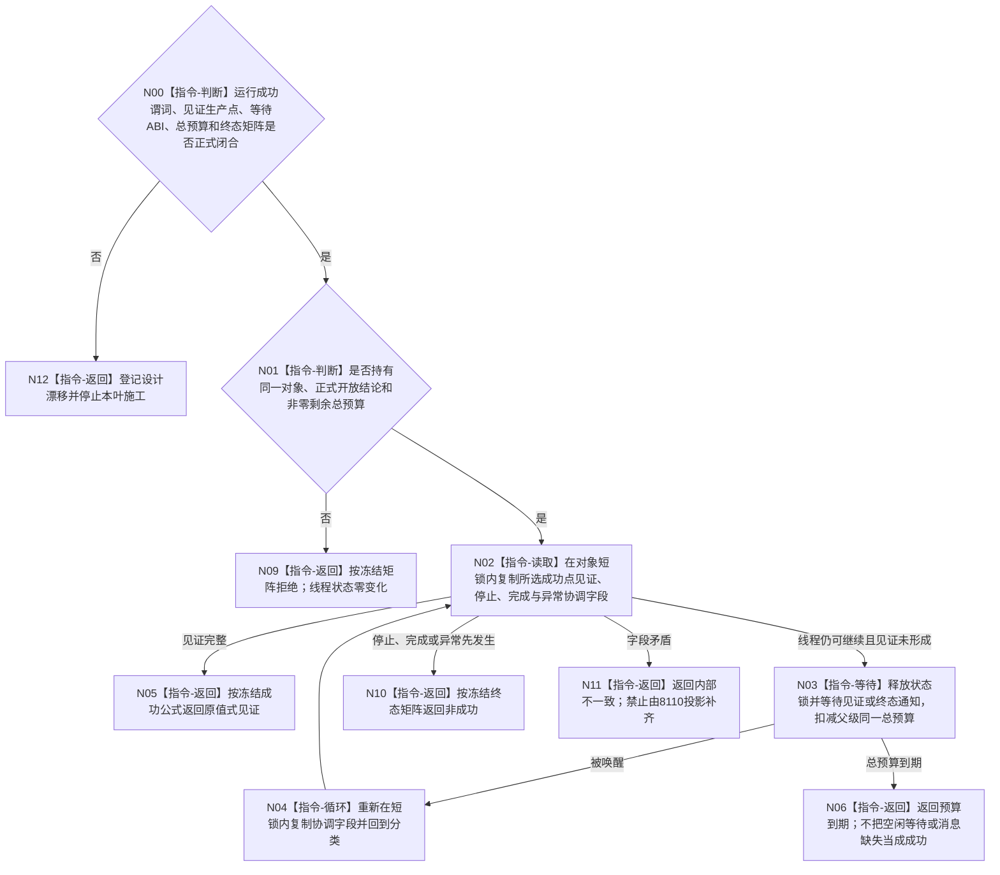

# BIZ-L3-001-08-03 等待自我线程进入治理循环目标函数流程图 v0.2

更新时间：2026-08-28

## 依据

```text
0050、8100、8110、8120 v0.10；BIZ-L1-T01 v0.5、BIZ-L1-T02 v0.6；
BIZ-L2-001-08；BIZ-L3-001-08-01/02 v0.2；当前发布源码：海中鱼巣/线程/创建.自我线程.ixx。
```

## 身份与边界

正式目标治理图。目标是让 T01 在开门后用有限等待观察自我线程是否达到正式冻结的运行成功点，而不是等待邮箱非空、消息出队、业务处理成功或空闲等待。读取和等待都只涉及同一个自我线程对象内的协调状态，不建立业务事实或第二治理邮箱 owner。

当前最大的语义缺口不是“缺一个布尔值”，而是成功点未冻结。旧 v0.1 规定 `执行线程入口正文()` 在调用 `运行治理循环()` 前发布“已进入见证”，但调用前只能证明线程已经越过门并准备调用，不能证明被调函数体已经进入；而 `运行治理循环()` 真正进入后还会立即检查邮箱和三个 provider，可能直接返回内部不一致。必须先在下列候选语义中冻结唯一一种：已经越过门并承诺调用、已经进入函数体、已经通过运行前置，或已经到达首个可消费治理批次的运行点。

成功谓词确定后，见证只能由真正越过该谓词的代码点形成并通知。门开放读回、8110生命周期投影、父级bool、消息出队或调用前预告都不能替代。见证字段、等待入口、单调总预算、虚假唤醒、停止/完成/异常竞态及重复观察矩阵均尚未冻结。

## 函数合同

```text
根函数候选：自我线程::等待进入治理循环
归属模块 / 文件 / 目标分解深度：自我线程 / 海中鱼巣/线程/创建.自我线程.ixx / BIZ-L3
现有或待新增：HEAD只有门等待、门后调用T02和最终完成通知；没有所选运行成功点见证或专属等待入口
完整签名：未冻结；旧 v0.1 的进入等待请求/结果只作目标草图，不构成ABI
参数：未冻结；必须绑定同一对象、08-02正式开放结论、父级剩余总预算及所选成功点的观察下界
返回结果：未冻结；必须区分观察成功、预算到期、开门后停止/完成/异常及内部矛盾，且不推断任何业务批次成功
被调函数流程图：无；所选见证生产点若落入BIZ-L1-T02函数体，必须同步其目标图与代码设计，不得由本等待函数补写
父图：BIZ-L2-001-08
```

## 设计门禁与目标骨架



## 节点合同

| 节点 | 当前可确认合同 | 仍待冻结 | 验证边界 |
| --- | --- | --- | --- |
| N00/N12 | 未冻结运行成功点即停止施工 | 成功谓词、见证生产函数/代码点、字段和通知源 | “调用前”“函数体已进入”“前置通过”不得混写 |
| N01/N09 | 等待只消费同一对象正式开放结论和父级剩余预算 | 请求绑定、预算单位/时钟和观察下界 | 不自建第二时限，不复制线程租约 |
| N02/N05 | 成功只由所选代码点形成的原值式见证证明 | 首次/重复观察语义、序号或版本是否需要 | 门开放、8110、bool、消息出队均为弱证据 |
| N03/N04/N06 | 条件等待必须允许虚假唤醒并扣减同一总预算 | 条件变量、通知源和预算到期状态 | 不等待邮箱为空、业务成功或UI投影 |
| N10/N11 | 停止、完成、异常和矛盾均按冻结矩阵收束 | 开门后快速退出、异常wrapper与见证竞态优先级 | 进入成功不自动证明治理循环持续存活 |

## 冻结发布源码对照（提交 `5d2986c2`）

- `执行线程入口正文()`在`运行门已开放_ && !停止已锁存_`时解锁并调用`运行治理循环()`，但调用前没有发布见证；调用结束后只丢弃局部退出结果。
- `运行治理循环()`函数体入口真实存在，先检查治理邮箱和三个 provider；任一缺失会立即返回内部不一致，因此“函数被调用”和“已具备持续治理能力”不是同一谓词。
- 当前`状态条件_`会在入口/停门形成及最终完成时通知，`治理运行门条件_`只负责唤醒关闭门等待者；没有运行成功点专属见证、通知或有限等待入口。
- 8110发布发生在入口正文的生命周期路径，但正式规范明确其只是只读投影，不能承担内部运行成功见证。

## 具名偏差

1. `DRIFT-BIZ-SELF-GOVERNANCE-LOOP-ENTRY-SUCCESS-PREDICATE-AND-WITNESS-UNFROZEN`：越过门、承诺调用、函数体进入、运行前置通过或首个可消费点尚未裁决为唯一成功谓词，见证生产位置因此不可确定。
2. `DRIFT-BIZ-SELF-GOVERNANCE-LOOP-ENTRY-WAIT-ABI-BUDGET-AND-TERMINAL-MATRIX-UNFROZEN`：等待请求/结果、父级总预算扣减、虚假唤醒、重复观察及停止/完成/异常/矛盾矩阵未冻结。

## 关键边界

```text
调用前发布只能证明调用承诺，不能命名为函数体已经进入。
即使函数体已经进入，也不自动证明运行前置通过、首批可消费或循环持续存活。
空闲等待、邮箱非空、消息出队和业务结果都不是线程运行成功的通用替代物。
```

## v0.2 校正记录

- 撤销旧 v0.1 的进入等待DTO、门/见证版本、最小序号和完整终态矩阵。
- 撤销“调用前见证等于函数已进入”的错误谓词，改为先冻结唯一运行成功点和真实生产位置。
- 保留同对象有限等待、虚假唤醒重读、零治理邮箱消费和不等待业务结果的职责方向。
