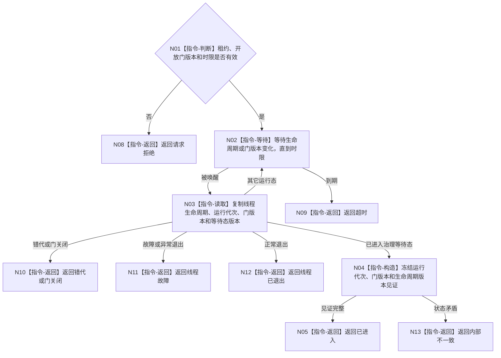

# BIZ-L3-001-08-03 等待自我线程进入治理等待态目标函数流程图 v0.1

更新时间：2026-08-03

## 依据

```text
8100、8110、8120；BIZ-L2-001-08；BIZ-L3-001-08-01—02
```

## 身份与边界

正式目标函数设计图。等待的是自我线程在开放后进入“可接收治理消息的等待态”见证，不等待任何业务结果。

## 函数合同

```text
根函数：自我线程::等待进入治理等待态
归属模块 / 文件 / 层级：自我线程 / 海中鱼巣/线程/自我线程.ixx / L3
现有或待新增：待新增
完整签名：自我治理等待态结果 自我线程::等待进入治理等待态(const 自我治理等待态请求& 请求) const
参数：请求为只读借用；含运行代次、线程租约、已开放门身份和版本、期望生命周期版本及等待时限；租约覆盖等待
返回结果：值式等待结果；含已进入、超时、线程已退出、线程故障、门关闭、错代或内部不一致，以及进入见证
被调函数流程图：无
父图：BIZ-L2-001-08
```

## 流程图



## 节点合同

| 节点 | 类型 | 输入 | 输出 | 事实读写 | 验证 |
| --- | --- | --- | --- | --- | --- |
| N01—N03 | 判断 / 等待 / 读取 | 等待请求 | 生命周期副本 | 只读线程运行状态 | 超时、伪唤醒、错代 |
| N04—N05 | 构造 / 返回 | 一致状态 | 不可变进入见证 | 无 | 见证字段完整 |
| N08—N13 | 返回 | 非成功条件 | 结构化非成功 | 不改线程状态 | 退出、故障、门关闭互斥 |

## 关键边界

“治理等待态”仅证明自我线程已可消费治理邮箱；不能证明已有需求、任务、方法或结算结果。
