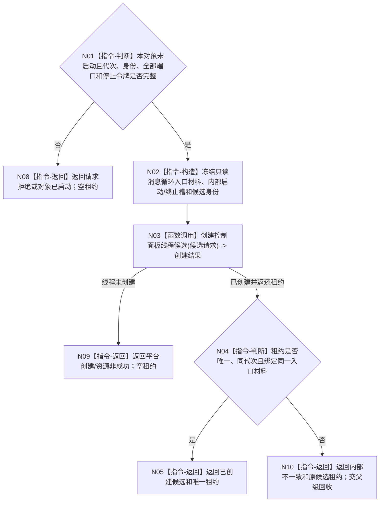

# BIZ-L3-001-09-01 启动控制面板线程入口目标函数流程图 v0.1

更新时间：2026-08-27

## 依据

```text
0050、8100、8110 v0.3、8120 v0.10；BIZ-L2-001-09；BIZ-L1-T05 v0.4
```

## 身份与边界

正式目标函数设计图。只把一个尚未启动的 T05 对象和完整入口材料变成唯一物理线程候选；不等待窗口进入，不把8110投影当资源账或启动成功，不在本函数显示页面或处理UI消息。

## 函数合同

```text
根函数：控制面板线程::启动
归属模块 / 文件 / 目标分解深度：控制面板线程 / 海中鱼巣/线程/控制面板线程.ixx / BIZ-L3
现有或待新增：目标类、模块、入口DTO和候选租约均不存在；HEAD只有启动.应用程序.ixx中的同主题bool空壳
完整签名：控制面板线程入口启动结果 控制面板线程::启动(const 控制面板线程入口启动请求& 请求) noexcept
参数：请求为只读借用；含运行代次、唯一逻辑线程/窗口/候选身份、具名业务只读投影端口组、程序控制消息提交端、唯一8110发布/读取端口、线程亲和窗口端口和宿主停止令牌；全部借用覆盖候选租约
返回结果：移动值式入口启动结果；线程未创建时为空租约，创建后无论后置状态如何都返还唯一候选租约；状态至少分账已创建候选、请求拒绝、对象已启动、平台创建失败、资源失败和内部不一致
被调函数流程图：BIZ-L4-001-09-01-01 创建控制面板线程候选；候选私有入口调用 BIZ-L1-T05 v0.4 运行只读消息循环
父图：BIZ-L2-001-09
```

## 流程图



## 节点合同

| 节点 | 类型 | 输入 | 输出 | 事实读写 | 验证 |
| --- | --- | --- | --- | --- | --- |
| N01—N02 | 判断 / 构造 | 新T05对象和完整入口请求 | 不可变入口材料 | 只写未发布对象内部槽 | 零代次、重复对象、缺端口和借用寿命 |
| N03—N04 | 函数调用 / 判断 | 候选创建请求 | 0..1唯一候选租约 | 只取得本地线程资源；8110创建事件由L4最佳努力旁路发布 | 平台失败、创建后快速退出、结果包装矛盾 |
| N05/N08—N10 | 返回 | 创建结论 | 空租约或唯一候选租约 | 不显示、不读业务事实 | 任一joinable线程必随结果返还 |

## 关键边界

本函数不调用“读取当前线程投影”寻找或裁决候选；候选唯一性只来自本对象内部状态和调用方持有的唯一租约。8110发布失败不回滚已创建线程，也不把候选伪装成未创建；父级仍按内部进入见证决定是否成功或回收。

## 当前代码对应（HEAD `180ea484`）

- HEAD不存在 `海中鱼巣/线程/控制面板线程.ixx`、`控制面板线程` 类、窗口端口或程序控制消息桥。
- 当前同主题能力只有 `bool 按模式启动控制面板线程(启动模式)`；它不创建线程，也没有可供本函数复用的候选状态或租约。
