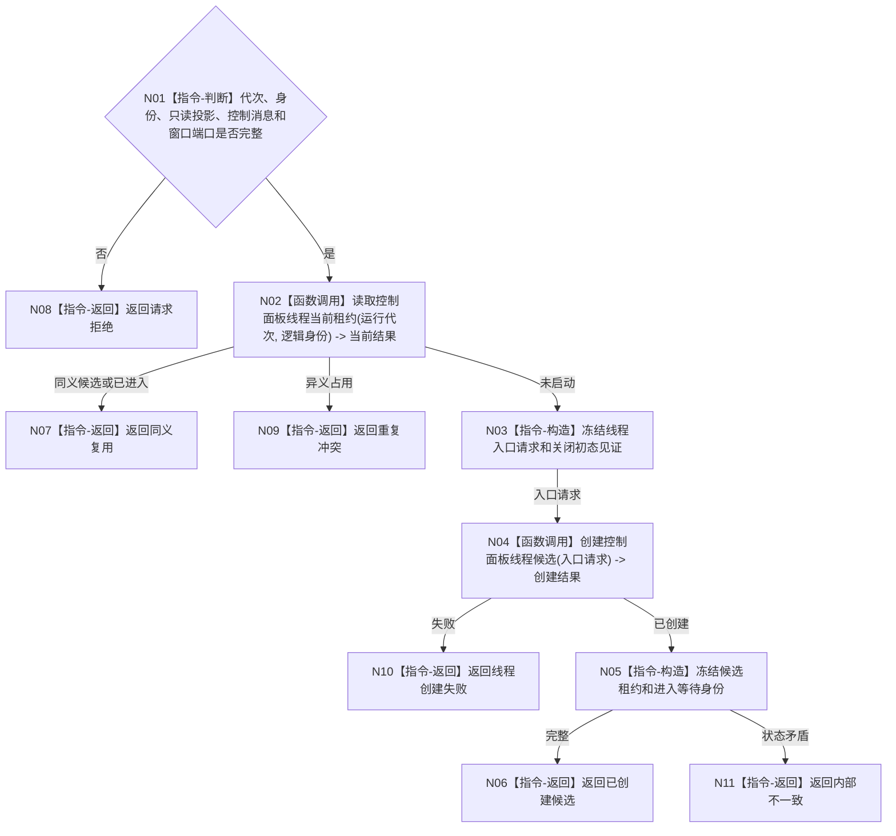

# BIZ-L3-001-09-01 启动控制面板线程入口目标函数流程图 v0.1

更新时间：2026-08-03

## 依据

```text
0050、8110、8120；BIZ-L2-001-09；BIZ-L1-T05；当前控制面板窗口宿主仅作相邻适配证据
```

## 身份与边界

正式目标函数设计图。目标把普通控制面板的窗口消息循环移入唯一独立线程；线程只读投影并发送程序控制消息，不反写业务事实。

## 函数合同

```text
根函数：控制面板线程::启动
归属模块 / 文件 / 层级：控制面板线程 / 海中鱼巣/线程/控制面板线程.ixx / L3
现有或待新增：待新增；复用现有窗口端口和控制面板服务
完整签名：控制面板线程启动结果 控制面板线程::启动(const 控制面板线程启动请求& 请求)
参数：请求为只读借用；含运行代次、唯一逻辑身份、只读投影端口、程序控制消息桥、窗口端口、启动幂等身份和时限；全部借用对象覆盖线程租约
返回结果：值式启动结果；含已创建候选、同义复用、请求拒绝、重复冲突、线程创建失败或内部不一致，以及候选租约和进入等待身份；窗口进入由独立读见证函数裁决
被调函数流程图：BIZ-L4-001-09-01-01创建控制面板线程候选；候选入口复用BIZ-L1-T05运行只读消息循环
父图：BIZ-L2-001-09
```

## 流程图



## 节点合同

| 节点 | 类型 | 输入 | 输出 | 事实读写 | 验证 |
| --- | --- | --- | --- | --- | --- |
| N01—N02 | 判断 / 函数调用 | 启动请求 | 准入和当前租约 | 只读线程投影 | 缺端口、错代、重复 |
| N03—N04 | 构造 / 函数调用 | 已冻结入口请求 | 创建结果 | 只发8110创建消息 | 创建失败、借用生命周期 |
| N05—N11 | 构造 / 返回 | 候选材料 | 候选租约或非成功 | 不显示、不写业务事实 | 候选身份唯一 |

## 关键边界

该函数不以窗口显示成功作为返回前置；进入消息循环和窗口见证由后继读取函数独立确认。
