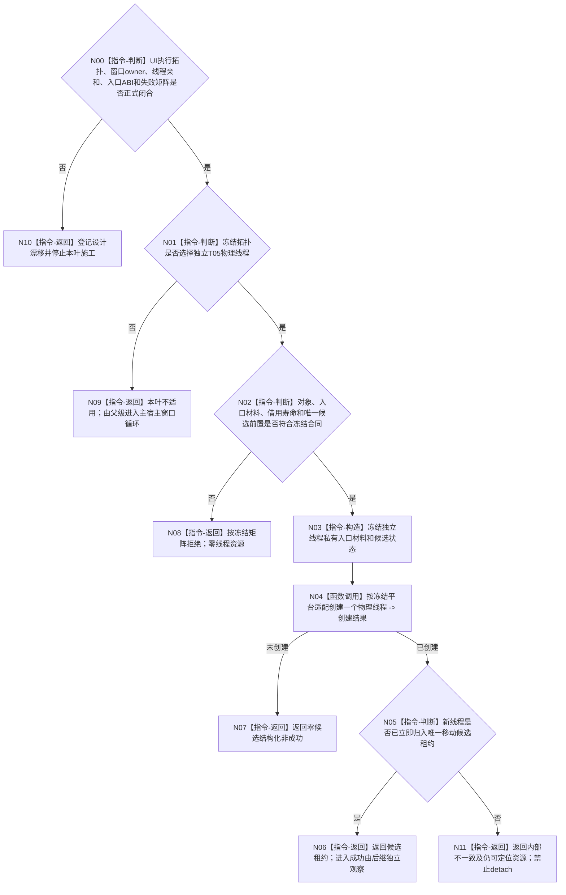

# BIZ-L3-001-09-01 启动控制面板线程入口目标函数流程图 v0.2

更新时间：2026-08-28

## 依据

```text
0050、8100、8110 v0.3、8120 v0.10；BIZ-L1-T01/T05 v0.4；BIZ-L2-001-09；
当前发布源码：海中鱼巣/启动.应用程序.ixx。
```

## 身份与边界

正式目标治理图。8120冻结普通模式必须运行控制面板窗口、无窗口模式执行无窗口等待，并把两者归于程序运行宿主；它没有冻结控制面板必须拥有独立物理线程。旧 v0.1 直接发明`控制面板线程`类、专属模块、线程/窗口/候选身份、移动租约、线程亲和端口和完整失败矩阵，不能施工。

必须先在主宿主线程运行窗口循环与独立T05物理线程之间冻结唯一执行拓扑。若选择主宿主线程，本叶不应实现而应退出，控制面板循环由宿主直接调用；只有正式选择独立线程后，本叶才取得候选创建职责。无论哪种拓扑，控制面板只读投影和程序停止请求职责保持，8110只作诊断投影。

## 函数合同

```text
根函数候选：控制面板线程::启动
归属模块 / 文件 / 目标分解深度：待拓扑裁决 / 物理文件待冻结 / BIZ-L3
现有或待新增：发布源码没有控制面板线程、窗口或消息循环；同主题bool只判断模式并返回true
完整签名：未冻结；旧 v0.1 的入口请求/结果不构成ABI
参数：未冻结；仅在独立线程拓扑成立后才设计窗口owner、只读投影端、程序控制端、停止源和借用寿命
返回结果：未冻结；独立线程方案必须守恒0..1唯一候选租约，主线程方案则本叶不适用
被调函数流程图：旧BIZ-L4-001-09-01-01只作候选资源守恒方向草图；BIZ-L1-T05的物理调用方式待拓扑冻结
父图：BIZ-L2-001-09
```

## 设计门禁与目标骨架



## 节点合同

| 节点 | 当前可确认合同 | 仍待冻结 | 验证边界 |
| --- | --- | --- | --- |
| N00/N10 | 物理拓扑未选即停止施工 | 主线程/独立线程选择、窗口owner、消息循环宿主 | BIZ编号和8110线程类别都不能证明必须新建线程 |
| N01/N09 | 主宿主方案使本叶退出 | 宿主直接调用接口和生命周期收口 | 不为统一图形创建隐藏线程或伪租约 |
| N02—N04 | 独立线程方案才允许取得本地线程资源 | 请求/结果、窗口端、借用寿命、平台适配 | 创建线程不等于窗口/循环已进入 |
| N05—N11 | 任一已创建线程必须进入唯一租约或保持可定位 | 候选owner、快速退出、资源失败和回收矩阵 | 零detach、零joinable析构、8110发布失败不丢资源 |

## 冻结发布源码对照（提交 `655a2bf3`）

- `bool 按模式启动控制面板线程(启动模式)`对无窗口返回true，对普通模式也只比较枚举并返回true，不创建线程、窗口或租约。
- 普通控制面板和无窗口当前都进入`运行无窗口宿主`；没有窗口消息循环、程序控制消息桥或UI线程亲和实现。
- 8110已支持控制面板线程类别，但类别与只读投影能力不能决定物理线程拓扑或充当资源账。

## 具名偏差

1. `DRIFT-BIZ-CONTROL-PANEL-EXECUTION-TOPOLOGY-WINDOW-OWNER-AND-THREAD-AFFINITY-UNFROZEN`：主宿主或独立T05、窗口owner、消息循环宿主和线程亲和边界未冻结。
2. `DRIFT-BIZ-CONTROL-PANEL-CANDIDATE-LEASE-ENTRY-ABI-AND-FAILURE-MATRIX-UNFROZEN`：仅在独立线程方案下需要的候选租约、入口DTO、进入/快速退出和失败回收矩阵未冻结。

## v0.2 校正记录

- 撤销旧 v0.1 对独立T05类、文件、DTO、身份、端口、租约和矩阵的提前冻结。
- 将物理拓扑裁决置于候选创建之前；主宿主方案下本叶明确退出。
- 保留只读显示、程序停止请求、8110非权威投影及独立线程方案下资源守恒方向。
