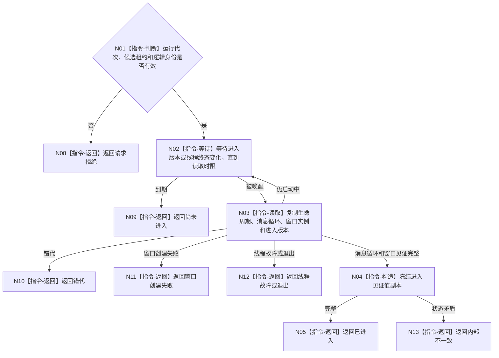

# BIZ-L3-001-09-02 读取控制面板线程进入见证目标函数流程图 v0.1

更新时间：2026-08-03

## 依据

```text
8110、8120；BIZ-L2-001-09；BIZ-L1-T05；BIZ-L3-001-09-01
```

## 身份与边界

正式目标函数设计图。见证只证明控制面板线程已进入自己的消息循环并持有当前窗口实例，不证明业务初始化或任何投影内容正确。

## 函数合同

```text
根函数：控制面板线程::读取进入见证
归属模块 / 文件 / 层级：控制面板线程 / 海中鱼巣/线程/控制面板线程.ixx / L3
现有或待新增：待新增
完整签名：控制面板线程进入见证结果 控制面板线程::读取进入见证(const 控制面板线程进入见证请求& 请求) const
参数：请求为只读借用；含运行代次、候选租约、预期逻辑身份、窗口实例身份和读取时限；租约覆盖读取等待
返回结果：调用方拥有的值式结果；含已进入、尚未进入、窗口创建失败、线程故障、线程退出、错代或内部不一致，以及进入版本和窗口实例见证
被调函数流程图：无
父图：BIZ-L2-001-09
```

## 流程图



## 节点合同

| 节点 | 类型 | 输入 | 输出 | 事实读写 | 验证 |
| --- | --- | --- | --- | --- | --- |
| N01—N03 | 判断 / 等待 / 读取 | 见证请求 | 当前线程和窗口副本 | 只读8110投影与窗口载体状态 | 超时、伪唤醒、错代 |
| N04—N05 | 构造 / 返回 | 一致进入材料 | 不可变见证 | 无 | 进入版本和窗口身份完整 |
| N08—N13 | 返回 | 非成功条件 | 结构化非成功 | 不改业务事实 | 失败类型互斥 |

## 关键边界

窗口句柄、显示状态和界面文本都不能作为业务身份或业务完成证据；调用方只保留值式见证。

