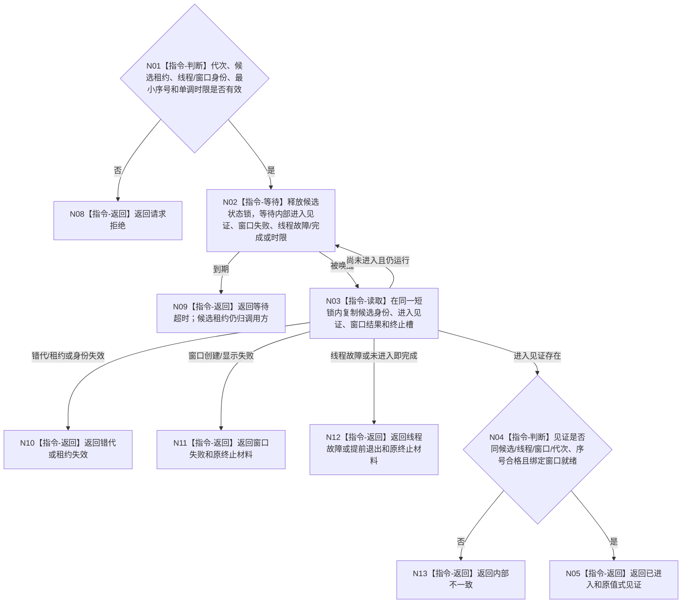

# BIZ-L3-001-09-02 读取控制面板线程进入见证目标函数流程图 v0.1

更新时间：2026-08-27

## 依据

```text
0050、8110 v0.3、8120 v0.10；BIZ-L2-001-09；BIZ-L1-T05 v0.4；BIZ-L3-001-09-01
```

## 身份与边界

正式目标函数设计图。只等待候选线程内部发布的“窗口已创建显示且只读消息循环已取得消费资格”见证，或读取同一候选的终止原因。它不读取8110投影裁决进入，不轮询窗口句柄、标题或可见性，也不等待首次页面刷新或任何业务投影成功。

## 函数合同

```text
根函数：控制面板线程::读取进入见证
归属模块 / 文件 / 目标分解深度：控制面板线程 / 海中鱼巣/线程/控制面板线程.ixx / BIZ-L3
现有或待新增：待新增；HEAD无T05对象、内部进入/终止槽或结构化等待入口
完整签名：控制面板线程进入见证结果 控制面板线程::读取进入见证(const 控制面板线程进入见证请求& 请求) const noexcept
参数：请求为只读借用；含运行代次、候选租约身份、预期逻辑线程/窗口身份、期望最小见证序号和非零单调剩余时限；候选租约覆盖等待
返回结果：调用方拥有的值式结果；含已进入、请求拒绝、等待超时、窗口创建或显示失败、线程故障、线程提前退出、错代、租约失效或内部不一致，以及可选进入见证或终止材料
被调函数流程图：无；条件等待、伪唤醒复核和内部值式槽复制为本函数内指令
父图：BIZ-L2-001-09
```

## 流程图



## 节点合同

| 节点 | 类型 | 输入 | 输出 | 事实读写 | 验证 |
| --- | --- | --- | --- | --- | --- |
| N01—N03 | 判断 / 等待 / 读取 | 见证请求和唯一候选租约 | 一个锁内的内部状态副本 | 只读T05对象内部协调槽 | 超时、虚假唤醒、快速失败、错代 |
| N04—N05 | 判断 / 返回 | 内部进入见证 | 已进入和原值见证 | 无业务写入 | 同候选、同窗口、序号和窗口就绪绑定 |
| N08—N13 | 返回 | 精确非成功条件 | 结构化终止或请求结果 | 不关闭、不连接、不丢租约 | 失败类型互斥和载荷闭合 |

## 关键边界

8110当前投影、生命周期消息、窗口句柄存在、窗口标题、显示文本和首次页面刷新都不是启动成功谓词。内部进入见证在 BIZ-L1-T05 N03 真实完成窗口创建/显示后、进入等待消息的循环前发布；它只证明T05可运行，不证明业务初始化或投影内容正确。
