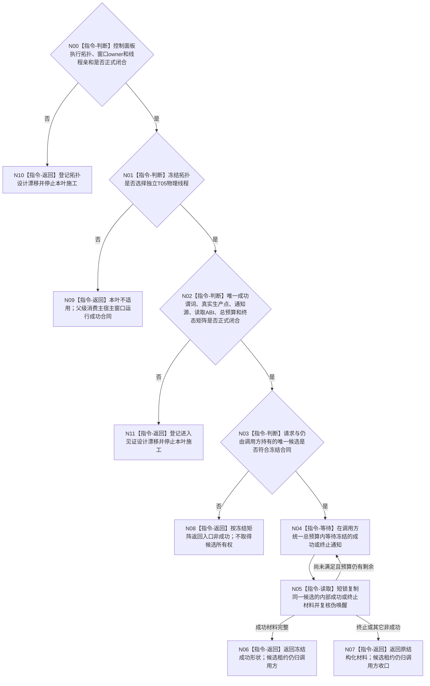

# BIZ-L3-001-09-02 读取控制面板线程进入见证目标函数流程图 v0.2

更新时间：2026-08-28

## 依据

```text
0050、8100、8110 v0.3、8120 v0.10；BIZ-L1-T01/T05 v0.4；
BIZ-L2-001-09；BIZ-L3-001-09-01 v0.2；
HEAD 海中鱼巣/启动.应用程序.ixx。
```

## 身份与边界

正式目标治理图。8120只要求普通模式由程序运行宿主运行控制面板窗口，没有冻结控制面板必须位于独立T05物理线程。旧 v0.1 直接冻结`控制面板线程`类、候选/线程/窗口身份、进入见证序号、单调等待时限和完整终态矩阵，也直接选择“窗口已创建显示且消息循环已取得消费资格”为唯一成功谓词；这些内容均没有现行正式依据。

必须先冻结主宿主线程窗口循环或独立T05物理线程的唯一拓扑。若选择主宿主线程，本“跨线程读取进入见证”叶不适用，父级只能消费正式冻结的宿主窗口运行成功合同；只有选择独立T05物理线程后，本叶才取得读取线程内部成功或终止材料的职责。即使选择独立线程，也必须先从“越过窗口运行入口”“窗口资源完整建立”“消息循环函数体已进入”“到达首个可消费控制消息点”等候选中冻结唯一成功谓词及真实生产点，不能由本图自行选择。

## 函数合同

```text
根函数候选：控制面板线程::读取进入见证
归属模块 / 文件 / 目标分解深度：待拓扑裁决 / 物理文件待冻结 / BIZ-L3
现有或待新增：HEAD没有控制面板线程、窗口、消息循环、内部进入/终止槽或结构化等待入口
完整签名：未冻结；旧 v0.1 的请求、结果和状态枚举不构成ABI
参数：未冻结；仅在独立线程拓扑成立后，才能设计候选定位、期望成功点、调用方总预算中的剩余预算和借用寿命
返回结果：未冻结；必须区分成功、仍未到达成功点、已终止和调用方可安全继续收口的结构化非成功，但不得提前发明状态数值或载荷
被调函数流程图：无；若合同闭合，等待、伪唤醒复核和内部槽复制均为本函数内指令
父图：BIZ-L2-001-09
```

## 设计门禁与目标骨架



## 节点合同

| 节点 | 当前可确认合同 | 仍待冻结 | 验证边界 |
| --- | --- | --- | --- |
| N00/N01/N09/N10 | 先裁决物理拓扑；主宿主方案使本叶退出 | 主宿主/独立T05、窗口owner和线程亲和 | BIZ编号、8110线程类别和页面需求都不能证明必须跨线程等待 |
| N02/N11 | 独立线程方案仍须先冻结一个唯一成功点 | 成功谓词、生产位置、先写状态后通知顺序、请求/结果和终态矩阵 | 窗口句柄、可见性、标题、页面文本和8110投影均为弱证据 |
| N03—N05 | 若合同闭合，只能在调用方统一总预算内等待并在短锁下复核 | 候选定位字段、预算单位、关闭/快速退出/伪唤醒映射 | 本叶不移动、关闭、连接或遗失候选租约 |
| N06/N07 | 原值返回正式成功或终止材料，供父级继续或收口 | 成功和全部非成功的载荷规则 | 读取成功不证明业务投影、页面刷新或整个程序已经成功 |

## 当前代码对应（HEAD `7e688332`）

- `bool 按模式启动控制面板线程(启动模式)`只判断无窗口/普通控制面板枚举并返回`bool`，不创建线程、窗口、候选或进入材料。
- 普通控制面板和无窗口当前都进入`运行无窗口宿主`；HEAD没有`海中鱼巣/线程/控制面板线程.ixx`、界面目录、窗口消息循环或程序控制消息桥。
- 8110线程生命周期投影支持“控制面板线程”类别，但只作只读运行诊断，不能决定物理拓扑、唯一成功点或跨线程进入事实。

## 具名偏差

1. `DRIFT-BIZ-CONTROL-PANEL-ENTRY-SUCCESS-PREDICATE-WITNESS-AND-NOTIFY-UNFROZEN`：独立线程方案下的唯一成功谓词、真实生产点、见证字段及先可见后通知合同未冻结。
2. `DRIFT-BIZ-CONTROL-PANEL-ENTRY-READ-ABI-BUDGET-AND-TERMINAL-MATRIX-UNFROZEN`：读取请求/结果、调用方统一预算、伪唤醒、快速终止和全部终态矩阵未冻结。

## v0.2 校正记录

- 撤销旧 v0.1 对独立T05类、文件、请求/结果、身份、序号、时限及终态矩阵的提前冻结。
- 把拓扑裁决置于跨线程见证读取之前；主宿主方案下本叶明确退出。
- 不再把窗口显示、消息循环进入或首个可消费点混成既定成功；保留独立线程方案下“内部真实状态先可见、再通知、父级有限等待”的职责方向。
