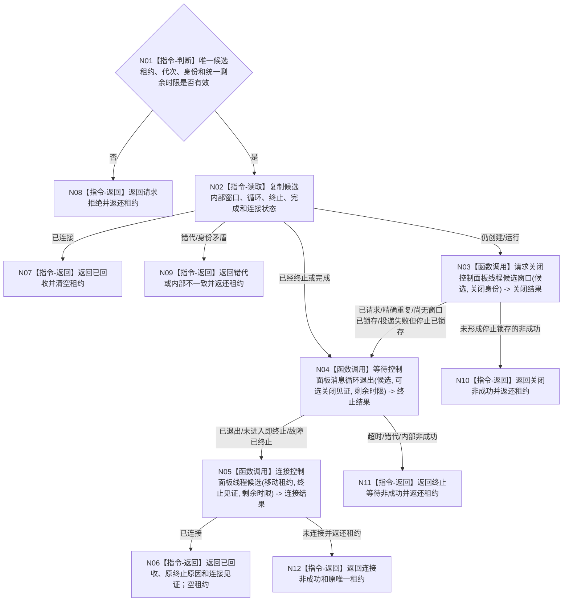

# BIZ-L3-001-09-03 停止并连接控制面板线程启动候选目标函数流程图 v0.1

更新时间：2026-08-27

## 依据

```text
0050、8110 v0.3、8120 v0.10；BIZ-L2-001-09；BIZ-L1-T05 v0.4；BIZ-L3-001-09-01—02
```

## 身份与边界

正式目标函数设计图。只收束尚未提升为正式T05启动结果的唯一候选。无论候选仍在创建窗口、已经进入消息循环、窗口创建失败还是线程故障，只要底层线程已经存在，就必须按“请求停止/锁存 -> 取得终止见证 -> 等待入口完成 -> join”收束；任何未连接结果都返还唯一租约。

## 函数合同

```text
根函数：停止并连接控制面板线程启动候选
归属模块 / 文件 / 目标分解深度：线程启动协调 / 海中鱼巣/启动.线程组协调.ixx / BIZ-L3
现有或待新增：待新增；HEAD无T05候选、停止锁存、终止见证或结构化join入口
完整签名：控制面板线程候选回收结果 停止并连接控制面板线程启动候选(控制面板线程候选租约&& 候选租约, const 控制面板线程候选回收请求& 请求) noexcept
参数：候选租约为唯一移动所有权；请求为只读借用，含运行代次、逻辑线程/候选身份、关闭幂等身份和统一非零单调剩余时限
返回结果：移动值式回收结果；含已回收、请求拒绝、错代、身份错配、关闭请求失败、终止等待超时、完成等待超时或内部不一致；全部未连接状态返还原唯一租约，已连接才清空租约
被调函数流程图：BIZ-L4-001-09-03-01 请求关闭控制面板线程候选窗口；BIZ-L4-001-09-03-02 等待控制面板消息循环退出；BIZ-L4-001-09-03-03 连接控制面板线程候选
父图：BIZ-L2-001-09
```

## 流程图



## 节点合同

| 节点 | 类型 | 输入 | 输出 | 事实读写 | 验证 |
| --- | --- | --- | --- | --- | --- |
| N01—N03 | 判断 / 读取 / 函数调用 | 唯一候选和统一截止 | 关闭资格或已终止状态 | 只改候选停止锁存并线程亲和投递窗口关闭 | 无窗口、窗口创建中、已进入、快速失败 |
| N04—N05 | 函数调用 | 候选、可选关闭见证和剩余时限 | 终止/完成见证与join结果 | 只读内部槽并释放本地线程资源 | 故障也继续join、虚假唤醒、截止耗尽 |
| N06—N12 | 返回 | 回收结论 | 空租约成功或原唯一租约非成功 | 不写业务事实 | 租约守恒、禁止detach和双join |

## 关键边界

候选窗口关闭只是资源回收步骤，不形成程序停止、任务完成或业务结果。窗口创建失败、线程故障和“从未进入消息循环”不是跳过join的理由；它们只改变终止原因。统一时限耗尽时必须把joinable候选原样返还T01，由共同收口继续持有，不能让局部析构终止进程。
