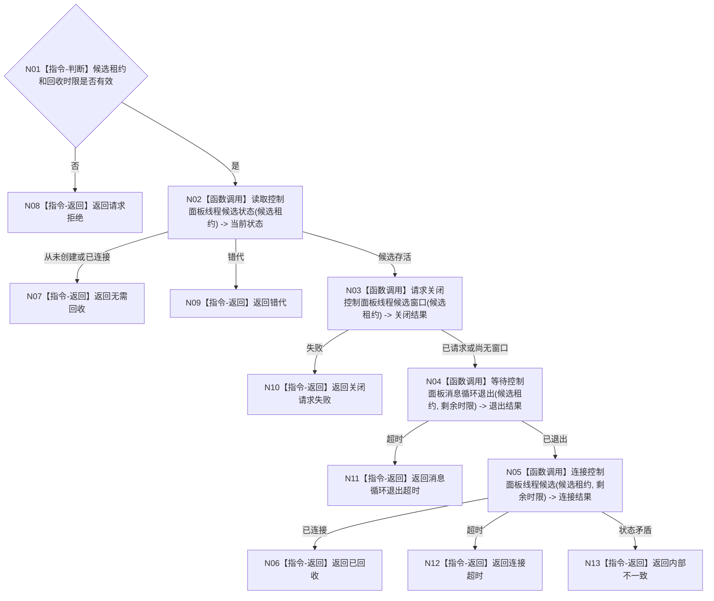

# BIZ-L3-001-09-03 停止并连接控制面板线程启动候选目标函数流程图 v0.1

更新时间：2026-08-03

## 依据

```text
8110、8120；BIZ-L2-001-09；BIZ-L1-T05；BIZ-L3-001-09-01—02
```

## 身份与边界

正式目标函数设计图。只收束尚未形成完整进入见证的控制面板启动候选；不代表普通宿主已经停止。

## 函数合同

```text
根函数：停止并连接控制面板线程启动候选
归属模块 / 文件 / 层级：线程启动协调 / 海中鱼巣/启动.线程组协调.ixx / L3
现有或待新增：待新增
完整签名：控制面板线程候选回收结果 停止并连接控制面板线程启动候选(控制面板线程候选租约&& 候选租约, const 控制面板线程候选回收请求& 请求) noexcept
参数：候选租约为唯一移动所有权；请求为只读借用，含运行代次、逻辑身份、窗口候选身份、关闭幂等身份和回收时限
返回结果：移动值式回收结果；含已回收、无需回收、关闭请求失败、消息循环退出超时、连接超时、错代或内部不一致；全部未连接结果返还唯一租约
被调函数流程图：BIZ-L4-001-09-03-01 请求关闭控制面板线程候选窗口；BIZ-L4-001-09-03-02 等待控制面板消息循环退出；BIZ-L4-001-09-03-03 连接控制面板线程候选
父图：BIZ-L2-001-09
```

## 流程图



## 节点合同

| 节点 | 类型 | 输入 | 输出 | 事实读写 | 验证 |
| --- | --- | --- | --- | --- | --- |
| N01—N02 | 判断 / 函数调用 | 候选租约和时限 | 准入与状态 | 只读线程/窗口载体状态 | 空租约、错代、已连接 |
| N03—N05 | 函数调用 | 候选租约 | 关闭、退出和连接结果 | 只操作当前候选窗口与线程 | 创建中失败、无窗口、退出超时 |
| N06—N13 | 返回 | 回收结论 | 结构化结果 | 不写业务事实 | 状态矛盾归内部不一致 |

## 关键边界

关闭窗口只是候选回收步骤；它不得生成程序停止已经完成、任务已经收口或业务结果已经发布的结论。
