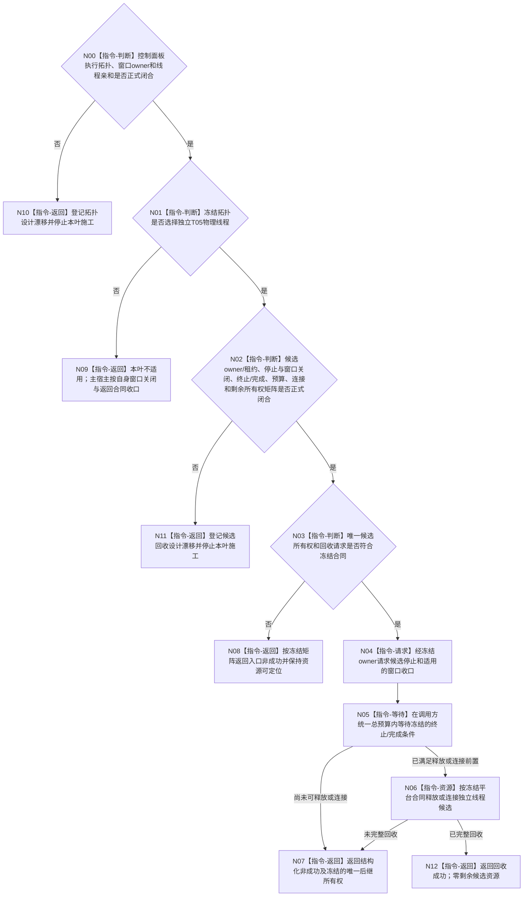

# BIZ-L3-001-09-03 停止并连接控制面板线程启动候选目标函数流程图 v0.2

更新时间：2026-08-28

## 依据

```text
0050、8100、8110 v0.3、8120 v0.10；BIZ-L1-T01/T05 v0.4；
BIZ-L2-001-09；BIZ-L3-001-09-01/02 v0.2；
HEAD 海中鱼巣/启动.应用程序.ixx。
```

## 身份与边界

正式目标治理图。8120没有冻结独立T05物理线程；若选择主宿主线程运行窗口循环，就不存在独立T05启动候选，本叶不适用，窗口关闭和宿主返回由主宿主合同承接。只有正式选择独立T05，并由09-01冻结候选owner/租约、由09-02冻结运行成功与终止边界后，本叶才取得未提升候选的安全回收职责。

旧 v0.1 直接冻结线程启动协调模块、移动候选租约、关闭幂等身份、统一单调时限、停止锁存、线程亲和窗口关闭、循环终止见证、外层wrapper完成见证、三段L4函数和完整join矩阵；现行正式材料没有支持这些具体ABI与分解。当前只能冻结资源守恒方向：已经创建的独立物理线程候选必须始终有唯一可定位owner；未安全释放或连接时不得丢失、detach、清空租约或让joinable资源进入无主析构。

## 函数合同

```text
根函数候选：停止并连接控制面板线程启动候选
归属模块 / 文件 / 目标分解深度：待拓扑与回收owner裁决 / 物理文件待冻结 / BIZ-L3
现有或待新增：HEAD没有T05候选、停止接口、窗口关闭端口、内部终止/完成材料或结构化连接入口
完整签名：未冻结；旧 v0.1 的移动租约、请求、结果和状态枚举不构成ABI
参数：未冻结；仅在独立T05方案成立后，才能设计候选所有权交付、停止原因、调用方统一预算和09-02材料绑定
返回结果：未冻结；必须证明候选已安全回收，或把仍可继续收口的唯一资源所有权明确交给冻结后继owner；不得提前发明状态数值或载荷
被调函数流程图：旧BIZ-L4-001-09-03-01—03仅作职责候选，不是已经闭合的三段公开函数
父图：BIZ-L2-001-09
```

## 设计门禁与目标骨架



## 节点合同

| 节点 | 当前可确认合同 | 仍待冻结 | 验证边界 |
| --- | --- | --- | --- |
| N00/N01/N09/N10 | 先裁决物理拓扑；主宿主方案没有T05候选 | 主宿主/独立T05、窗口owner和线程亲和 | 不为统一两种模式制造隐藏线程、伪候选或伪join |
| N02/N11 | 独立线程方案必须先闭合完整回收合同 | 回收owner、租约形态、停止接口、窗口关闭、终止/完成谓词、预算、连接和后继owner | 09-02运行成功点与本叶终止点必须一致设计，不能各自发明 |
| N03—N05 | 已创建候选始终保持唯一可定位，并在统一预算内收口 | 请求/结果字段、快速失败、无窗口、故障、伪唤醒和超时矩阵 | 8110投影、窗口句柄消失或日志都不能证明线程可释放 |
| N06/N07/N12 | 只有平台资源确已释放/连接才清空候选；否则交付唯一后继所有权 | 一个或多个内部终止点、平台连接错误和共同收口owner | 零detach、零joinable无主析构、零双连接、零租约丢失 |

## 当前代码对应（HEAD `1b5fc97e`）

- `按模式启动控制面板线程(启动模式)`仍只返回`bool`；没有创建控制面板线程或候选，因而也没有可执行的T05回收路径。
- 普通控制面板和无窗口当前都进入`运行无窗口宿主`；HEAD没有控制面板窗口、消息循环、窗口关闭端口或程序控制消息桥。
- 仓库其它线程的`join`与候选实现只能证明局部实现形状存在，不能自动冻结控制面板候选的owner、成功/终止点、预算或状态矩阵。

## 具名偏差

1. `DRIFT-BIZ-CONTROL-PANEL-CANDIDATE-RECOVERY-OWNER-STOP-AND-WINDOW-CLOSE-CONTRACT-UNFROZEN`：独立T05候选的回收owner、所有权交付、停止语义及窗口线程亲和关闭合同未冻结。
2. `DRIFT-BIZ-CONTROL-PANEL-CANDIDATE-TERMINATION-COMPLETION-JOIN-BUDGET-AND-LEASE-MATRIX-UNFROZEN`：终止/完成谓词数量与生产点、总预算、平台连接及全部未回收所有权矩阵未冻结。

## v0.2 校正记录

- 撤销旧 v0.1 对移动租约、关闭幂等身份、三段L4函数、两个内部见证、统一时限和join结果矩阵的提前冻结。
- 把拓扑裁决置于候选回收之前；主宿主方案下本叶明确退出。
- 保留独立线程方案下资源守恒方向：已创建候选必须唯一可定位，完整回收前不得detach、清空或遗失所有权。
