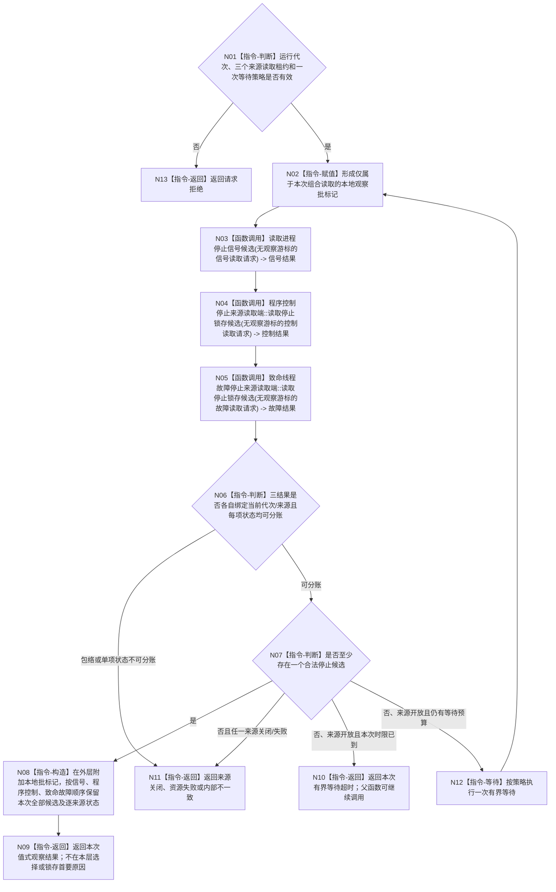

# BIZ-L3-001-10-01 等待任一停止来源目标函数流程图 v0.1

更新时间：2026-08-28

## 依据

```text
0050、8110 v0.3、8120 v0.10；BIZ-L2-001-10；目标线程归属与跨线程材料；确认稿第30项
```

## 身份与边界

正式目标函数设计图。对同一运行代次的进程信号锁存、程序控制停止锁存和致命线程故障停止来源执行一次或多次有界观察，只产生本次调用拥有的完整值式观察结果、超时或结构化非成功。它不裁决停止阶段、不停止任何线程，也不从普通生命周期投影推导致命性；通知只负责唤醒，首条验真候选的不可逆锁存由父函数 BIZ-L2-001-10 唯一负责。

“本地观察批标记”只由本函数用于区分同一次三来源读取，不进入任何来源拥有体，也不要求三个来源保存或返回该标记。结果中的 0..3 项候选是本次栈上读取结果的规范排序，不是来源队列、候选缓存或持久历史。

## 函数合同

```text
根函数：等待任一停止来源
归属模块 / 文件 / 目标分解深度：程序运行宿主 / 海中鱼巣/启动.程序运行宿主.ixx / BIZ-L3
现有或待新增：待新增；复用现有停止信号租约；致命来源受 DRIFT-BIZ-HOST-FATAL-FAULT-CLASSIFIER-AND-SOURCE-ABI-UNFROZEN 限制
完整签名：程序停止来源观察结果 等待任一停止来源(const 程序停止来源等待请求& 请求)
参数：请求为只读借用；含运行代次、三类来源读取租约和一次有界等待策略；各租约覆盖调用；不携带业务事实截止
返回结果：值式观察结果；含本次观察的本地批标记、按固定来源顺序保存的0..3项合法候选、逐来源状态、超时、来源关闭、请求拒绝、资源失败或内部不一致
被调函数流程图：BIZ-L4-001-10-01-01 读取进程停止信号候选；BIZ-L4-001-10-01-02 程序控制停止来源读取端::读取停止锁存候选；BIZ-L4-001-10-01-03 致命线程故障停止来源读取端::读取停止锁存候选
父图：BIZ-L2-001-10
```

## 流程图



## 节点合同

| 节点 | 类型 | 输入 | 输出 | 事实读写 | 验证 |
| --- | --- | --- | --- | --- | --- |
| N01—N02 | 判断 / 指令 | 等待请求 | 准入和本地批标记 | 只读来源状态；本地标记不写入来源 | 缺租约、错代和坏等待策略 |
| N03—N05 | 函数调用 | 三个无游标来源读取请求 | 三个值式来源结果 | 三类来源均非破坏性只读 | 旧代次、无候选、来源关闭及来源独立重复读取 |
| N06—N12 | 判断 / 构造 / 等待 / 返回 | 三来源结果和剩余时限 | 本次候选组、逐来源状态、超时或零候选非成功 | 不锁存停止阶段、不停止线程、不保存历史 | 有候选优先保留；零候选时才由来源关闭/失败结束等待 |

## 关键边界

- 固定读取顺序只提供本次组合结果的确定性，不伪造物理发生顺序。父函数只在同一值式观察结果内按该顺序验真和锁存。
- 程序控制通知和其它唤醒信号都不构成停止候选；每项必须重读自己的来源锁存。重复观察不消费已经成立的候选。
- 三个来源彼此独立。一个来源关闭、错代或内部失败不能覆盖同次另一个已成立候选；有候选时返回候选并携带其它来源状态，只有零候选时来源关闭或失败才终止本轮等待。
- 线程普通退出不是停止来源；致命分类及其提交 ABI 未冻结前，致命来源叶和本组合根均不得进入代码计划。
- 本函数不保存全部后到致命故障，也不按严重度重排。若需要该能力，须先闭合具名 DRIFT 中的历史 owner、排序与完整读取合同。
- 当前代码只实现单信号位轮询；三来源有界观察、T01本地观察包络和完整逐来源状态尚未实现。

## 2026-08-28 校正记录

- 将观察批序号收回组合函数本地值式包络，三个来源均不持久化、不接收也不返回该标记。
- 明确0..3项候选只是本次读取结果，不是观察端口、队列、缓存或历史账。
- 致命来源分类与逐字段 ABI 继续由具名 DRIFT 阻断。
