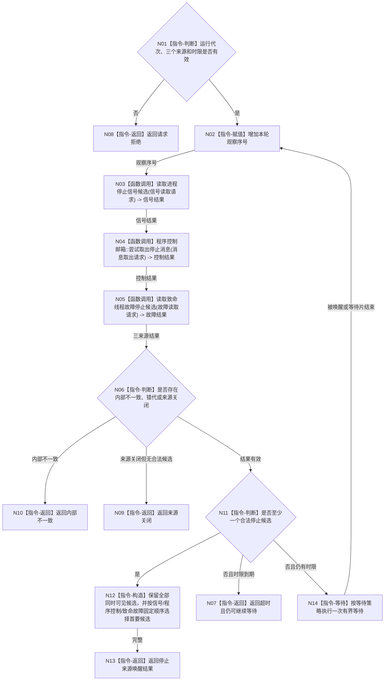

# BIZ-L3-001-10-01 等待任一停止来源目标函数流程图 v0.1

更新时间：2026-08-03

## 依据

```text
0050、8110、8120；BIZ-L2-001-10；目标线程归属与跨线程材料
```

## 身份与边界

正式目标函数设计图。统一等待进程信号、程序控制消息和具名致命线程故障，只产生停止候选，不直接停止任何线程。

## 函数合同

```text
根函数：等待任一停止来源
归属模块 / 文件 / 层级：程序运行宿主 / 海中鱼巣/启动.程序运行宿主.ixx / L3
现有或待新增：待新增；复用现有停止信号租约
完整签名：程序停止来源唤醒结果 等待任一停止来源(const 程序停止来源等待请求& 请求)
参数：请求为只读借用；含运行代次、停止信号租约、程序控制邮箱、线程故障观察端口和等待时限；各来源所有者覆盖等待
返回结果：值式唤醒结果；含信号候选、程序控制候选、致命故障候选、超时、来源关闭、请求拒绝或内部不一致，并保留来源身份和观察顺序
被调函数流程图：BIZ-L4-001-10-01-01 读取进程停止信号候选；BIZ-L4-001-10-01-02 程序控制邮箱::尝试取出停止消息；BIZ-L4-001-10-01-03 读取致命线程故障停止候选
父图：BIZ-L2-001-10
```

## 流程图



## 节点合同

| 节点 | 类型 | 输入 | 输出 | 事实读写 | 验证 |
| --- | --- | --- | --- | --- | --- |
| N01—N02 | 判断 / 指令 | 等待请求 | 准入和观察序号 | 只读来源状态 | 缺端口、错代 |
| N03—N05 | 函数调用 | 三个具名来源请求 | 三个值式结果 | 只有程序控制邮箱移动一条已确认消息 | 同时到达、旧代次和来源关闭 |
| N06—N14 | 判断 / 构造 / 等待 / 返回 | 三来源结果和剩余时限 | 候选组、首要候选或超时 | 不停止线程 | 稳定优先序、伪唤醒和内部错误分离 |

## 关键边界

线程普通退出不是停止来源；是否把故障认定为致命必须由输入端口在本函数外按正式合同裁决。
