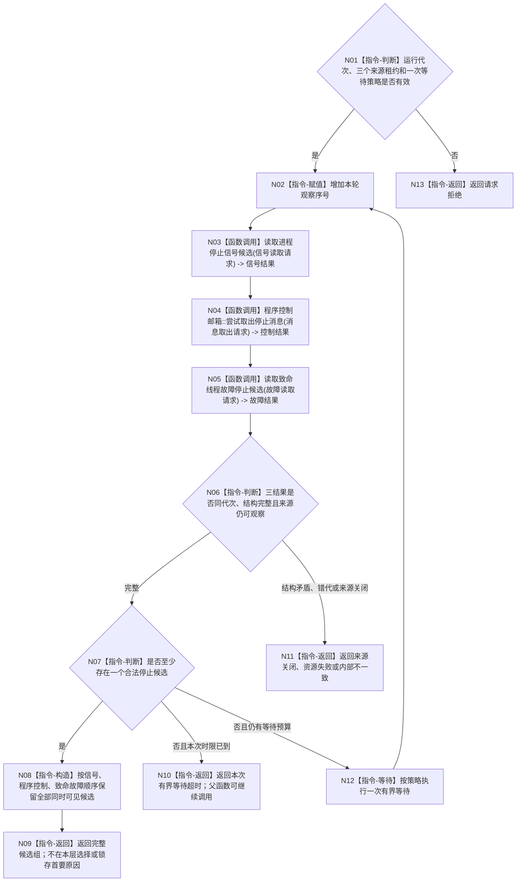

# BIZ-L3-001-10-01 等待任一停止来源目标函数流程图 v0.1

更新时间：2026-08-27

## 依据

```text
0050、8110、8120；BIZ-L2-001-10；目标线程归属与跨线程材料；确认稿第30项
```

## 身份与边界

正式目标函数设计图。对同一运行代次的进程信号、程序控制消息和具名致命线程故障执行一次或多次有界观察，只产生完整候选组、超时或结构化非成功。它不裁决停止阶段、不停止任何线程，也不从普通生命周期投影推导致命性；首条验真候选的不可逆锁存由父函数 BIZ-L2-001-10 唯一负责。

## 函数合同

```text
根函数：等待任一停止来源
归属模块 / 文件 / 目标分解深度：程序运行宿主 / 海中鱼巣/启动.程序运行宿主.ixx / BIZ-L3
现有或待新增：待新增；复用现有停止信号租约
完整签名：程序停止来源唤醒结果 等待任一停止来源(const 程序停止来源等待请求& 请求)
参数：请求为只读借用；含运行代次、三类来源租约和一次有界等待策略；各租约覆盖调用
返回结果：值式唤醒结果；含同时可见的合法候选组、超时、来源关闭、请求拒绝、资源失败或内部不一致，并保留来源身份和本次观察序号
被调函数流程图：BIZ-L4-001-10-01-01 读取进程停止信号候选；BIZ-L4-001-10-01-02 程序控制邮箱::尝试取出停止消息；BIZ-L4-001-10-01-03 读取致命线程故障停止候选
父图：BIZ-L2-001-10
```

## 流程图



## 节点合同

| 节点 | 类型 | 输入 | 输出 | 事实读写 | 验证 |
| --- | --- | --- | --- | --- | --- |
| N01—N02 | 判断 / 指令 | 等待请求 | 准入和观察序号 | 只读来源状态 | 缺租约、错代和坏等待策略 |
| N03—N05 | 函数调用 | 三个具名来源请求 | 三个值式结果 | 只有程序控制邮箱移动一条已确认消息 | 同时可见、旧代次、无候选和来源关闭 |
| N06—N12 | 判断 / 构造 / 等待 / 返回 | 三来源结果和剩余时限 | 完整候选组、超时或非成功 | 不锁存停止阶段、不停止线程 | 全候选保留、有界等待和结构错误分离 |

## 关键边界

- 本函数保持源级结果，不把固定读取顺序冒充物理发生顺序；父函数只在同一观察批内按该稳定顺序执行验证和首条锁存。
- 线程普通退出不是停止来源；是否把故障认定为致命必须由输入端口外的具名分类合同裁决。
- 来源关闭且没有合法候选不是“正常停止”，必须结构化返回给父函数；不得无限等待一个已失效端口。
- 当前代码只实现单信号位轮询；三端口有界观察和完整候选组尚未实现。
