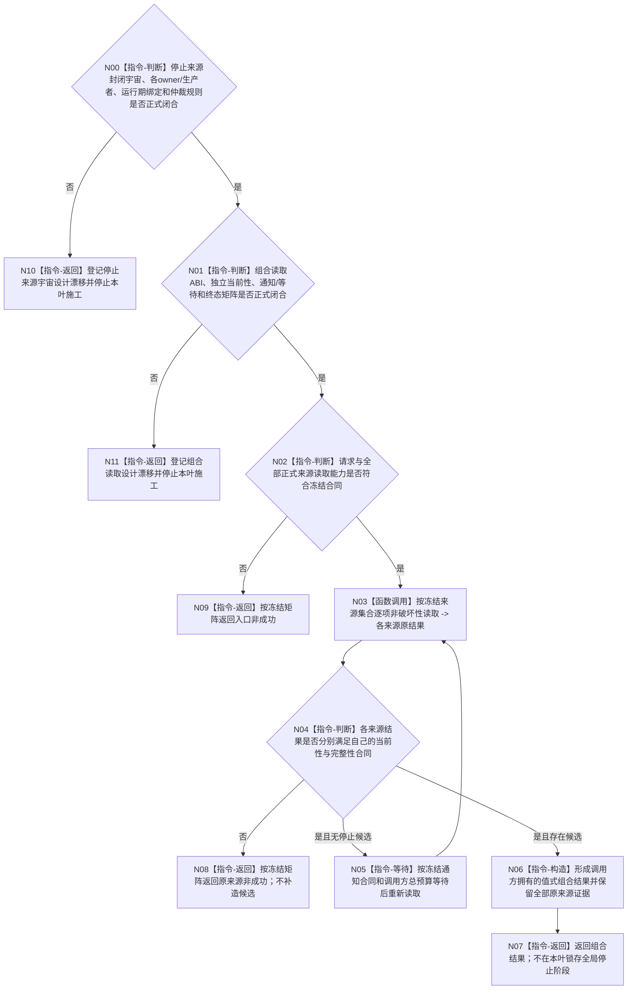

# BIZ-L3-001-10-01 等待任一停止来源目标函数流程图 v0.2

更新时间：2026-08-28

## 依据

```text
0050、8100 v0.7、8110 v0.3、8120 v0.10；BIZ-L1-T01 v0.5；
BIZ-L2-001-10 v0.2；当前发布源码：海中鱼巣/启动.程序运行宿主.ixx。
```

## 身份与边界

正式目标治理图。8120只冻结程序运行宿主负责信号安装、控制面板窗口运行和无窗口等待；8110只冻结线程生命周期诊断投影。二者都没有冻结“进程信号、程序控制、致命线程故障”构成封闭三来源宇宙，也没有冻结来源owner、首次记录、共同运行代次、固定仲裁顺序或同次0..3项完整观察组。

旧 v0.1 直接冻结三类读取租约、值式观察批标记、固定来源顺序、逐来源状态、候选伴随其它来源失败仍成功、来源关闭和有界等待矩阵；这些属于待裁决机器语义，不能由目标图产生。当前HEAD只存在一个`volatile std::sig_atomic_t 停止请求`及100毫秒轮询；程序控制停止来源、致命分类器/停止来源和组合读取入口均不存在。

## 函数合同

```text
根函数候选：等待任一停止来源
归属模块 / 文件 / 目标分解深度：程序运行宿主 / 物理文件待来源合同冻结 / BIZ-L3
现有或待新增：HEAD只有单一信号位轮询；多来源组合器不存在
完整签名：未冻结；旧 v0.1 的请求、结果、本地批标记和状态枚举不构成ABI
参数：未冻结；必须先确定封闭来源集合、各来源读取能力、运行期绑定、等待预算和通知边界
返回结果：未冻结；必须保留每个正式来源的原读回证据，不能伪造共同原子快照、物理发生顺序或完整故障历史
被调函数流程图：BIZ-L4-001-10-01-01可作为现行信号位读取适配候选；001-10-01-02/03仅为未获正式来源合同的旧职责草图
父图：BIZ-L2-001-10 v0.2
```

## 设计门禁与目标骨架



## 节点合同

| 节点 | 当前可确认合同 | 仍待冻结 | 验证边界 |
| --- | --- | --- | --- |
| N00/N10 | 现行信号位是一个真实候选来源；8110投影不是致命停止来源 | 封闭来源集合、owner、生产者、生命周期、运行期绑定和仲裁 | 不从窗口关闭、日志或普通线程故障补造停止候选 |
| N01/N11 | 多owner顺序读取不能自动称为共同原子快照 | 请求/结果、版本、各来源当前性、等待预算、通知与终态矩阵 | 本地循环序号不进入来源，也不证明物理同时性或发生顺序 |
| N02—N05 | 若合同闭合，逐来源只经其正式非破坏性读取入口 | 空来源、关闭、旧运行期、部分失败、伪唤醒和超时映射 | 一个来源通知只能促使重读，不能代替来源锁存 |
| N06/N07 | 组合器只外包各来源原证据，不锁存全局停止阶段 | 候选排序/仲裁以及伴随非成功的结果形状 | 不消费来源、不保存历史、不枚举全部后到故障 |

## 冻结发布源码对照（提交 `ef3c8ec9`）

- `停止信号租约`只拥有一个`volatile std::sig_atomic_t 停止请求`；处理器只把它置1，没有运行代次、来源身份、首次记录或具体信号号。
- `运行无窗口宿主`每100毫秒轮询该停止位，同时可执行维护回调；没有多来源通知、逐来源状态、组合结果或T01停止阶段锁存。
- HEAD没有程序控制停止来源、致命线程故障分类器/停止来源或同名组合函数。

## 具名偏差

1. `DRIFT-BIZ-HOST-STOP-SOURCE-UNIVERSE-OWNERS-AND-ARBITRATION-UNFROZEN`：封闭停止来源集合、各来源owner/生产者/生命周期、运行期绑定及多个候选的仲裁规则未冻结。
2. `DRIFT-BIZ-HOST-STOP-COMPOSER-READ-ABI-WAIT-CURRENTNESS-AND-TERMINAL-MATRIX-UNFROZEN`：组合读取请求/结果、各来源独立当前性、通知/等待预算、部分失败和终态矩阵未冻结。
3. `DRIFT-BIZ-HOST-FATAL-FAULT-CLASSIFIER-AND-SOURCE-ABI-UNFROZEN`：哪些线程故障必须停止进程及其正式生产/读取来源仍未冻结。

## v0.2 校正记录

- 撤销旧 v0.1 对封闭三来源、固定顺序、本地批标记、0..3项结果和完整矩阵的提前冻结。
- 保留现行信号位读取候选；程序控制和致命故障来源只保留为待正式裁决职责。
- 明确多owner顺序读回只能形成值式组合材料，不能伪造共同原子快照或物理发生顺序。
