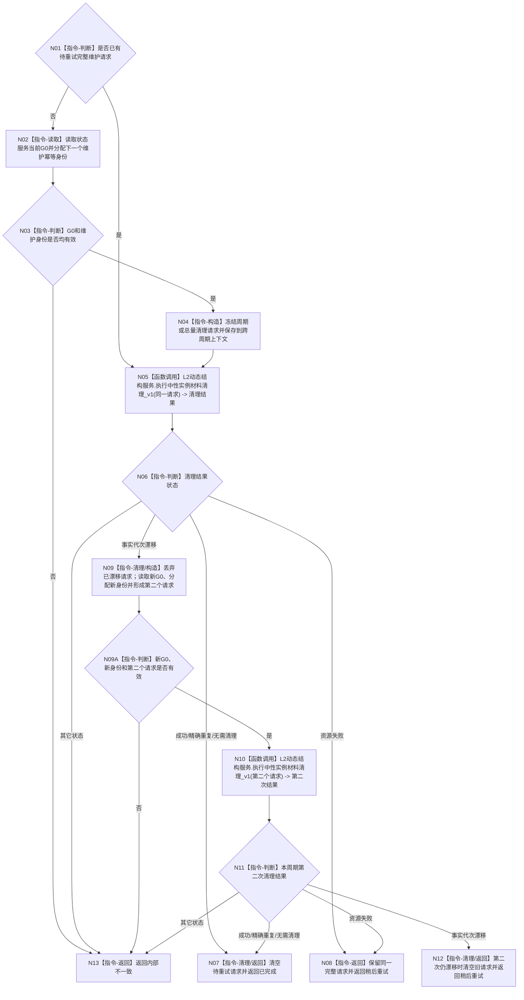

# BIZ-L3-001-10-02 执行一个中性实例材料维护周期目标函数流程图 v0.1

更新时间：2026-08-28

## 依据

```text
1160、4230；20260827 ARCH-L2-NEUTRAL-STATE-DYNAMIC-LIFECYCLE详细设计；
BIZ-L1-T01 v0.5、BIZ-L2-001-10 v0.2；HEAD 07283c7b 的海中鱼巣/启动.应用程序.ixx。
```

## 身份与边界

正式目标函数设计图。一次调用只推进一个宿主维护周期，跨周期上下文保存唯一待重试请求。函数调用`L2动态结构服务::执行中性实例材料清理_v1`，不枚举、删除或改写DATA内部材料，不创建线程/定时器，不把资源失败改成新请求，也不拥有清理事实第二权威。

当前HEAD把等价逻辑实现为`形成中性实例材料维护回调`返回闭包的调用体；目标具名函数用于稳定业务分解，不宣称同名C++ helper已经存在。

## 函数合同

```text
目标根函数：执行一个中性实例材料维护周期
归属模块 / 文件 / 目标分解深度：普通应用宿主维护 / 海中鱼巣/启动.应用程序.ixx / BIZ-L3
现有或待新增：等价闭包已实现；同名具名helper待机械整理
目标签名：程序周期维护状态 执行一个中性实例材料维护周期(中性实例材料维护上下文& 上下文) noexcept
参数：上下文绑定同一普通应用的L2状态/动态结构服务、可选待重试完整请求和进程内原子单调维护身份分配器
返回结果：已完成、稍后重试或内部不一致；不返回停止原因、线程状态或业务结果
被调函数流程图：无；正式DATA清理入口调用和宿主重试编排均在本函数内表达
父图：BIZ-L2-001-10 v0.2
```

## 流程图



## 节点合同

| 节点 | 输入 / 结果 | 状态保持 | 验证 |
| --- | --- | --- | --- |
| N01—N04 | 当前G0、单调维护身份、可选待重试请求 | 只有没有待重试请求时形成新请求 | 身份前缀、低48位非零/不耗尽、请求头G0 |
| N05—N08 | 同一完整请求与DATA清理结果 | 资源失败保留原G0、身份和请求 | 首次、精确重复、无需清理、资源失败 |
| N09—N11 | 首次事实代次漂移 | 丢旧请求、换新G0和新身份；本周期最多重试一次 | 不复用漂移身份，不无限循环 |
| N12/N13 | 第二次漂移或其它内部状态 | 第二次漂移清空请求等待下周期；内部不一致由宿主终止运行 | 不把失败改成停止来源或成功 |

## 当前代码对应（HEAD `07283c7b`）

- `形成中性实例材料维护回调`的闭包已经实现上述跨周期请求、资源失败保留、一次漂移换新和第二次漂移延后逻辑。
- 维护身份使用`0x4E43'0000'0000'0000`前缀与原子单调低48位；耗尽返回内部不一致。
- 宿主负责立即一次和每60秒调度；本函数本身不等待、不创建线程。

## v0.1建立记录

- 从已发布闭包提取单周期业务合同，固定资源失败保留请求、首次漂移换新且本周期仅重试一次、第二次漂移延后。
- 明确维护失败与停止来源分账，DATA服务继续拥有唯一清理写权。
