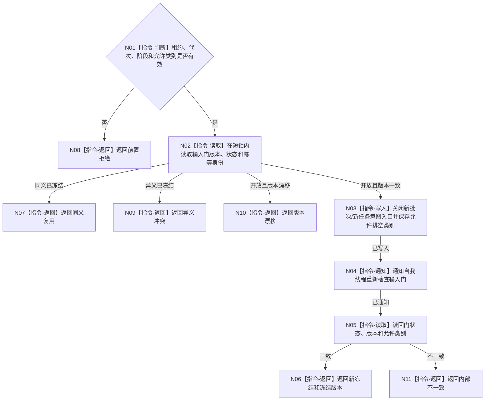

# BIZ-L3-001-11-01 冻结自我治理新输入门目标函数流程图 v0.1

更新时间：2026-08-03

## 依据

```text
8100、8110；BIZ-L2-001-11；目标线程归属与跨线程材料
```

## 身份与边界

正式目标函数设计图。在线性化点关闭新治理批次和新任务意图入口，同时保留最终回执与已允许结算类别。

## 函数合同

```text
根函数：自我线程::冻结治理新输入门
归属模块 / 文件 / 层级：自我线程 / 海中鱼巣/线程/自我线程.ixx / L3
现有或待新增：待新增
完整签名：自我治理输入门冻结结果 自我线程::冻结治理新输入门(const 自我治理输入门冻结请求& 请求)
参数：请求为只读借用；含运行代次、线程租约、预期门版本、停止阶段身份、允许排空材料类别和幂等身份
返回结果：值式结果；含新冻结、同义复用、未启动、版本漂移、异义冲突、错代或内部不一致，以及冻结版本
被调函数流程图：无
父图：BIZ-L2-001-11
```

## 流程图



## 节点合同

| 节点 | 类型 | 输入 | 输出 | 事实读写 | 验证 |
| --- | --- | --- | --- | --- | --- |
| N01—N02 | 判断 / 读取 | 冻结请求 | 当前门副本 | 只读线程输入门 | 错代、同义/异义重复 |
| N03—N05 | 写入 / 通知 / 读取 | 预期版本和允许类别 | 新版本及读回 | 只改线程输入门 | 并发冻结、丢失唤醒 |
| N06—N11 | 返回 | 冻结结论 | 结构化结果 | 不撤销已发布意图 | 读回一致 |

## 关键边界

禁止的是新治理生产，不是清空邮箱；已接受回执和已经授权的结算材料仍可沿指定类别排空。

