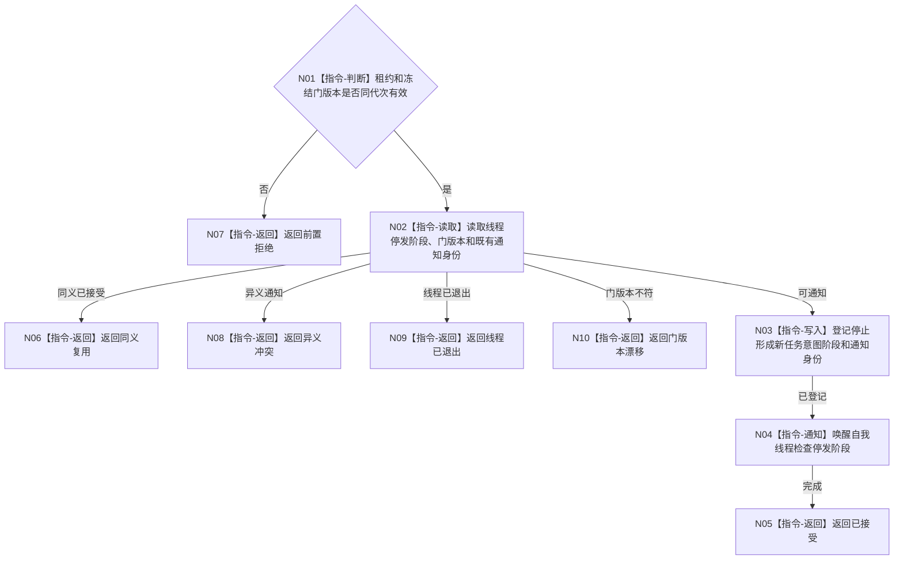

# BIZ-L3-001-11-02 通知自我线程停止形成新任务意图目标函数流程图 v0.1

更新时间：2026-08-03

## 依据

```text
8100、8110；BIZ-L2-001-11；BIZ-L3-001-11-01
```

## 身份与边界

正式目标函数设计图。通知只推进线程停发阶段，不写任务、需求或业务完成状态。

## 函数合同

```text
根函数：自我线程::通知停止形成新任务意图
归属模块 / 文件 / 层级：自我线程 / 海中鱼巣/线程/自我线程.ixx / L3
现有或待新增：待新增
完整签名：自我停发通知结果 自我线程::通知停止形成新任务意图(const 自我停发通知请求& 请求)
参数：请求为只读借用；含运行代次、线程租约、已冻结输入门版本、停止阶段身份和通知幂等身份
返回结果：值式结果；含已接受、同义复用、前置拒绝、门版本漂移、异义冲突、线程已退出或内部不一致
被调函数流程图：无
父图：BIZ-L2-001-11
```

## 流程图



## 节点合同

| 节点 | 类型 | 输入 | 输出 | 事实读写 | 验证 |
| --- | --- | --- | --- | --- | --- |
| N01—N02 | 判断 / 读取 | 通知请求 | 当前停发状态 | 只读线程状态 | 错代、已退出、重复 |
| N03—N04 | 写入 / 通知 | 阶段与幂等身份 | 新停发阶段 | 只改线程协调状态 | 并发通知、唤醒 |
| N05—N10 | 返回 | 通知结论 | 结构化结果 | 不写业务事实 | 分支互斥 |

## 关键边界

通知接受不等于自我线程已经停止产生新意图；必须由后继见证读取确认线性化结果。

