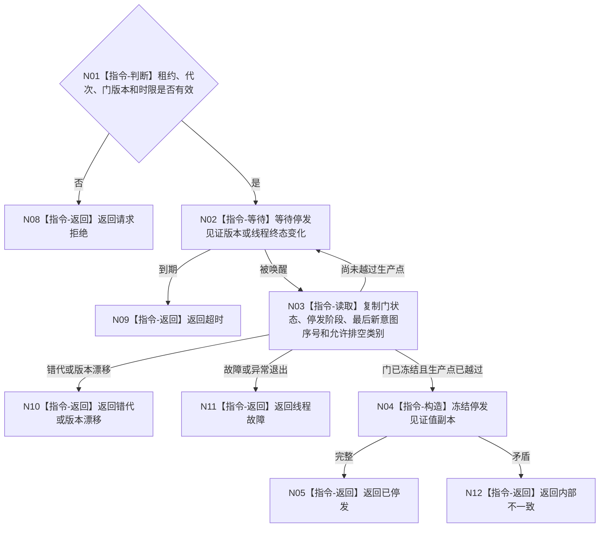

# BIZ-L3-001-11-03 读取自我停发见证目标函数流程图 v0.1

更新时间：2026-08-03

## 依据

```text
8100、8110；BIZ-L2-001-11；BIZ-L3-001-11-01—02
```

## 身份与边界

正式目标函数设计图。见证必须同时证明输入门已冻结且自我线程已越过最后一个新意图生产点。

## 函数合同

```text
根函数：自我线程::读取停发见证
归属模块 / 文件 / 层级：自我线程 / 海中鱼巣/线程/自我线程.ixx / L3
现有或待新增：待新增
完整签名：自我停发见证结果 自我线程::读取停发见证(const 自我停发见证请求& 请求) const
参数：请求为只读借用；含运行代次、线程租约、冻结门版本、停止阶段身份和读取时限；租约覆盖等待
返回结果：值式结果；含已停发、尚未停发、超时、错代、线程故障、线程退出或内部不一致，以及最后新意图序号和允许排空类别
被调函数流程图：无
父图：BIZ-L2-001-11
```

## 流程图



## 节点合同

| 节点 | 类型 | 输入 | 输出 | 事实读写 | 验证 |
| --- | --- | --- | --- | --- | --- |
| N01—N03 | 判断 / 等待 / 读取 | 见证请求 | 当前停发副本 | 只读线程协调状态 | 超时、错代、伪唤醒 |
| N04—N05 | 构造 / 返回 | 一致停发材料 | 不可变见证 | 无 | 最后序号和排空类别完整 |
| N08—N12 | 返回 | 非成功条件 | 结构化非成功 | 不改线程状态 | 故障与未停发分离 |

## 关键边界

最后新意图序号用于排空边界，不是任务状态或需求版本；见证不表示自我线程已退出。

