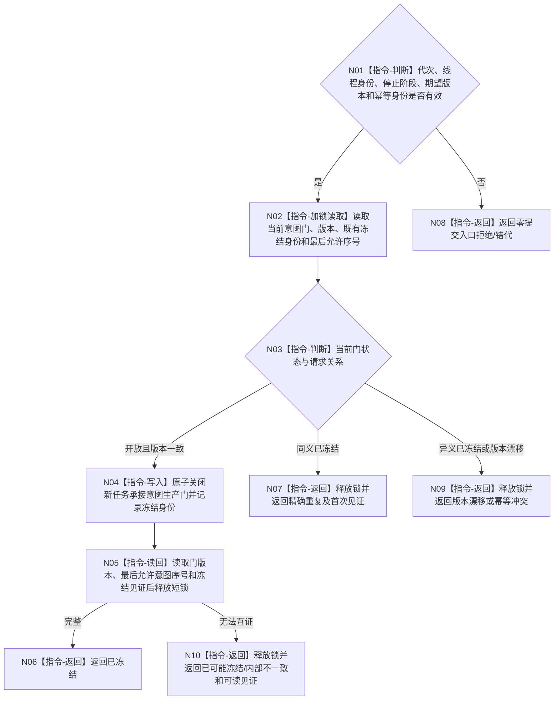

# BIZ-L3-001-12-00 冻结自我线程新任务承接意图生产门目标函数流程图 v0.1

更新时间：2026-08-27

## 依据

```text
0050、8100 v0.8、8110 v0.3；BIZ-L1-T02 v0.6；BIZ-L2-001-12；确认稿第30项
```

## 身份与边界

正式目标函数设计图。只在 T02 控制域内原子禁止后续治理批次为新的当前具体需求 D 形成和提交任务承接意图。它不停止 T02、不关闭治理邮箱，也不阻止停机前已接受的任务轮次结算定位、self 后继决议、停止消息或已接管治理批次继续形成结构化收口结果。

## 函数合同

```text
根函数：自我线程::冻结新任务承接意图生产门
归属模块 / 文件 / 目标分解深度：自我线程控制域 / 海中鱼巣/线程/创建.自我线程.ixx / BIZ-L3
现有或待新增：待新增；HEAD 3752fda8 没有独立的新任务承接意图生产门
完整签名：自我新任务意图门冻结结果 自我线程::冻结新任务承接意图生产门(const 自我新任务意图门冻结请求& 请求) noexcept
参数：请求为只读借用；含运行代次、自我线程逻辑身份、已锁存程序停止阶段、期望门版本和幂等身份
返回结果：不可变值式结果；含已冻结、精确重复、入口拒绝、错代、版本漂移、幂等冲突、资源失败、内部不一致或已可能冻结，以及门版本、最后允许意图序号和冻结见证
被调函数流程图：无；短锁内读取、比较、不可逆门锁存和写后读回均为本函数内指令
父图：BIZ-L2-001-12
```

## 流程图



## 节点合同

| 节点 | 类型 | 输入 | 输出 | 事实读写 | 验证 |
| --- | --- | --- | --- | --- | --- |
| N01—N03 | 判断 / 加锁读取 | 门冻结请求 | 当前门副本 | 只读T02线程协调状态 | 错代、版本、同义/异义重放 |
| N04—N05 | 写入 / 读回 | 开放门与停止阶段 | 不可逆冻结见证 | 只改T02新任务意图生产门 | 与并发N24—N26形成/提交意图线性化 |
| N06—N10 | 返回 | 写入或既有状态 | 结构化结果 | 不回开已冻结门 | 写后读回失败、已可能冻结和见证守恒 |

## 关键边界

- 线性化点之前已经取得允许序号并完成冻结载荷的意图属于最后允许组；之后不得新分配意图身份、幂等键或提交请求。
- 门关闭后 BIZ-L1-T02 仍可完成当前批次，但其 N24 发现需要新的 D 承接时必须形成“停产期间未下行”结构化结果，不得调用 N25/N26 补造或提交新意图。
- self 后继决议不是本门的“新具体需求任务承接意图”。已接受结算形成的后继定位继续交付，由 T03 在派发门关闭后按共同排空策略处理，不能被本函数丢弃。
- 写后读回失败不授权重新开放门；返回已可能冻结并保留可读见证，只允许同键重试。
