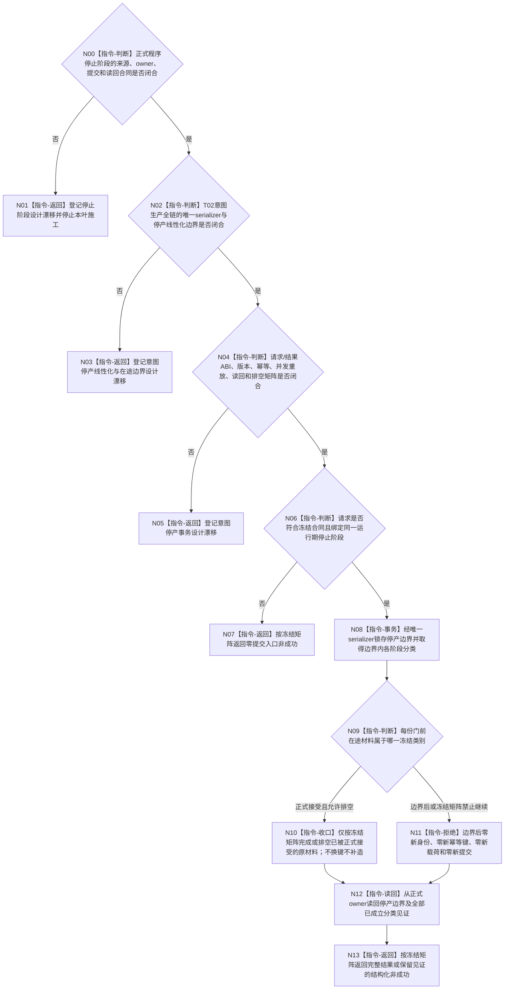

# BIZ-L3-001-12-00 冻结自我线程新任务承接意图生产门目标函数流程图 v0.2

更新时间：2026-08-28

## 依据

```text
0050、8100 v0.7、8200 v0.7；BIZ-L1-T02 v0.7；BIZ-L2-001-12 v0.2；
当前已发布的海中鱼巣/线程/创建.自我线程.ixx、海中鱼巣/线程/自我治理消息协议.ixx。
```

## 身份与边界

正式目标治理图。8100与8200只冻结：自我线程形成绑定一个当前具体需求D的不可变任务承接意图，经异步消息边界交给任务管理线程，接收方必须独立取出、复核并回读绑定事实。它们没有冻结停机专属意图生产门的物理位置、owner、版本、幂等事务或“最后允许意图序号”。

旧v0.1把门前已经取得序号并完成载荷冻结的意图直接归入“最后允许组”，但正式规范没有裁决唯一停产线性化点。意图从身份分配、幂等信封分配、载荷冻结、邮箱提交到T03正式接管存在多个阶段；仅关闭T02某个布尔门不能证明这些阶段均已分类，也不能决定“已形成但尚未被T03接受”的材料应完成提交、返回未下行还是撤销。当前HEAD没有该专属门或同名函数，普通停止锁存和8110生命周期投影均不能代替这项业务边界。

## 函数合同

```text
根函数候选：冻结自我线程新任务承接意图生产门
归属模块 / 文件 / 目标分解深度：T02意图生产控制域 / 物理文件待线性化owner裁决 / BIZ-L3
现有或待新增：HEAD不存在专属生产门、门版本、最后允许意图序号或正式读回入口
完整签名：未冻结；旧v0.1的请求、结果、状态枚举和自我线程成员函数不构成ABI
参数：未冻结；必须先绑定正式程序停止阶段、运行代次、T02生产链身份和同一线性化边界
返回结果：未冻结；必须区分零提交、边界已提交、同义重放、并发在途、已可能提交和读回不完整，且保留已成立见证
被调函数流程图：无；具体serializer、消息提交端和读回能力须由合同确定后再展开
父图：BIZ-L2-001-12 v0.2
```

## 设计门禁与目标骨架



## 节点合同

| 节点 | 当前可确认合同 | 仍待冻结 | 验证边界 |
| --- | --- | --- | --- |
| N00/N01 | T02不得从8110投影、普通停止布尔量或聊天材料推导程序已进入正式停止阶段 | 停止阶段owner、提交、幂等、读回和生命周期 | 没有正式停止阶段时零意图停产提交 |
| N02/N03 | 停产必须覆盖一个意图从身份分配到T03正式接管的完整生产链 | 唯一serializer、线性化点、门前/门后分类及T02/T03共同边界 | 不能只扫描邮箱或只关闭形成函数证明完整停产 |
| N04/N05 | 已成立的不可逆见证必须守恒；同键重试不得生成第二身份或第二载荷 | DTO字段、枚举数值、版本、同义/异义重放、已可能提交和资源失败矩阵 | bool、日志、消息数量和最后本地序号均为弱证据 |
| N06—N13 | 正式接受的原意图不能因停产被静默丢弃；边界后不得补造新意图材料 | “已形成未提交、提交中、已入邮箱未接管、已被T03接管”各类的唯一收口动作与读回 | 每类必须以owner读回证明，不能用调用方缓存或旧结果代替 |

## 当前已发布代码对应（`c7d7edd9`；相关源码自`696f93d4`后未变）

- `自我线程`存在普通`停止已锁存_`、运行门和治理邮箱停止处理，但没有停机专属“新任务承接意图生产门”、门版本、最后允许意图序号或独立读回。
- `运行治理循环()`的当前普通后继仍未接线；任务治理意图和下行提交只保留控制流骨架，不能据此提取真实生产线性化点。
- `自我治理消息协议`定义的是现行治理消息及停止消息准入，不提供目标中的具体需求任务承接意图门或T02到T03的完整停产事务。

## 具名偏差

1. `DRIFT-BIZ-HOST-STOP-STAGE-OWNER-COMMIT-IDEMPOTENCY-AND-READBACK-MATRIX-UNFROZEN`：本叶请求依赖的正式程序停止阶段尚未冻结。
2. `DRIFT-BIZ-T02-NEW-TASK-INTENT-STOP-LINEARIZATION-OWNER-AND-IN-FLIGHT-BOUNDARY-UNFROZEN`：意图生产全链的唯一serializer、停产线性化点及门前/门后在途分类尚未冻结。
3. `DRIFT-BIZ-T02-NEW-TASK-INTENT-STOP-ABI-IDEMPOTENCY-READBACK-AND-DRAIN-MATRIX-UNFROZEN`：专属请求/结果、版本、幂等、读回、并发重放和排空矩阵尚未冻结。

## v0.2校正记录

- 撤销旧v0.1对具体成员函数、请求/结果DTO、门版本、最后允许意图序号、短锁事务和完整状态矩阵的提前冻结。
- 把停产对象从单一“形成新意图”调用扩展为身份分配到T03正式接管的完整生产链，并把中间在途分类列为必须先闭合的设计门禁。
- 保留“正式接受的原材料不得丢失、边界后不得补造新身份/键/载荷”的目标方向，但不替owner发明具体分类结果。
