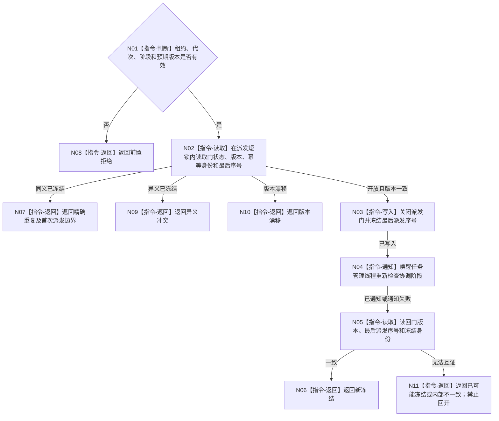

# BIZ-L3-001-12-01 冻结任务工作包派发门目标函数流程图 v0.1

更新时间：2026-08-27

## 依据

```text
8100、8110；BIZ-L2-001-12；目标线程归属与跨线程材料
```

## 身份与边界

正式目标函数设计图。在线性化点同时禁止新的筹办工作包和执行工作包入队，但不取消已经派出的工作。同义重放只返回首次不可逆派发边界；父级仍须继续确认只排空阶段并重新读取本次当前在途快照。

## 函数合同

```text
根函数：任务管理线程::冻结工作包派发门
归属模块 / 文件 / 目标分解深度：任务管理线程 / 海中鱼巣/线程/任务管理线程.ixx / BIZ-L3
现有或待新增：待新增；HEAD 3752fda8 的 `强类型请求停止锁存` 只覆盖执行请求准备，不能冻结筹办与执行统一派发边界
完整签名：任务工作包派发门冻结结果 任务管理线程::冻结工作包派发门(const 任务工作包派发门冻结请求& 请求) noexcept
参数：请求为只读借用；含运行代次、线程租约、预期派发门版本、停止阶段身份和幂等身份
返回结果：不可变值式结果；含已冻结、精确重复、入口拒绝、版本漂移、幂等冲突、线程已退出、资源失败、内部不一致或已可能冻结，以及首次冻结版本、最后派发序号和可读冻结见证
被调函数流程图：无
父图：BIZ-L2-001-12
```

## 流程图



## 节点合同

| 节点 | 类型 | 输入 | 输出 | 事实读写 | 验证 |
| --- | --- | --- | --- | --- | --- |
| N01—N02 | 判断 / 读取 | 冻结请求 | 当前门副本 | 只读调度门 | 错代、重复、版本漂移 |
| N03—N05 | 写入 / 通知 / 读取 | 预期版本 | 新门版本和最后序号 | 只改统一筹办/执行派发门 | 与两类并发派发线性化；通知失败后仍正式读回 |
| N06—N11 | 返回 | 冻结结论 | 结构化结果 | 不改任务状态 | 精确重复只复用首次派发边界；写后读回失败分账 |

## 关键边界

- 最后派发序号仅界定需排空的工作包集合；不得据此把在途任务改成完成、等待或失败。
- 派发门必须覆盖由主阶段治理形成的筹办工作包，以及普通调度选择形成的执行工作包；只锁住执行请求准备不是完整停产。
- 精确重复不携带或复用动态在途快照。调用方取得首次边界后仍继续进入只排空阶段并读取本次当前快照。
- 门写入后通知或读回失败均不得重新开放派发；结果必须携带已可能冻结状态与可读见证，只允许同键重试。
