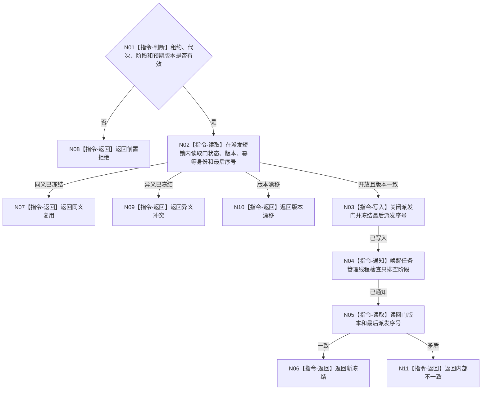

# BIZ-L3-001-12-01 冻结任务工作包派发门目标函数流程图 v0.1

更新时间：2026-08-03

## 依据

```text
8100、8110；BIZ-L2-001-12；目标线程归属与跨线程材料
```

## 身份与边界

正式目标函数设计图。在线性化点禁止新筹办/执行工作包入队，但不取消已经派出的工作。

## 函数合同

```text
根函数：任务管理线程::冻结工作包派发门
归属模块 / 文件 / 层级：任务管理线程 / 海中鱼巣/线程/任务管理线程.ixx / L3
现有或待新增：待新增
完整签名：任务工作包派发门冻结结果 任务管理线程::冻结工作包派发门(const 任务工作包派发门冻结请求& 请求)
参数：请求为只读借用；含运行代次、线程租约、预期派发门版本、停止阶段身份和幂等身份
返回结果：值式结果；含新冻结、同义复用、版本漂移、异义冲突、错代、线程已退出或内部不一致，以及冻结版本和最后派发序号
被调函数流程图：无
父图：BIZ-L2-001-12
```

## 流程图



## 节点合同

| 节点 | 类型 | 输入 | 输出 | 事实读写 | 验证 |
| --- | --- | --- | --- | --- | --- |
| N01—N02 | 判断 / 读取 | 冻结请求 | 当前门副本 | 只读调度门 | 错代、重复、版本漂移 |
| N03—N05 | 写入 / 通知 / 读取 | 预期版本 | 新门版本和最后序号 | 只改调度门 | 与并发派发线性化 |
| N06—N11 | 返回 | 冻结结论 | 结构化结果 | 不改任务状态 | 写后读回一致 |

## 关键边界

最后派发序号仅界定需排空的工作包集合；不得据此把在途任务改成完成、等待或失败。

