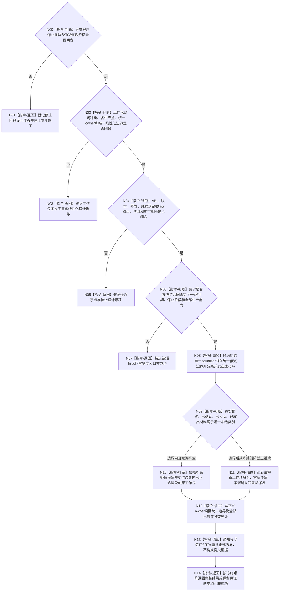

# BIZ-L3-001-12-01 冻结任务工作包派发门目标函数流程图 v0.2

更新时间：2026-08-28

## 依据

```text
0050、5230、8100 v0.7、8200 v0.7；BIZ-L2-001-12 v0.2；
当前已发布的海中鱼巣/线程/任务管理线程.ixx、海中鱼巣/线程/运行包.任务结果生产.ixx。
```

## 身份与边界

正式目标治理图。8100只确认任务管理维护工作包、调度队列和工作项身份，任务工作线程每次推进一个闭合工作包；5230与8200确认执行冻结后、真实派发前必须重新复核当前事实和门控。它们没有冻结“筹办工作包+执行工作包”构成封闭统一派发宇宙，也没有冻结统一派发owner、派发序号、门版本或停机专属幂等事务。

当前HEAD的`强类型请求停止锁存`与`准备强类型任务执行请求`共用`强类型请求队列锁`，可线性阻止新的强类型执行请求预留，并允许已经确认的请求继续被取出。该能力只覆盖现行强类型执行请求队列，不证明筹办工作包、主阶段治理槽或其它下行材料均由同一门控制，也没有返回首次边界、最后派发序号或正式读回见证。运行包在锁存前先解除旧重筹办端口绑定，更不能据此推出跨两类生产路径的原子统一停派。

## 函数合同

```text
根函数候选：冻结任务工作包派发门
归属模块 / 文件 / 目标分解深度：T03工作包生产与派发控制域 / 物理文件待统一owner裁决 / BIZ-L3
现有或待新增：HEAD存在只覆盖强类型执行请求准备的相邻锁存；统一停派根不存在
完整签名：未冻结；旧v0.1的请求、结果、状态枚举和任务管理线程成员函数不构成ABI
参数：未冻结；必须先绑定正式停止阶段、封闭工作包种类、各生产点、队列/槽和T03/T04交接边界
返回结果：未冻结；必须区分零提交、边界已提交、同义重放、并发在途、已可能提交和读回不完整，并保留各owner原见证
被调函数流程图：无；若统一门由多个现有owner组合，须先为各子门建立独立正式读回再形成父组合
父图：BIZ-L2-001-12 v0.2
```

## 设计门禁与目标骨架



## 节点合同

| 节点 | 当前可确认合同 | 仍待冻结 | 验证边界 |
| --- | --- | --- | --- |
| N00/N01 | 普通线程状态和8110投影不等于正式停派资格 | 正式停止阶段owner及本叶消费合同 | 无正式阶段时零统一停派提交 |
| N02/N03 | HEAD强类型请求锁存能线性阻止一种请求预留 | 封闭工作包种类、筹办/执行生产点、统一或分owner结构、T03/T04交接边界 | 不把旧重筹办端口解绑、主阶段槽或执行队列静默拼成原子事务 |
| N04/N05 | 停止后已确认请求仍可被取出，说明“停止新增”和“排空既有”必须分账 | 预留/确认/入队/取出并发矩阵、DTO、版本、幂等、读回和失败续点 | 队列长度、bool、通知和日志不能证明首次冻结边界 |
| N06—N14 | 边界后不得产生新工作包；已正式接受的原工作包不得因停派静默丢失 | 各阶段的唯一分类、允许动作、最后边界表达及完整见证 | 每类须由正式owner读回；不以本地“最后序号”替代完整账覆盖 |

## 当前已发布代码对应（`c7d7edd9`；相关源码自`d31dcf3f`后未变）

- `任务管理线程::请求停止新派发()`在`强类型请求队列锁`内把`强类型请求停止锁存`置真，只返回普通成功bool形状；没有版本、幂等身份、首次边界或读回。
- `准备强类型任务执行请求()`在同一锁内先检查停止锁存，因此该局部能力可线性拒绝新的执行请求预留；`取出强类型任务执行请求()`仍会排空已确认请求。
- `任务结果生产运行包::请求停止新派发()`先解除旧重筹办端口绑定，再调用上述锁存；两步不是一个正式原子事务，且HEAD 5230已把旧下一筹办工作包生产语义降为历史兼容边界。
- HEAD没有覆盖全部工作包生产点的统一门、派发序号或正式独立读回入口。

## 具名偏差

1. `DRIFT-BIZ-HOST-STOP-STAGE-OWNER-COMMIT-IDEMPOTENCY-AND-READBACK-MATRIX-UNFROZEN`
2. `DRIFT-BIZ-T03-WORK-PACKAGE-DISPATCH-UNIVERSE-OWNER-AND-LINEARIZATION-BOUNDARY-UNFROZEN`：封闭工作包种类、各生产/交接点、统一或分owner结构及停派线性化边界尚未冻结。
3. `DRIFT-BIZ-T03-WORK-PACKAGE-DISPATCH-FREEZE-ABI-IDEMPOTENCY-READBACK-AND-DRAIN-MATRIX-UNFROZEN`：请求/结果、版本、幂等、并发阶段分类、正式读回和排空矩阵尚未冻结。

## v0.2校正记录

- 撤销旧v0.1对具体成员函数、DTO、门版本、最后派发序号、短锁事务和完整状态矩阵的提前冻结。
- 把HEAD强类型执行请求停止锁存降为局部可复用能力候选，不再冒充筹办/执行统一派发边界。
- 保留“边界后零新工作包、边界内正式接受材料继续排空、通知只触发重读”的职责方向，具体分类等待正式owner合同。
