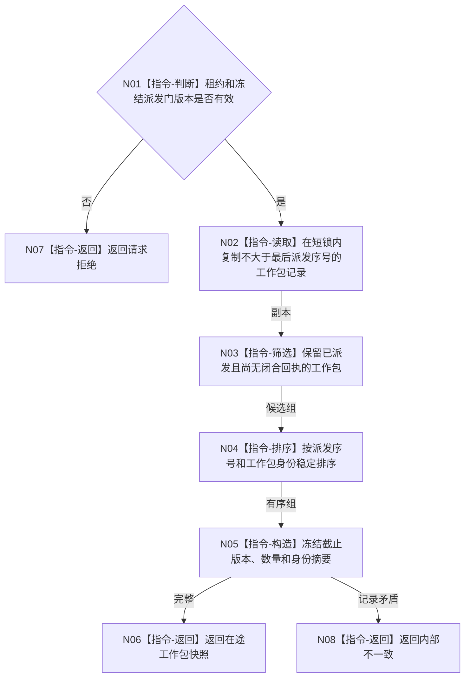

# BIZ-L3-001-12-02 读取当前在途工作包快照目标函数流程图 v0.1

更新时间：2026-08-03

## 依据

```text
8100、8110；BIZ-L2-001-12；BIZ-L3-001-12-01
```

## 身份与边界

正式目标函数设计图。快照按冻结派发边界枚举已派发未闭合工作包，只作收口跟踪材料。

## 函数合同

```text
根函数：任务管理线程::读取当前在途工作包快照
归属模块 / 文件 / 层级：任务管理线程 / 海中鱼巣/线程/任务管理线程.ixx / L3
现有或待新增：待新增
完整签名：在途工作包快照结果 任务管理线程::读取当前在途工作包快照(const 在途工作包快照请求& 请求) const
参数：请求为只读借用；含运行代次、线程租约、冻结派发门版本和最后派发序号
返回结果：调用方拥有的不可变快照；含工作包身份、种类、任务/工作项引用、派发序号、回执状态和截止版本，或错代、版本漂移、未找到、内部不一致
被调函数流程图：无
父图：BIZ-L2-001-12
```

## 流程图



## 节点合同

| 节点 | 类型 | 输入 | 输出 | 事实读写 | 验证 |
| --- | --- | --- | --- | --- | --- |
| N01—N02 | 判断 / 读取 | 快照请求 | 记录副本 | 只读调度记录 | 错代、门版本漂移 |
| N03—N05 | 筛选 / 排序 / 构造 | 记录副本 | 不可变快照 | 无 | 空集、重复身份、数量守恒 |
| N06—N08 | 返回 | 快照结论 | 值式结果 | 不改任务状态 | 摘要与集合一致 |

## 关键边界

快照为空只表示冻结边界内无未闭合工作包，不证明所有任务或需求已经完成。
