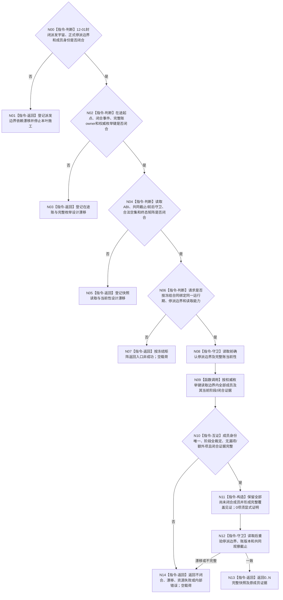

# BIZ-L3-001-12-02 读取当前在途工作包快照目标函数流程图 v0.2

更新时间：2026-08-28

## 依据

```text
0050、5230、8100 v0.7、8200 v0.7；BIZ-L2-001-12 v0.2；BIZ-L3-001-12-01 v0.2；
HEAD 海中鱼巣/线程/任务管理线程.ixx、海中鱼巣/线程/任务工作线程.ixx。
```

## 身份与边界

正式目标治理图。收口确实需要识别冻结边界内尚未闭合的工作，但8100、8200只规定任务管理维护工作包/队列/工作项、任务工作线程推进一个闭合工作包并交付结果定位；它们没有冻结“在途”的起点、闭合事件、完整账owner、枚举键或跨T03/T04的一致观察合同。

旧v0.1假定存在按最后派发序号完整保存的派发账，并可用“完整派发账减去闭合回执”形成0..N快照。12-01 v0.2已经撤销最后派发序号和统一派发门的提前冻结；本叶不能继续把下游所需的完整账反向当作既有能力。当前HEAD的管理线程快照只返回容量与预留/可消费/记录等计数，工作线程快照也只返回队列计数和最后一次形成/上交结果；计数与末项都不能证明成员全集或合法空集。

## 函数合同

```text
根函数候选：读取当前在途工作包快照
归属模块 / 文件 / 目标分解深度：T03/T04在途工作观察 / 物理文件待完整账owner裁决 / BIZ-L3
现有或待新增：HEAD只有两个局部统计快照；完整成员读取入口不存在
完整签名：未冻结；旧v0.1的请求、结果、状态枚举和任务管理线程成员函数不构成ABI
参数：未冻结；必须绑定12-01正式停派边界、运行期、完整账owner、成员枚举键和观察当前性
返回结果：未冻结；合法0项必须由完整枚举证明，非成功不得返回部分成员冒充快照
被调函数流程图：若成员跨多个owner，须先建立每个owner的正式完整读取及共同截止/前后守卫，再由本叶组合
父图：BIZ-L2-001-12 v0.2
```

## 设计门禁与目标骨架



## 节点合同

| 节点 | 当前可确认合同 | 仍待冻结 | 验证边界 |
| --- | --- | --- | --- |
| N00/N01 | 本叶必须消费正式停派边界，不能自行发明最后派发序号 | 12-01成员宇宙、边界身份和正式读回 | 12-01未闭合时本叶不可独立施工 |
| N02/N03 | 任务跨T03准备/确认/队列与T04取得/执行/结果交付多个阶段 | “在途”起点、闭合事件、唯一或分owner账、成员身份和完整枚举键 | 队列长度、数据库行数、最后结果和线程状态均不能证明全集 |
| N04/N05 | 多owner顺序读取不能自动称为同一当前快照 | DTO、状态、共同截止、读前/读后守卫、合法空集与部分失败矩阵 | 任何子读取非成功时零组合载荷，不把已读部分当快照 |
| N06—N14 | 完整成功须逐成员证明边界内身份、阶段、闭合与覆盖；0项同样需要覆盖见证 | 排序、版本、生命周期、重复/漏项/额外项和当前性公式 | 快照可随正式闭合缩小，但每次都须重新完整读取和守卫 |

## 当前代码对应（HEAD `13116c80`）

- `任务管理线程::读取强类型任务执行队列快照()`只返回容量、预留数量、可消费数量、记录/索引数量和停止bool，不返回全部请求身份或各成员当前阶段。
- `任务工作线程::读取快照()`只返回状态、队列容量/长度、累计计数以及最后形成和最后上交结果，不返回全部待处理、正在处理或待上交成员。
- 当前两个快照属于不同锁与不同局部对象，没有共同截止、前后当前性守卫或正式完整集合见证。
- HEAD没有“完整派发账减去闭合回执”的统一owner，也没有可证明0项合法成功的枚举入口。

## 具名偏差

1. `DRIFT-BIZ-T03-WORK-PACKAGE-DISPATCH-UNIVERSE-OWNER-AND-LINEARIZATION-BOUNDARY-UNFROZEN`
2. `DRIFT-BIZ-T03-T04-IN-FLIGHT-WORK-LEDGER-OWNER-CLOSURE-EVENT-AND-COMPLETE-ENUMERATION-UNFROZEN`：在途起点、闭合事件、成员身份、完整账owner和权威枚举键尚未冻结。
3. `DRIFT-BIZ-T03-T04-IN-FLIGHT-WORK-SNAPSHOT-ABI-CUTOFF-CURRENTNESS-AND-TERMINAL-MATRIX-UNFROZEN`：读取DTO、共同截止、读前/读后守卫、合法空集和终态矩阵尚未冻结。

## v0.2校正记录

- 撤销旧v0.1对最后派发序号、完整派发账、回执减法、0..N成功DTO和状态矩阵的提前冻结。
- 把HEAD两个局部统计快照降为候选观察材料；它们不能单独或拼接证明成员全集。
- 保留“停派边界内尚未闭合成员需可完整观察、合法0项必须有覆盖见证”的目标职责，具体owner与读取合同等待正式裁决。
