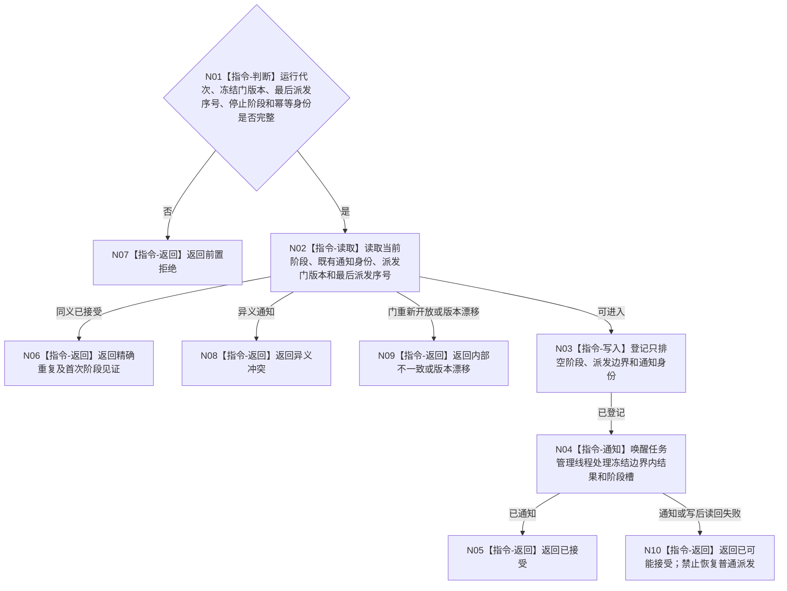

# BIZ-L3-001-12-03 通知任务管理进入只排空阶段目标函数流程图 v0.1

更新时间：2026-08-27

## 依据

```text
8100、8110；BIZ-L2-001-12；BIZ-L3-001-12-01—02
```

## 身份与边界

正式目标函数设计图。只排空阶段继续接收冻结边界内工作回执并推进合法结果提交，不再派发新工作包。

## 函数合同

```text
根函数：任务管理线程::通知进入只排空阶段
归属模块 / 文件 / 目标分解深度：任务管理线程 / 海中鱼巣/线程/任务管理线程.ixx / BIZ-L3
现有或待新增：待新增
完整签名：任务管理只排空通知结果 任务管理线程::通知进入只排空阶段(const 任务管理只排空通知请求& 请求)
参数：请求为只读借用；含运行代次、线程租约、派发门冻结版本、最后派发序号、停止阶段身份和幂等身份；请求只绑定派发边界，禁止携带任何快照字段
返回结果：值式结果；含已接受、精确重复、前置拒绝、版本漂移、幂等冲突、线程已退出、资源失败、内部不一致或已可能接受，以及首次阶段见证
被调函数流程图：无
父图：BIZ-L2-001-12
```

## 流程图



## 节点合同

| 节点 | 类型 | 输入 | 输出 | 事实读写 | 验证 |
| --- | --- | --- | --- | --- | --- |
| N01—N02 | 判断 / 读取 | 通知请求 | 当前阶段 | 只读协调状态 | 派发边界错代、重复通知；不读取动态快照 |
| N03—N04 | 写入 / 通知 | 阶段与派发边界 | 新阶段 | 只改线程协调状态 | 并发通知、唤醒、写后读回失败 |
| N05—N10 | 返回 | 通知结论 | 结构化结果 | 不改任务事实 | 派发门不能重开；精确重复保留首次阶段见证 |

## 关键边界

- 只排空阶段不是“只清空队列”；每条回执仍须经过独立回读和任务领域合同，不能丢弃或批量标记完成。
- 阶段只绑定不可逆派发门版本和最后派发序号，不绑定任何一次在途快照。进入后仍可处理冻结边界内工作结果、主阶段治理槽、轮次结算定位和 self 后继决议，但不得形成或派发新的筹办/执行工作包。
- 精确重复只复用首次阶段见证；父级仍须按同一派发边界读取本次当前在途快照。
