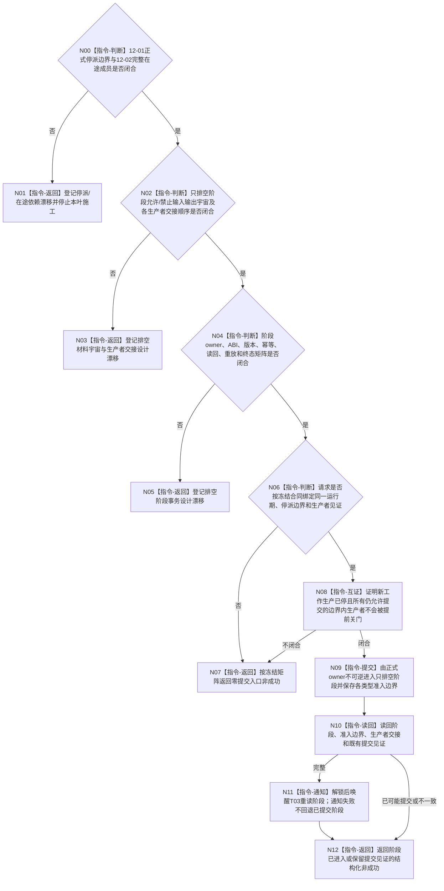

# BIZ-L3-001-12-03 通知任务管理进入只排空阶段目标函数流程图 v0.2

更新时间：2026-08-28

## 依据

```text
0050、5230、8100 v0.7、8110 v0.3、8200 v0.7；BIZ-L2-001-12 v0.2；
BIZ-L3-001-12-01/02 v0.2；HEAD任务管理线程与任务结果生产运行包代码。
```

## 身份与边界

正式目标治理图。停派后需要一个“零新工作、守恒收口既有材料”的阶段方向，但8100、8200没有冻结该阶段的允许输入/输出封闭集合、生产者关闭顺序、阶段owner、版本或正式读回。8110的“停止请求中/收尾中”只是诊断投影，不能承担业务排空阶段。

旧v0.1假定T03可先登记只排空阶段，同时继续接收冻结边界内工作回执、处理主阶段槽/轮次结算定位/self后继决议，并以派发门版本和最后派发序号形成幂等见证。12-01/02 v0.2已经撤销这两个未冻结字段；更重要的是，必须逐类型裁决哪些生产者仍可在阶段内提交、何时关闭其提交门以及怎样证明不丢失。仅写一个阶段枚举并notify不能完成该交接。

## 函数合同

```text
根函数候选：通知任务管理进入只排空阶段
归属模块 / 文件 / 目标分解深度：T03停派后收口控制域 / 物理文件待阶段owner裁决 / BIZ-L3
现有或待新增：HEAD只有“生产者先连接、再停止接收并最终排空”的终止路径；中间只排空阶段不存在
完整签名：未冻结；旧v0.1的请求、结果、状态枚举和任务管理线程成员函数不构成ABI
参数：未冻结；必须绑定正式停派边界、完整在途成员、允许继续生产的材料类型和各生产者关闭见证
返回结果：未冻结；阶段提交、通知和业务排空进度必须分账，通知成功不能代替阶段读回
被调函数流程图：无；各输入端停止/继续准入和生产者关闭须先由其owner给出正式能力
父图：BIZ-L2-001-12 v0.2
```

## 设计门禁与目标骨架



## 节点合同

| 节点 | 当前可确认合同 | 仍待冻结 | 验证边界 |
| --- | --- | --- | --- |
| N00/N01 | 阶段不能使用未冻结的最后派发序号或统计快照作为前置 | 正式停派边界、完整在途成员及两者读回 | 依赖不闭合时不写阶段 |
| N02/N03 | 新工作必须停止；边界内已接受结果不能被提前关闭接收门而丢失 | 每类输入/输出、内部槽、反向材料、重试和生产者关闭顺序 | “只排空”不是清空所有队列，也不是允许所有旧消息继续进入 |
| N04/N05 | 阶段提交与通知必须分账；8110投影不能作提交证据 | DTO、owner、版本、幂等、同义/异义重放、读回与已可能提交矩阵 | bool、线程状态、notify和日志均为弱证据 |
| N06—N12 | 阶段只改变线程协调准入，不批量改任务状态或伪造业务完成 | 各类型准入边界、生产者见证、失败续点和最终静止条件 | 已提交阶段不可因通知失败回退；调用方须独立读回 |

## 当前代码对应（HEAD `0c2ea91a`）

- `任务管理线程::排空结果上行并停止()`把`结果上行停止锁存_`和`结果上行排空请求_`同时置真、状态改为正在停止并通知；它会拒绝随后到达的新结果回执。
- `任务结果生产运行包::收口工作线程并排空结果上行()`先让任务工作线程停止接收并排空、连接完成，再调用管理线程最终排空；这依赖“生产者先关闭”，不是T04仍运行时的中间只排空阶段。
- `运行结果上行循环()`只排空已经进入结果上行槽和旧重筹办槽的材料，完成后把线程停止原子量置真；没有可独立读回的阶段版本、幂等身份或类型化准入边界。
- HEAD没有允许边界内结果继续到达、同时禁止新工作产生的独立阶段owner。

## 具名偏差

1. `DRIFT-BIZ-T03-WORK-PACKAGE-DISPATCH-UNIVERSE-OWNER-AND-LINEARIZATION-BOUNDARY-UNFROZEN`
2. `DRIFT-BIZ-T03-T04-IN-FLIGHT-WORK-LEDGER-OWNER-CLOSURE-EVENT-AND-COMPLETE-ENUMERATION-UNFROZEN`
3. `DRIFT-BIZ-T03-DRAIN-ONLY-ALLOWED-INPUT-OUTPUT-UNIVERSE-AND-PRODUCER-HANDOFF-UNFROZEN`：只排空期间每类输入/输出、重试、内部槽和生产者关闭顺序尚未冻结。
4. `DRIFT-BIZ-T03-DRAIN-ONLY-STAGE-OWNER-TRANSITION-ABI-IDEMPOTENCY-READBACK-AND-TERMINAL-MATRIX-UNFROZEN`：阶段owner、转换、DTO、版本、幂等、读回和终态矩阵尚未冻结。

## v0.2校正记录

- 撤销旧v0.1对具体成员函数、派发门版本、最后派发序号、阶段DTO、幂等事务和完整状态矩阵的提前冻结。
- 区分“生产者已关闭后的最终排空”与“边界内生产者仍需交付结果的中间只排空阶段”；HEAD只实现前者的局部路径。
- 保留零新工作、守恒处理正式接受材料、阶段提交与通知分账的目标方向，类型化准入和生产者交接等待正式裁决。
