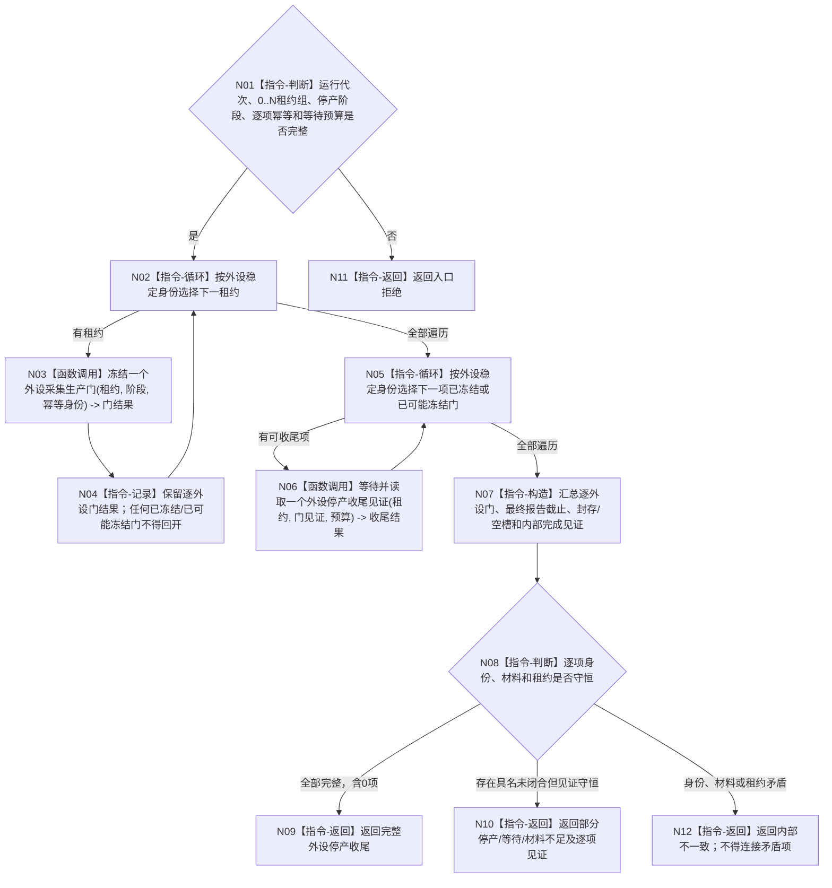

# BIZ-L3-001-13-01 停止外设线程组产生新材料目标函数流程图 v0.1

更新时间：2026-08-27

## 依据

```text
6340 v0.6、8110 v0.3、8120 v0.10；BIZ-L1-T06 v0.4；BIZ-L2-001-13
```

## 身份与边界

正式目标函数设计图。对 0..N 个 T06 控制域先逐项原子关闭新采集生产门，再逐项等待控制域完成停产前已取得轮次的收尾。成功单项必须冻结最终报告截止，并证明唯一在途槽为空，或不可舍弃材料已经由该外设控制域按 6340 封存为可恢复强类型报告且能够正式读取。

本函数不消费报告、不等待任务域承接全部报告，也不因一项外设失败而回开其它生产门。冻结门之后立即读取队列尾项不能证明最终报告截止。

## 函数合同

```text
根函数：停止外设线程组产生新材料
归属模块 / 文件 / 目标分解深度：分阶段停止协调 / 海中鱼巣/启动.分阶段停止.ixx / BIZ-L3
现有或待新增：待新增；HEAD 18810452 没有外设线程或控制域，启动和收口均为空壳
完整签名：外设线程组停产结果 停止外设线程组产生新材料(const 外设线程组停产请求& 请求) noexcept
参数：请求为只读借用；含运行代次、0..N外设线程租约只读借用、停产阶段身份、逐外设门幂等身份和单调等待预算
返回结果：不可变值式逐外设结果；每项含门冻结/精确重复/已可能冻结、最终报告截止、在途槽收口、可选外设owner封存见证、内部完成见证或具名非成功
被调函数流程图：BIZ-L4-001-13-01-01 冻结一个外设采集生产门；BIZ-L4-001-13-01-02 等待并读取一个外设停产收尾见证
父图：BIZ-L2-001-13
```

## 流程图



## 节点合同

| 节点 | 类型 | 输入 | 输出 | 事实读写 | 验证 |
| --- | --- | --- | --- | --- | --- |
| N01—N04 | 判断 / 循环 / 调用 / 记录 | 停产请求 | 逐线程不可逆门结果 | 只改T06控制域采集生产门 | 0/N、首次、精确重复、并发取轮次、部分/可能提交 |
| N05—N06 | 循环 / 调用 | 门见证和租约 | 最终报告截止、空槽/封存、内部完成见证 | 只读控制域内部收尾结果 | 停产前轮次晚到报告、封存失败、等待到期 |
| N07—N12 | 构造 / 判断 / 返回 | 逐项结果 | 完整或部分停产结果 | 不消费或删除报告 | 稳定排序、身份/租约守恒、空组成功 |

## 关键边界

- 生产门只禁止取得新的采集轮次。停产前已取得轮次的驱动返回、报告形成、发布重试或合法封存继续由同一控制域收束。
- 最终报告截止只能来自控制域收尾见证；门冻结版本、队列当前位置、外部观察时间或当前尾项都不能替代。
- 不可舍弃报告按 6340 必须先成为可持久恢复的强类型报告或承接事实。这里仅读取外设 owner 已形成的封存见证，不建立第二持久适配器。
- 单项门未冻结、材料未封存或内部未完成时，该租约不得进入连接资格；其它已完成项继续独立收口。
