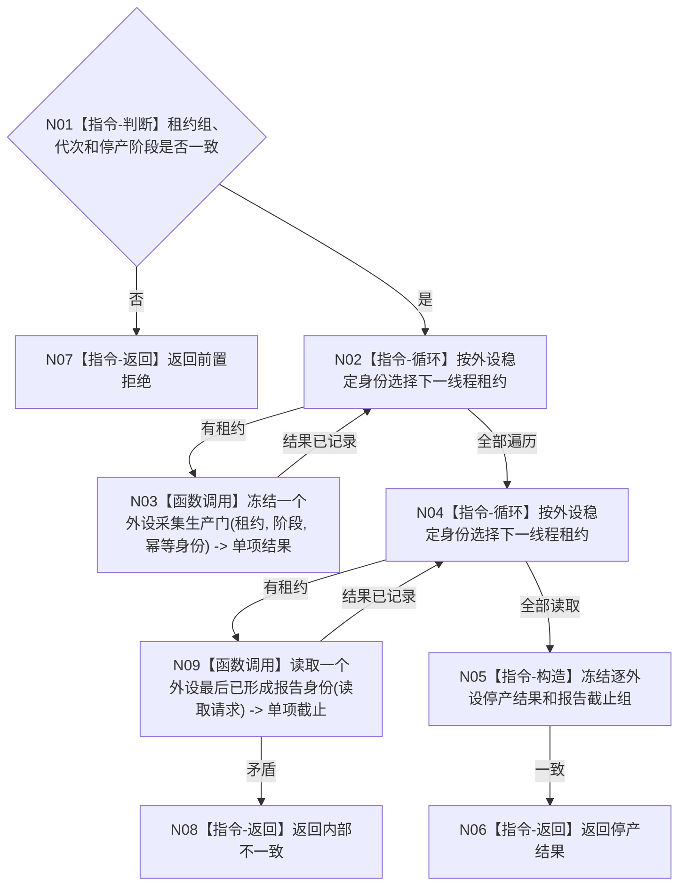

# BIZ-L3-001-13-01 停止外设线程组产生新材料目标函数流程图 v0.1

更新时间：2026-08-03

## 依据

```text
6340、8110；BIZ-L2-001-13；目标线程归属与跨线程材料
```

## 身份与边界

正式目标函数设计图。停止新采集与新报告生产，同时保留已形成报告和不可舍弃材料的正式发布/接管路径。

## 函数合同

```text
根函数：停止外设线程组产生新材料
归属模块 / 文件 / 层级：分阶段停止协调 / 海中鱼巣/启动.分阶段停止.ixx / L3
现有或待新增：待新增；组合具体外设停止门能力
完整签名：外设线程组停产结果 停止外设线程组产生新材料(const 外设线程组停产请求& 请求)
参数：请求为只读借用；含运行代次、外设线程租约组、停产阶段身份、报告截止身份和幂等身份
返回结果：值式逐外设结果；含已停产、同义复用、未启动、停止失败、错代或内部不一致，以及最后报告身份组
被调函数流程图：BIZ-L4-001-13-01-01 冻结一个外设采集生产门；BIZ-L4-001-13-01-02 读取一个外设最后已形成报告身份
父图：BIZ-L2-001-13
```

## 流程图



## 节点合同

| 节点 | 类型 | 输入 | 输出 | 事实读写 | 验证 |
| --- | --- | --- | --- | --- | --- |
| N01—N03 | 判断 / 循环 / 调用 | 停产请求 | 逐线程停产结果 | 只改采集生产门 | 空组、错代、部分失败 |
| N04/N09/N05 | 循环 / 函数调用 / 构造 | 租约组 | 报告截止组 | 只读报告身份 | 并发最后报告 |
| N06—N08 | 返回 | 汇总结论 | 结构化结果 | 不丢弃报告 | 身份守恒 |

## 关键边界

停产后仍可发布停产前已经形成的报告；不可舍弃报告必须进入6340承接或恢复材料，不能随线程退出消失。
