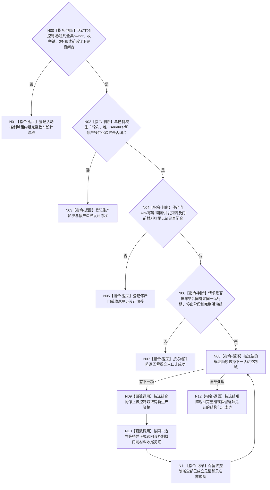

# BIZ-L3-001-13-01 停止外设线程组产生新材料目标函数流程图 v0.2

更新时间：2026-08-28

## 依据

```text
0050、6340 v0.6、8110 v0.3、8120 v0.10；BIZ-L1-T06 v0.5；BIZ-L2-001-13 v0.2；
HEAD 海中鱼巣/启动.应用程序.ixx。
```

## 身份与边界

正式目标治理图。停止T06新材料生产的业务方向仍应覆盖每个活动外设控制域，并且不能丢弃停产线性化点之前已经进入控制域的不可舍弃材料。但6340没有定义活动控制域租约组的完整枚举、采集轮次、停产门、最终报告截止、唯一在途槽或内部完成见证；8120也没有定义T06租约组和停止协议。

旧v0.1把0..N租约组、逐外设门幂等身份、最后允许采集轮次、最终报告截止、空槽/封存见证和完整状态矩阵写成已冻结合同。这些内容既无正式规范来源，也无HEAD实现。合同闭合前，本图只能表达“完整发现活动控制域—按同一正式边界停止新生产—收束边界内材料—正式读回”的职责骨架，不能产生目标ABI或施工许可。

## 函数合同

```text
根函数候选：停止外设线程组产生新材料
归属模块 / 文件 / 目标分解深度：T06停止协调 / 物理文件待活动控制域与停产owner裁决 / BIZ-L3
现有或待新增：HEAD不存在T06线程组、控制域租约组、采集生产门或收尾读回
完整签名：未冻结；旧v0.1的外设线程组停产请求/结果不构成ABI
参数：未冻结；必须绑定正式停止阶段、完整活动控制域组及各控制域同一停产线性化边界
返回结果：未冻结；必须保存逐控制域已成立见证，并区分入口拒绝、部分提交、已可能提交、等待/材料不足和完整读回
被调函数流程图：BIZ-L4-001-13-01-01—02 v0.2均为设计门禁
父图：BIZ-L2-001-13 v0.2
```

## 设计门禁与目标骨架



## 节点合同

| 节点 | 当前可确认合同 | 仍待冻结 | 验证边界 |
| --- | --- | --- | --- |
| N00/N01 | 每个外设实例必须有独立控制域；低频外设共享线程池仍不能合并控制域 | 活动租约owner、完整枚举键、稳定排序、合法0项和漂移矩阵 | 线程容器、配置表或当前队列不能证明完整活动组 |
| N02/N03 | 停产必须覆盖控制域内新材料生产的真实线性化边界 | 生产轮次身份、取得点、唯一serializer及门前/门后分类 | 关闭驱动、线程停止bool或队列不再增长均不是线性化证据 |
| N04/N05 | 不可舍弃材料必须先形成可恢复强类型报告或承接事实 | 门owner、请求/结果、版本、幂等、并发重放、最终截止和恢复见证 | 队列尾项/为空、缓存和日志不能证明最终收尾 |
| N06—N12 | 每项已成立的不可逆见证必须保留；一项失败不得回开其它已停项 | 父级部分提交与逐项读回矩阵 | 0/N、并发生产、重放、发布未知、晚到材料和恢复失败均须具名验证 |

## 当前代码对应（HEAD `f2fea3fb`）

- `启动外设线程组()`只返回true，`收口并连接外设线程组()`为空；HEAD没有真实T06线程组、控制域租约组、采集生产门或收尾见证。
- 6340描述外设控制域与报告交付边界，但没有提供本目标所需的停产ABI；不能从规范中的报告队列原则反推出具体生产轮次和停止事务。

## 具名偏差

1. `DRIFT-BIZ-T06-ACTIVE-CONTROL-DOMAIN-LEASE-GROUP-COMPLETE-ENUMERATION-UNFROZEN`
2. `DRIFT-BIZ-T06-DEVICE-CONTROL-DOMAIN-PRODUCTION-ROUND-AND-STOP-LINEARIZATION-UNFROZEN`
3. `DRIFT-BIZ-T06-PRODUCTION-STOP-GATE-ABI-IDEMPOTENCY-READBACK-AND-CONCURRENCY-MATRIX-UNFROZEN`
4. `DRIFT-BIZ-T06-SHUTDOWN-TAIL-REPORT-CUTOFF-IN-FLIGHT-AND-RECOVERY-WITNESS-UNFROZEN`

## v0.2校正记录

- 撤销旧v0.1的完整函数签名、逐外设幂等键、最后允许采集轮次、最终报告截止、唯一在途槽和空组成功矩阵。
- 把目标收敛为四道设计门禁闭合后的逐控制域停止与正式读回骨架。
- 明确6340的控制域/报告原则和8120的线程准备顺序不能直接产生T06停止协议。
