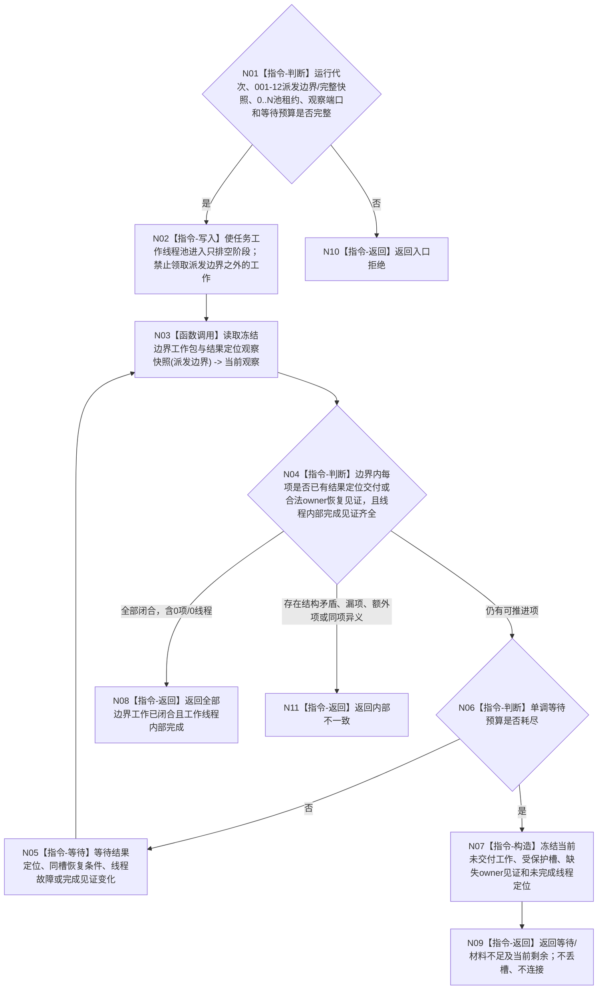

# BIZ-L3-001-13-02 停止任务工作线程池领取并排空冻结边界工作目标函数流程图 v0.1

更新时间：2026-08-27

## 依据

```text
0050、8100 v0.8、8110 v0.3、8120 v0.10；BIZ-L1-T04 v0.3；BIZ-L2-001-12、BIZ-L2-001-13
```

## 身份与边界

正式目标函数设计图。以 001-12 已冻结的 T03 筹办/执行统一派发边界和完整当前在途快照为上限，使 0..N 个 T04 工作线程停止领取边界之外的工作，并继续推进边界内已经派发的工作包。一个工作包只有结果定位已成功交给 T03，或其受保护槽已经取得合法 owner 的可读恢复见证，才从 T04 收口角度闭合。

本函数不重做方法动作、不把完成消息或本地回执当结果定位、不按超时自行宣称“合法剩余”。等待预算耗尽时，未交付且未获 owner 接管的材料保持受保护并随未连接线程租约返回。

## 函数合同

```text
根函数：停止任务工作线程池领取并排空冻结边界工作
归属模块 / 文件 / 目标分解深度：分阶段停止协调 / 海中鱼巣/启动.分阶段停止.ixx / BIZ-L3
现有或待新增：待新增；HEAD 18810452 只有一个旧结果尾部线程，其停止接收/无时限join不能证明目标工作包收口
完整签名：任务工作线程池排空结果 停止任务工作线程池领取并排空冻结边界工作(const 任务工作线程池排空请求& 请求) noexcept
参数：请求为只读借用；含运行代次、0..N线程池租约只读借用、001-12派发门版本/最后派发序号/完整当前在途组、结果定位观察端口和非零单调等待预算
返回结果：不可变值式结果；含池只排空门见证、逐工作包结果定位已交付/受保护槽/未领取/执行中、逐线程内部完成见证、等待/材料不足/内部不一致和当前剩余定位
被调函数流程图：BIZ-L4-001-13-02-01 读取冻结边界工作包与结果定位观察快照
父图：BIZ-L2-001-13
```

## 流程图



## 节点合同

| 节点 | 类型 | 输入 | 输出 | 事实读写 | 验证 |
| --- | --- | --- | --- | --- | --- |
| N01—N02 | 判断 / 写入 | 派发边界、池租约和预算 | 线程池只排空见证 | 只改T04私有领取门 | 0/N、错代、并发领取、边界外工作拒绝 |
| N03—N04 | 调用 / 判断 | 完整冻结边界 | 逐工作包与逐线程观察 | 只读派发账、T04保护槽、T03定位接收和内部完成见证 | 空集、漏/多/重/异义、定位晚到、线程故障 |
| N05—N09 | 等待 / 判断 / 构造 / 返回 | 当前剩余和预算 | 完整排空或具名剩余 | 不重做动作；不补造owner接管 | 伪唤醒、预算耗尽、永久provider失败 |
| N10—N11 | 返回 | 非成功 | 结构化结果 | 保留全部受保护槽 | 零提交拒绝和内部矛盾分账 |

## 关键边界

- 001-12 的当前在途快照是本次初始完整集合，后继观察可随结果定位交付缩小；派发门版本和最后派发序号不变。
- T04 侧闭合点是工作结果定位成功交给 T03，而不是完成消息已发布、动作已发生、方法返回成功或本地回执已形成。T03 是否已经处理定位属于后继 001-14。
- 未领取工作也不能静默丢弃；它必须按 004-07 形成动作前结构化停止结果并交付定位，或由已冻结的合法恢复合同接管。
- 动作后受保护槽的持久 owner 尚未冻结时，等待预算耗尽只能返回 `材料不足` 和未连接租约；这保持 `DRIFT-BIZ-L1-T04-STOP-WITH-UNDELIVERED-ACTION-RESULT-UNFROZEN`，不借流程图临时造 owner。
