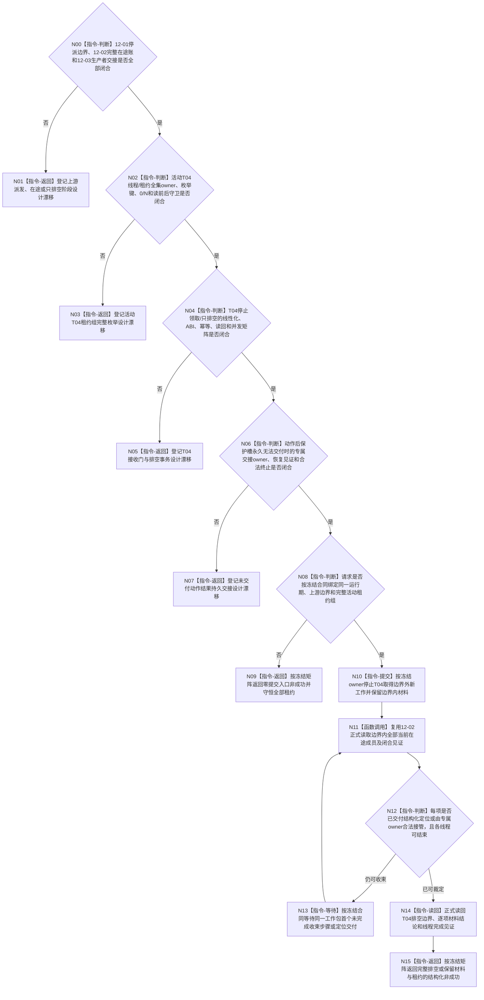

# BIZ-L3-001-13-02 停止任务工作线程池领取并排空冻结边界工作目标函数流程图 v0.2

更新时间：2026-08-28

## 依据

```text
0050、8100 v0.7、8110 v0.3、8120 v0.10；BIZ-L1-T04 v0.4；BIZ-L2-001-05 v0.1、BIZ-L2-001-12/13 v0.2；
BIZ-L3-001-12-01—03 v0.2；HEAD任务工作线程、任务管理线程与任务结果生产运行包代码。
```

## 身份与边界

正式目标治理图。T03正式停派后，T04仍应停止取得边界外新工作，并继续收束已经正式接管的工作包、动作后保护槽和待交工作结果定位；只有这些材料均按正式合同闭合后，物理线程才可进入后继连接资格。线程返回、join、完成消息、方法返回或本地计数都不能代替业务材料闭合。

旧v0.1把001-12的派发门版本、最后派发序号和完整当前在途组当作已闭合输入，并另建L4-001-13-02-01再次读取一套“完整派发账+T04槽+T03定位”快照。12-01—03 v0.2已经证明这些上游合同尚未冻结；其中12-02正是完整在途账的唯一目标读取职责，13-02不得建立第二派发账或第二快照provider。旧L4因此退出，本根后继只可消费未来闭合的12-01/02/03正式结果。

BIZ-L2-001-05与其单线程启动叶也没有冻结活动T04线程租约组、池owner或完整枚举；BIZ-L1-T04另有动作后永久无法交付时的持久交接owner缺口。因此本图当前只能表达上游正式边界闭合后的T04排空职责骨架，不能冻结函数签名、池只排空门或合法终止矩阵。

## 函数合同

```text
根函数候选：停止任务工作线程池领取并排空冻结边界工作
归属模块 / 文件 / 目标分解深度：T04停止协调 / 物理文件待活动租约、接收门和排空owner裁决 / BIZ-L3
现有或待新增：HEAD只有一个旧结果尾部线程、本地停止锁存和无时限join；目标T04工作包循环尚未实现
完整签名：未冻结；旧v0.1的任务工作线程池排空请求/结果不构成ABI
参数：未冻结；必须绑定12-01停派边界、12-02完整在途读取、12-03生产者交接、完整活动T04租约组及动作后材料owner
返回结果：未冻结；必须守恒逐工作包/线程已成立见证，并区分入口拒绝、部分停领、等待、材料不足、已可能提交和完整读回
被调函数流程图：复用BIZ-L3-001-12-02未来正式完整在途读取；旧BIZ-L4-001-13-02-01退出，不建第二快照provider
父图：BIZ-L2-001-13 v0.2
```

## 设计门禁与目标骨架



## 节点合同

| 节点 | 当前可确认合同 | 仍待冻结 | 验证边界 |
| --- | --- | --- | --- |
| N00/N01 | 本根不得从本地快照补造001-12停派、在途全集或生产者交接 | 12-01—03各owner及父级组合结果 | 任一上游门禁未闭合时零T04排空提交 |
| N02/N03 | 当前HEAD只有一个不可移动旧工作线程对象，不证明0..N池或完整活动组 | 池owner、租约身份、完整枚举键、稳定排序、合法0项和当前性 | 容器大小、线程ID和对象存在不是租约全集见证 |
| N04/N05 | 停止新领取与排空已接管材料必须分账；通知和bool不是正式边界 | T04接收门/排空owner、线性化、DTO、版本、幂等、并发分类和读回 | 并发取包、门前已取、门后拒绝、重放与发布未知须分账 |
| N06/N07 | 动作后不得重做动作；保护槽无合法交接时不能因超时丢弃或强连线程 | 专属持久交接owner、恢复见证、生命周期和合法终止 | 永久provider失败、T03永久拒绝、进程停止和跨重启恢复 |
| N08—N15 | T04正常闭合点是每份已接管工作均交付结构化结果定位，或按正式合同由专属owner接管 | 父级请求/结果、等待预算、部分提交、线程完成和租约返还矩阵 | 0/N、定位晚到、受保护槽、线程故障和等待耗尽均保留原材料/租约 |

## 当前代码对应（HEAD `199d6448`）

- `任务工作线程::停止接收并排空()`只锁存旧结果材料队列停止，`收口等待()`直接无时限join；它不识别目标筹办/执行工作包、动作后槽、定位交付或活动池租约。
- `运行结果尾部()`只消费已经形成的旧`任务工作结果材料`；形成或上交回执失败只计数后丢材料，违反目标T04同槽恢复与定位守恒方向。
- `任务结果生产运行包`只内嵌一个不可移动工作线程，先停旧派发再同步连接该线程；没有中间只排空阶段、完整在途账或未连接租约返还。
- HEAD的T03/T04局部快照只有计数和末项，不能合并成完整成员读取；该缺口已经由12-02 v0.2唯一登记。

## 具名偏差

1. `DRIFT-BIZ-T03-WORK-PACKAGE-DISPATCH-UNIVERSE-OWNER-AND-LINEARIZATION-BOUNDARY-UNFROZEN`
2. `DRIFT-BIZ-T03-T04-IN-FLIGHT-WORK-LEDGER-OWNER-CLOSURE-EVENT-AND-COMPLETE-ENUMERATION-UNFROZEN`
3. `DRIFT-BIZ-T03-DRAIN-ONLY-ALLOWED-INPUT-OUTPUT-UNIVERSE-AND-PRODUCER-HANDOFF-UNFROZEN`
4. `DRIFT-BIZ-T04-ACTIVE-WORKER-LEASE-GROUP-COMPLETE-ENUMERATION-UNFROZEN`
5. `DRIFT-BIZ-T04-WORK-ACCEPTANCE-STOP-AND-DRAIN-ABI-IDEMPOTENCY-READBACK-AND-CONCURRENCY-MATRIX-UNFROZEN`
6. `DRIFT-BIZ-L1-T04-STOP-WITH-UNDELIVERED-ACTION-RESULT-UNFROZEN`

## v0.2校正记录

- 撤销旧v0.1的派发门版本、最后派发序号、0..N线程池租约、只排空门和完整排空结果矩阵。
- 删除与12-02完整在途读取职责重复的L4-001-13-02-01；本根未来只消费12-02正式结果，不建立第二账或第二快照provider。
- 保留“停止新领取、收束边界内已接管材料、定位交付/专属接管后才结束”的职责方向，并新增活动T04租约全集与动作后持久交接门禁。
