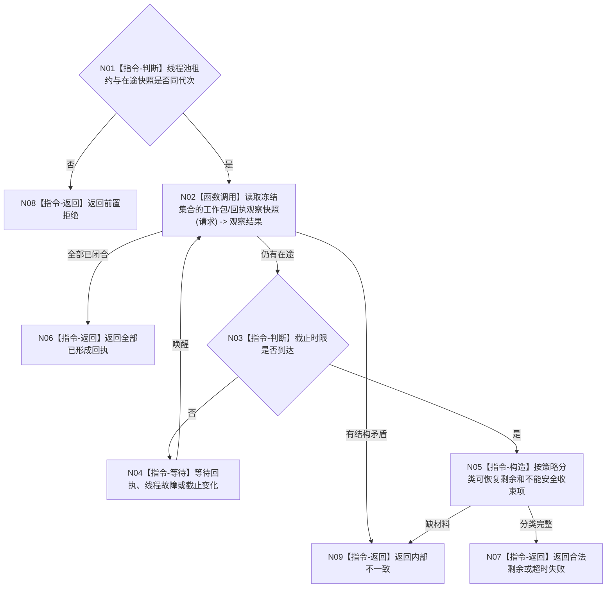

# BIZ-L3-001-13-02 等待任务工作线程池完成可完成在途工作目标函数流程图 v0.1

更新时间：2026-08-03

## 依据

```text
8100、8110；BIZ-L2-001-13；BIZ-L3-001-12-02—03
```

## 身份与边界

正式目标函数设计图。等待冻结快照中的工作包形成回执或合法剩余，不启动、重试或改判任务。

## 函数合同

```text
根函数：等待任务工作线程池完成可完成在途工作
归属模块 / 文件 / 层级：分阶段停止协调 / 海中鱼巣/启动.分阶段停止.ixx / L3
现有或待新增：待新增
完整签名：任务工作线程池排空结果 等待任务工作线程池完成可完成在途工作(const 任务工作线程池排空请求& 请求)
参数：请求为只读借用；含运行代次、线程池租约、冻结在途快照、排空策略、截止时限和停止身份；租约覆盖等待
返回结果：值式结果；逐工作包含已形成回执、合法剩余、超时、线程故障或内部不一致，并含最后观察版本
被调函数流程图：BIZ-L4-001-13-02-01 读取冻结集合的工作包回执观察快照
父图：BIZ-L2-001-13
```

## 流程图



## 节点合同

| 节点 | 类型 | 输入 | 输出 | 事实读写 | 验证 |
| --- | --- | --- | --- | --- | --- |
| N01—N02 | 判断 / 调用 | 排空请求 | 工作包观察快照 | 只读工作包和回执状态 | 错代、重复回执、未知身份 |
| N03—N05 | 判断 / 等待 / 构造 | 在途集合和策略 | 闭合或剩余分类 | 不重做工作 | 超时、线程故障、伪唤醒 |
| N06—N09 | 返回 | 排空结论 | 结构化结果 | 不改任务状态 | 集合数量守恒 |

## 关键边界

“可完成”由既定排空策略和已启动工作决定；不得为追求线程退出而新增执行、重做动作或伪造回执。
