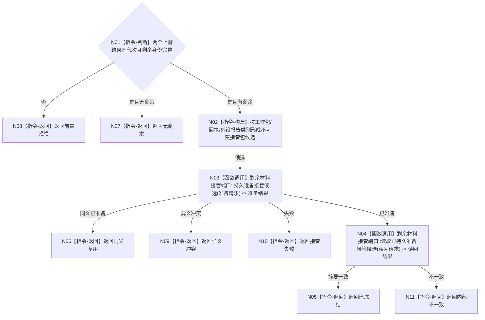

# BIZ-L3-001-13-03 冻结未完成工作与未发布材料目标函数流程图 v0.1

更新时间：2026-08-03

## 依据

```text
0050、6340、8100；BIZ-L2-001-13；BIZ-L3-001-13-01—02
```

## 身份与边界

正式目标函数设计图。把无法在时限内闭合的工作和外设材料冻结为可恢复接管包，不把它们升级成业务事实。

## 函数合同

```text
根函数：冻结未完成工作与未发布材料
归属模块 / 文件 / 层级：分阶段停止协调 / 海中鱼巣/启动.分阶段停止.ixx / L3
现有或待新增：待新增
完整签名：在途剩余材料冻结结果 冻结未完成工作与未发布材料(const 在途剩余材料冻结请求& 请求)
参数：请求为只读借用；含运行代次、外设停产结果、工作池排空结果、接管端口、材料版本和幂等身份；接管端口所有者覆盖调用
返回结果：值式结果；含已冻结、无剩余、同义复用、接管失败、异义冲突或内部不一致，以及不可变接管包身份和摘要
被调函数流程图：BIZ-L4-001-13-03-01 剩余材料接管端口::持久准备接管候选；BIZ-L4-001-13-03-02 剩余材料接管端口::读取已持久准备接管候选
父图：BIZ-L2-001-13
```

## 流程图



## 节点合同

| 节点 | 类型 | 输入 | 输出 | 事实读写 | 验证 |
| --- | --- | --- | --- | --- | --- |
| N01—N02 | 判断 / 构造 | 两类收口结果 | 接管包候选 | 不写业务事实 | 空集、重复身份、材料分类 |
| N03—N04 | 调用 | 候选和幂等身份 | 准备及读回结果 | 只形成非权威恢复候选 | 失败、结果未知、异义重复 |
| N05—N11 | 返回 | 冻结结论 | 结构化结果 | 不删除来源材料 | 摘要一致 |

## 关键边界

接管包是恢复输入，不是任务结果、外设报告已承接或运行期事实；正式恢复仍须重新准入并原子发布。
