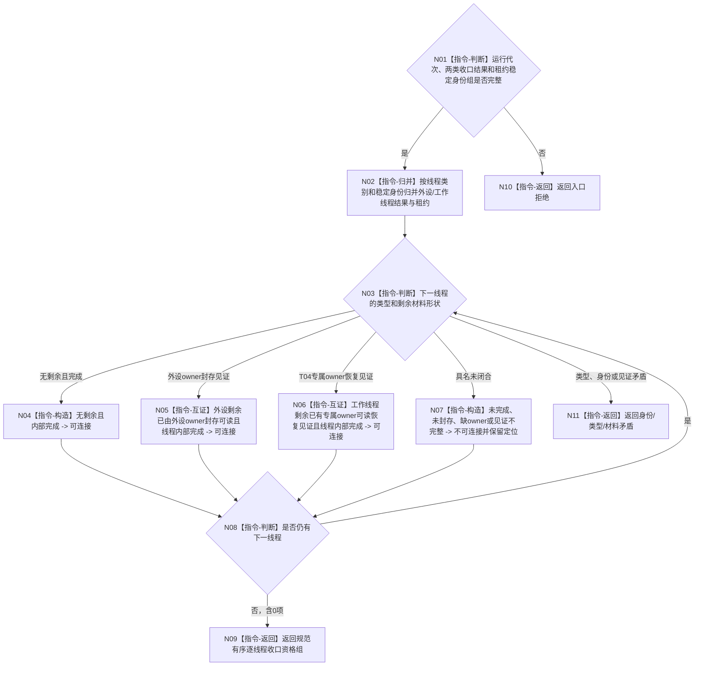

# BIZ-L3-001-13-03 核对生产线程剩余材料收口见证目标函数流程图 v0.1

更新时间：2026-08-27

## 依据

```text
0050、6340 v0.6、8100 v0.8；BIZ-L1-T04 v0.3、BIZ-L1-T06 v0.4；BIZ-L2-001-13；BIZ-L3-001-13-01—02
```

## 身份与边界

正式目标函数设计图。把两类收口结果按线程稳定身份逐项核对为“无剩余且内部完成”“剩余材料已由来源 owner 给出可读接管见证”或“不可连接”。它只验证既有强类型见证，不写通用恢复包、不删除来源材料，也不把不同业务 owner 的材料归一为第二权威。

## 函数合同

```text
根函数：核对生产线程剩余材料收口见证
归属模块 / 文件 / 目标分解深度：分阶段停止协调 / 海中鱼巣/启动.分阶段停止.ixx / BIZ-L3
现有或待新增：待新增；纯值组合，不需要通用持久适配器
完整签名：生产线程逐项收口资格结果 核对生产线程剩余材料收口见证(const 生产线程逐项收口资格请求& 请求) noexcept
参数：请求为只读借用；含运行代次、外设停产收尾结果、工作线程池排空结果和两类租约稳定身份组
返回结果：不可变值式结果；逐线程含可连接、待等待、材料不足、owner见证不完整、身份错配或内部不一致，以及原收口/接管见证的值式引用
被调函数流程图：无；逐线程归并、强类型分支穷尽和见证一致性均为本函数内纯值指令
父图：BIZ-L2-001-13
```

## 流程图



## 节点合同

| 节点 | 类型 | 输入 | 输出 | 事实读写 | 验证 |
| --- | --- | --- | --- | --- | --- |
| N01—N03 | 判断 / 归并 | 收口结果和租约身份 | 逐线程唯一材料形状 | 无写入 | 0/N、漏项、额外项、重复身份、错代 |
| N04—N07 | 构造 / 互证 | 内部完成和owner见证 | 可连接或不可连接 | 只读值式见证 | 空槽、外设封存、T04 owner缺失、见证异义 |
| N08—N11 | 判断 / 返回 | 逐项资格 | 规范有序结果 | 无写入 | 全量覆盖与失败分账 |

## 关键边界

- 外设封存见证只由对应 T06 控制域及 6340 报告恢复合同提供；本函数不复制报告正文或消费状态。
- T04 动作后材料只有在专属恢复 owner 已正式冻结并给出可读见证时才能进入可连接分支。当前该 owner 未冻结，因此真实未交付槽只能稳定返回材料不足。
- “持久介质写入成功”、摘要、日志或线程快照不能脱离来源 owner 合同单独取得接管语义。
- 不可连接是逐线程结论；它不撤销其它线程已经取得的资格。
