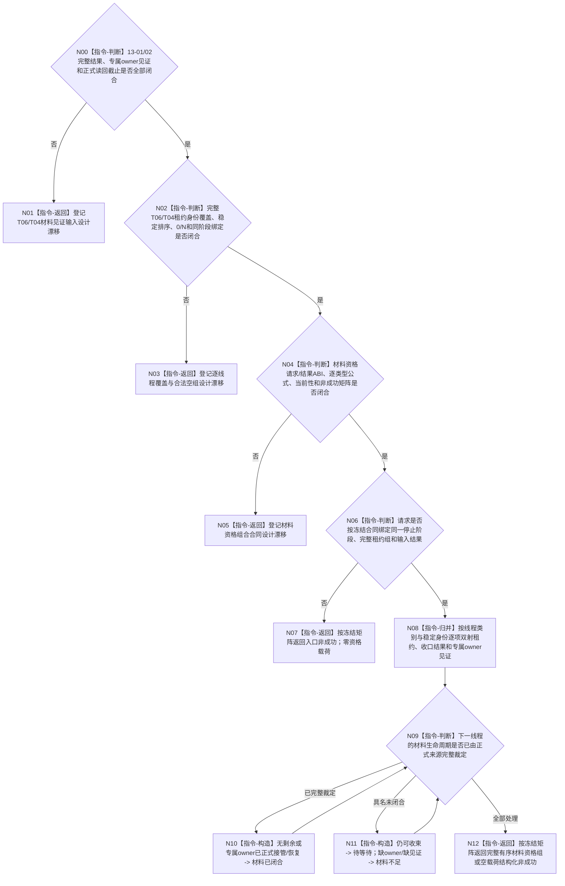

# BIZ-L3-001-13-03 核对生产线程剩余材料收口见证目标函数流程图 v0.2

更新时间：2026-08-28

## 依据

```text
0050、6340 v0.6、8100 v0.7、8110 v0.3；BIZ-L1-T04 v0.4、BIZ-L1-T06 v0.5；
BIZ-L2-001-13 v0.3、BIZ-L3-001-13-01/02 v0.2；当前已发布启动与任务工作线程代码。
```

## 身份与边界

正式目标治理图。本叶只核对T06/T04逐线程剩余业务材料是否已经由其正式owner完整收束：无剩余材料，或剩余材料已取得该类型专属owner的正式接管/恢复见证。它不写通用恢复包、不复制来源材料、不改变报告/工作包生命周期，也不等待或裁决物理线程内部完成。

旧v0.1把“材料闭合”和“线程内部完成”合并成“可连接”资格，与13-04“函数内部等待完成见证再join”的职责重叠。v0.2把本叶输出收窄为材料资格；13-04未来必须在材料资格成立后自行等待线程完成并执行连接。线程生命周期投影、线程ID、joinable或已退出消息都不能反向证明业务材料已闭合。

13-01/02当前均为设计门禁：T06封存/最终截止和T04动作后持久交接owner都未冻结，两类活动租约全集及输入结果ABI也不存在。因此本叶不能先行冻结具体签名、值式见证引用、稳定排序或完整成功公式；只能登记输入合同闭合后的纯值核对骨架。

## 函数合同

```text
根函数候选：核对生产线程剩余材料收口见证
归属模块 / 文件 / 目标分解深度：程序停止材料资格组合 / 物理文件待两类输入结果与资格ABI裁决 / BIZ-L3
现有或待新增：HEAD不存在本函数、逐线程材料收口结果或两类专属见证输入
完整签名：未冻结；旧v0.1的生产线程逐项收口资格请求/结果不构成ABI
参数：未冻结；必须绑定13-01/02完整正式结果、同一停止阶段、完整T06/T04租约身份组和各来源读回截止
返回结果：未冻结；只表达逐线程材料已闭合/待等待/材料不足/见证不完整/引用冲突，不表达线程已完成或已连接
被调函数流程图：无；合同闭合后仅做逐线程纯值覆盖、类型和见证互证
父图：BIZ-L2-001-13 v0.3
```

## 设计门禁与目标骨架



## 节点合同

| 节点 | 当前可确认合同 | 仍待冻结 | 验证边界 |
| --- | --- | --- | --- |
| N00/N01 | 外设材料只认6340合法报告/承接事实；T04动作后材料只认其专属owner | 13-01/02输入DTO、owner、生命周期和读回截止 | 缓存、持久介质写成功、摘要、日志和线程投影均为弱证据 |
| N02/N03 | 每份活动租约必须恰有一项材料结论，额外/漏项/重复均不能成功 | 两类租约全集、稳定身份、排序、合法0项和阶段绑定 | 容器为空不能自动证明0项完整覆盖 |
| N04/N05 | 材料资格与线程物理完成/连接必须分账 | 请求/结果、状态数值、逐类型公式、当前性、引用冲突和内部矩阵 | 同一见证异义、错阶段、旧截止和部分输入失败均空资格载荷 |
| N06—N12 | 本叶纯值核对，不等待、不join、不改来源owner | 逐项覆盖见证和完整成功公式 | 已闭合/待等待/材料不足全量分账；任何线程完成状态不改变材料结论 |

## 当前已发布代码对应（`28125acb`；相关源码自`682d56af`后未变）

- HEAD没有本函数、T06控制域租约组、T04工作线程租约组或逐线程材料资格DTO。
- 外设收口为空壳；任务工作线程只有旧结果队列计数、停止锁存和无时限join，没有正式材料收口/接管见证。
- 8110只提供非权威线程生命周期投影，不能成为材料owner、恢复见证或连接资格。

## 具名偏差

1. `DRIFT-BIZ-T06-ACTIVE-CONTROL-DOMAIN-LEASE-GROUP-COMPLETE-ENUMERATION-UNFROZEN`
2. `DRIFT-BIZ-T06-SHUTDOWN-TAIL-REPORT-CUTOFF-IN-FLIGHT-AND-RECOVERY-WITNESS-UNFROZEN`
3. `DRIFT-BIZ-T04-ACTIVE-WORKER-LEASE-GROUP-COMPLETE-ENUMERATION-UNFROZEN`
4. `DRIFT-BIZ-L1-T04-STOP-WITH-UNDELIVERED-ACTION-RESULT-UNFROZEN`
5. `DRIFT-BIZ-T01-PRODUCTION-THREAD-MATERIAL-QUALIFICATION-ABI-COVERAGE-CURRENTNESS-AND-NON-SUCCESS-MATRIX-UNFROZEN`

## v0.2校正记录

- 撤销旧v0.1的具体签名、值式见证引用、0项成功和完整状态矩阵。
- 将输出从混合的“可连接资格”收窄为“业务材料资格”，物理线程完成等待与join全部留给13-04。
- 保留只认来源专属owner、逐线程完整覆盖和零通用恢复包方向；输入owner未闭合前本叶不可施工。
