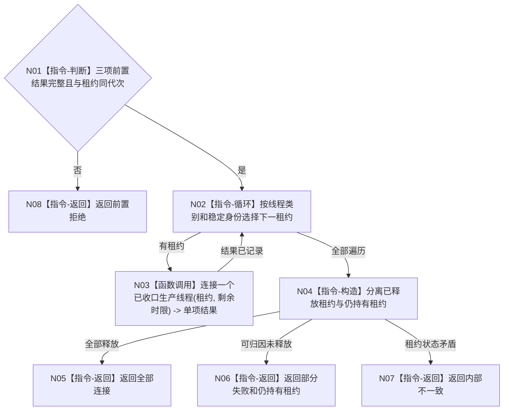

# BIZ-L3-001-13-04 连接外设线程组和任务工作线程池目标函数流程图 v0.1

更新时间：2026-08-03

## 依据

```text
6340、8100、8110；BIZ-L2-001-13；BIZ-L3-001-13-01—03
```

## 身份与边界

正式目标函数设计图。只有停产、排空和剩余材料冻结都已形成结构化结果后才连接生产线程。

## 函数合同

```text
根函数：连接外设线程组和任务工作线程池
归属模块 / 文件 / 层级：分阶段停止协调 / 海中鱼巣/启动.分阶段停止.ixx / L3
现有或待新增：待新增；复用现有线程收口等待
完整签名：在途生产线程连接结果 连接外设线程组和任务工作线程池(在途生产线程租约组&& 线程租约组, const 在途生产线程连接请求& 请求) noexcept
参数：线程租约组为两类线程的唯一移动所有权；请求为只读借用，含运行代次、停产结果、排空结果、剩余材料持久准备结果和连接时限
返回结果：移动值式逐线程结果；含全部连接、部分失败、超时、错代或内部不一致，以及已释放/仍持有租约集合
被调函数流程图：BIZ-L4-001-13-04-01 连接一个已收口生产线程
父图：BIZ-L2-001-13
```

## 流程图



## 节点合同

| 节点 | 类型 | 输入 | 输出 | 事实读写 | 验证 |
| --- | --- | --- | --- | --- | --- |
| N01—N02 | 判断 / 循环 | 连接请求 | 稳定连接顺序 | 无 | 前置缺失、重复租约 |
| N03—N04 | 调用 / 构造 | 单线程租约 | 连接和租约集合 | 只改线程生命周期 | 超时、异常退出 |
| N05—N08 | 返回 | 汇总结论 | 结构化结果 | 不裁决业务结果 | 租约守恒 |

## 关键边界

连接成功只证明线程资源已回收；任务完成、报告承接和剩余材料可恢复性分别由其正式结果证明。
