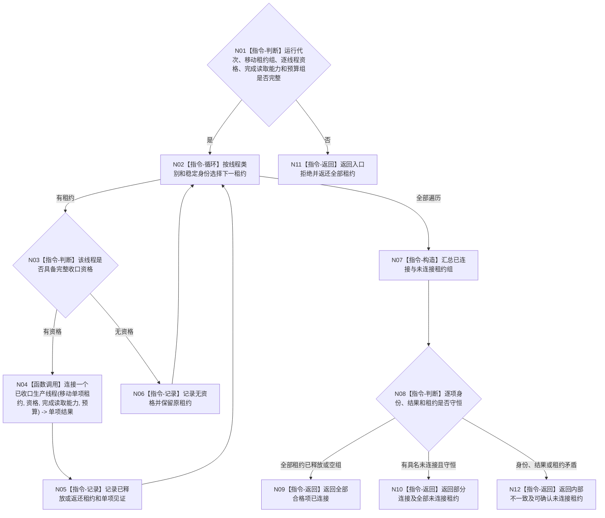

# BIZ-L3-001-13-04 连接已具备收口资格的生产线程目标函数流程图 v0.1

更新时间：2026-08-27

## 依据

```text
6340 v0.6、8100 v0.8、8110 v0.3、8120 v0.10；BIZ-L2-001-13；BIZ-L3-001-13-01—03
```

## 身份与边界

正式目标函数设计图。按线程类别和稳定身份遍历唯一移动租约组，只为已经取得逐线程收口资格的外设或任务工作线程等待内部完成见证并执行单次连接。没有资格、等待超时或完成见证异常的线程保留原租约返回；一项失败不阻止其它独立合格线程连接。

## 函数合同

```text
根函数：连接已具备收口资格的生产线程
归属模块 / 文件 / 目标分解深度：分阶段停止协调 / 海中鱼巣/启动.分阶段停止.ixx / BIZ-L3
现有或待新增：待新增；HEAD 任务工作线程只有对象内无时限join，T06连接为空壳
完整签名：在途生产线程连接结果 连接已具备收口资格的生产线程(在途生产线程租约组&& 线程租约组, const 在途生产线程连接请求& 请求) noexcept
参数：租约组唯一移动拥有两类0..N线程；请求含运行代次、规范有序逐线程收口资格组、内部完成见证读取能力和非零单调等待预算组
返回结果：移动值式逐线程结果；含已连接、无资格未连接、完成等待、超时、错代、身份错配、内部不一致及全部已释放/未连接租约
被调函数流程图：BIZ-L4-001-13-04-01 连接一个已收口生产线程
父图：BIZ-L2-001-13
```

## 流程图



## 节点合同

| 节点 | 类型 | 输入 | 输出 | 事实读写 | 验证 |
| --- | --- | --- | --- | --- | --- |
| N01—N03 | 判断 / 循环 | 移动租约和逐项资格 | 单项连接资格 | 无 | 0/N、重复/缺失资格、错代、未知variant |
| N04—N06 | 调用 / 记录 | 单项租约、资格和预算 | 已释放或原样返还租约 | 只改线程资源生命周期 | 完成晚到、超时、join异常、无资格不得调用 |
| N07—N12 | 构造 / 判断 / 返回 | 单项结果 | 移动值式组结果 | 不写业务事实 | 部分成功和租约守恒 |

## 关键边界

- 连接函数负责等待并正式读取内部完成见证；请求不预先携带一个“已经完成”布尔再重复等待。
- `join` 只在线程内部完成见证成立后执行，且每个租约至多一次。禁止 detach、析构碰运气或以生命周期投影替代内部完成。
- 连接成功只证明线程资源已回收；报告承接、工作结果处理和后继治理分别由其 owner 与 001-14 证明。
